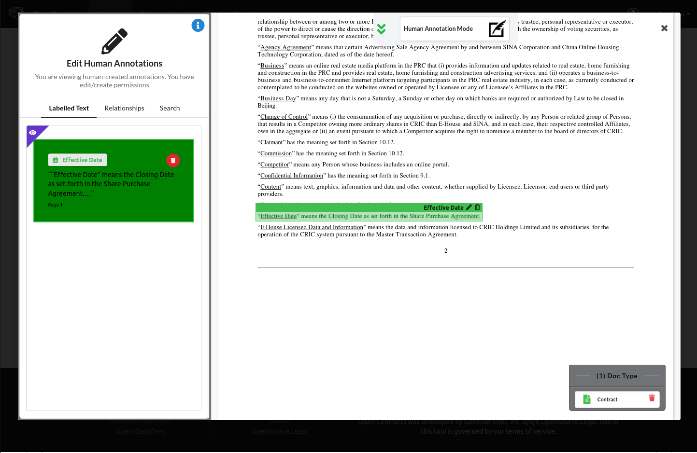

## The Free and Open Source Document Analytics Platform

---

| |                                                                                                                                                                                                                                                                                                                                                                                                                                                                                            |
| --- |--------------------------------------------------------------------------------------------------------------------------------------------------------------------------------------------------------------------------------------------------------------------------------------------------------------------------------------------------------------------------------------------------------------------------------------------------------------------------------------------|
| CI/CD |                                                                                                                                                                                                                                                                                                                   |
| Meta |     |

## What Does it Do?

OpenContracts is an **Apache-2 Licensed** enterprise document analytics tool. It was originally designed to label and 
share label document corpuses with complex layouts such as contracts, scientific papers, newspapers,
etc. It has evolved into a platform for mass contract analytics that still maintains its core functionality as an open 
platform that makes it effortless to view, edit and share annotations:

Now, in the version 2 release (currently in beta) - we've incorporated LLMs and vector databases to 
provide a seamless and efficient workflow for processing large volumes of documents in parallel. At the core of the
system is pgvector for vector search, LlamaIndex for precise vector search and retrieval, and Marvin framework for data 
parsing and extraction.

Users can still create and edit annotations directly within the platform, enabling them to enrich documents with their 
own insights and domain expertise. Through a custom LlamaIndex DjangoVectorStore, we can expose this structured data - 
human annotated text with embeddings - to LLMs and the LlamaIndex ecosystem. 

Finally, the tool's intuitive interface allows for easy navigation through documents, providing clear visual cues to identify 
the exact source of information extracted by the language model. This transparency ensures that users can verify the 
accuracy and context of the extracted data.

## Documentation

We use MkDocs for our documentation. Please visit [https://JSv4.github.io/OpenContracts/](https://JSv4.github.io/OpenContracts/)
for our detailed documentation - including a quick start guide, a walk through, architectural overview and more.

## Why Does it Exist?

The OpenContracts stack is designed to provide a cutting edge frontend experience while providing access to the
incredible machine learning and natural language processing capabilities of Python. For this reason, our frontend is
based on React. We use a GraphQL API to connect it to a django-based backend. Django is a incredibly mature,
battle-tested framework that is written in Python, so integrating all the amazing Python-based AI and NLP libraries out
there is super easy.

We'd like to give credit to AllenAI's PAWLs project for our document annotating component. We rewrote most of the
code base and replaced their backend entirely, so it was hard to keep , but we believe in giving credit where it's due!
We are relying on their document parser, however, as it produces a really excellent text and x-y coordinate layer that
we'd encourage others to use as well in similar applications that require you to interact with complex text layouts.

## Limitations

At the moment, it only works with PDFs. In the future, it will be able to convert other document types to PDF for
storage and labeling. PDF is an excellent format for this as it introduces a consistent, repeatable format which we can
use to generate a text and x-y coordinate layer from scratch. Formats like .docx and .html are too complex and varied
to provide an easy, consistent format. Likewise, the output quality of many converters and tools is sub-par and these
tools can produce very different document structures for the same inputs.

**Adding OCR and ingestion for other enterprise documents is a priority**.
