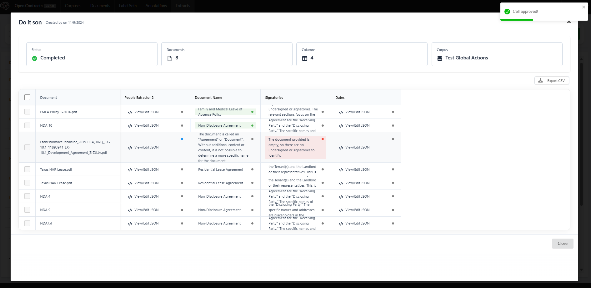
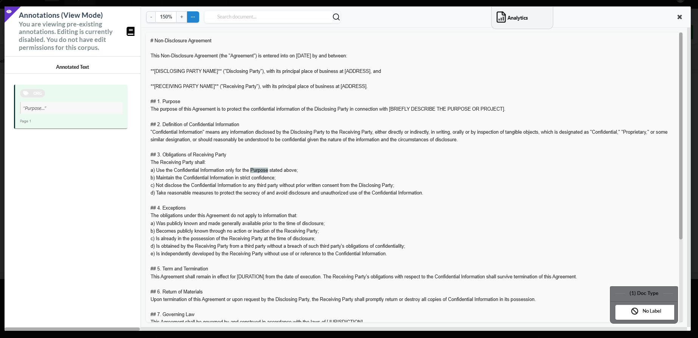
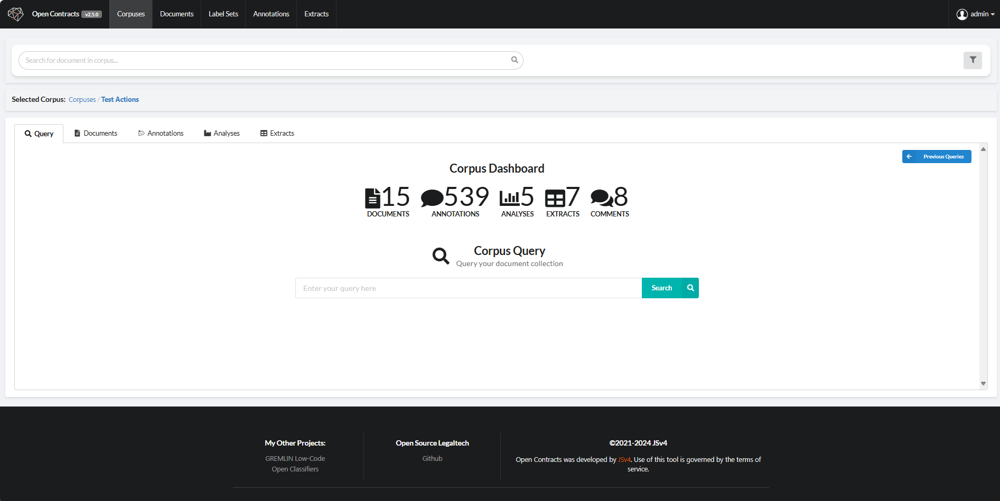
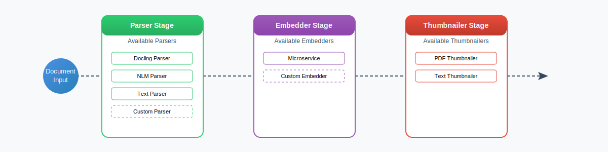
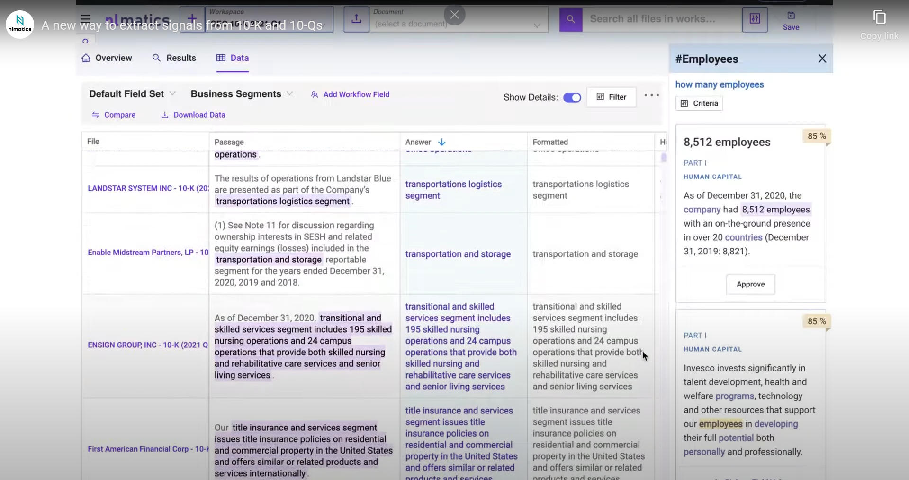

# Open Contracts ([Demo](https://opencontracts.opensource.legal))
## The Free and Open Source Document Analytics Platform 

---

| |                                                                                                                                                                                                                                                                                                                                                                                                                                                                                            |
| --- |--------------------------------------------------------------------------------------------------------------------------------------------------------------------------------------------------------------------------------------------------------------------------------------------------------------------------------------------------------------------------------------------------------------------------------------------------------------------------------------------|
| Backend CI/CD |                                                                                                                                                                                                                                                                                                                   |
| Meta |     |

## TLDR: What Does it Do?

OpenContracts is an **Apache-2 Licensed** enterprise document analytics tool. It supports multiple formats - including PDF and txt-based formats (with more on the way). It also supports multiple document ingestion pipelines with a [pluggable architecture](docs/pipelines/pipeline_overview.md) designed to make supporting new formats and ingestion engines easy - see our [Docling Integration](docs/pipelines/docling_parser.md) for an example. Writing your own custom document analytics tools where the results get displayed beautifully over the original document [is easy](docs/walkthrough/advanced/register-doc-analyzer.md). We also support mass document [data extraction](docs/extract_and_retrieval/intro_to_django_annotation_vector_store.md) with a [LlamaIndex](https://www.llamaindex.ai/) wrapper.

## 📊 Telemetry (as of v3.0.0-alpha2)

OpenContracts collects anonymous usage data to help improve the platform. We only collect:
- Installation events (unique installation ID per first DB initialization)
- Feature usage statistics (e.g., analyzer activations, post-processor runs)
- **Aggregate** usage (documents uploaded, total queries, total extracts, users served, etc.)

We **never** collect:
- Document contents
- Extracted data
- Identifiable user information
- Query contents

This data helps us understand which features are most valuable and prioritize development. Telemetry can be disabled by setting `TELEMETRY_ENABLED=False` in your settings.

## Walkthroughs

### PDF-Annotation and Analysis:

### TXT-Based Format Annotation and Analysis:

### Data Extract:

### Rapidly Deployable Bespoke Analytics

### [DEVELOPING] Document Management

## 🗺️ Roadmap

| Timeline | Milestone | Description |
|----------|-----------|-------------|
| 🌟 January 2025 | **Document Format Expansion** | <ul><li>LlamaParse integration for enhanced document processing</li><li>Native Markdown viewing and highlighting support</li></ul> |
| 📊 February 2025 | **Benchmarking Suite** | <ul><li>Comprehensive benchmarks for extract features</li><li>Benchmark Tools</li></ul> |
| 🚀 March 2025 | **Extract Enhancement** | <ul><li>Improved default data extract algorithms</li><li>Enhanced accuracy and speed</li></ul> |
| 🌊 April 2025 | **Streaming & Filtering** | <ul><li>Real-time response streaming for chats and queries</li><li>Better UX for asking questions of entier corpus</li><li>Improved search functionality</li></ul> |
| 📚 May 2025 | **Government Data Integration** | <ul><li>Code of Federal Regulations (CFR) integration</li><li>Additional government data sources</li></ul> |
| 🏗️ Summer 2025 | **Enterprise DMS Features** | <ul><li>Document versioning</li><li>Intelligent file matching</li></ul> |

> 💡 This roadmap represents our current plans and is subject to change based on community feedback and evolving requirements.

## Ok, now tell me more. What Does it Do?

OpenContracts provides several key features:

1. **Manage Documents** - Manage document collections (`Corpuses`)
2. **Layout Parser** - Automatically extracts layout features from PDFs
3. **Automatic Vector Embeddings** - generated for uploaded PDFs and extracted layout blocks
4. **Pluggable microservice analyzer architecture** - to let you analyze documents and automatically annotate them
5. **Pluggable Parsing Pipelines** - to let you support new document formats and ingestion engines. 
6. **Human Annotation Interface** - to manually annotated documents, including multi-page annotations.
7. **LlamaIndex Integration** - Use our vector stores (powered by pgvector) and any manual or automatically annotated features
   to let an LLM intelligently answer questions.
8. **Data Extract** - ask multiple questions across hundreds of documents using complex LLM-powered querying behavior.
   Our sample implementation uses LlamaIndex + Marvin.
9. **Custom Data Extract** - Custom data extract pipelines can be used on the frontend to query documents in bulk.

## Key Docs

We recommend you [browse our docs](https://jsv4.github.io/OpenContracts/) via our Mkdocs Site. You can also view the 
docs in the repo:

1. [Quickstart Guide](docs/quick-start.md) - You'll probably want to get started quickly. Setting up locally should be
   pretty painless if you're already running Docker.
2. [Basic Walkthrough](docs/walkthrough/key-concepts.md) - Check out the walkthrough to step through basic usage of the
   application for document and annotation management.
2. [PDF Annotation Data Format Overview](docs/architecture/PDF-data-layer.md) - You may be interested how we map text to
   PDFs visually and the underlying data format we're using.
3. [Django + Pgvector Powered Hybrid Vector Database](docs/extract_and_retrieval/intro_to_django_annotation_vector_store.md)
   We've used the latest open source tooling for vector storage in postgres to make it almost trivially easy to
   combine structured metadata and vector embeddings with an API-powered application.
4. [LlamaIndex Integration Walkthrough](docs/extract_and_retrieval/intro_to_django_annotation_vector_store.md) - We wrote a
   wrapper for our backend database and vector store to make it simple to load our parsed annotations, embeddings and
   text into LlamaIndex. Even better, if you have additional annotations in the document, the LLM can access those too.
5. [Write Custom Data Extractors](docs/walkthrough/advanced/write-your-own-extractors.md) - Custom data extract tasks (which
   can use LlamaIndex or can be totally bespoke) are automatically loaded and displayed on the frontend to let user's
   select how to ask questions and extract data from documents.

## Architecture and Data Flows at a Glance

### Core Data Standard

The core idea here - besides providing a platform to analyze contracts - is an open and standardized architecture that
makes data extremely portable. Powering this is a set of data standards to describe the text and layout blocks on a PDF
page:

### Modern, Pluggable Document Processing Pipeline

OpenContracts features a powerful, modular pipeline system for processing documents. The architecture supports easy creation and integration of custom parsers, embedders, and thumbnail generators:

Each pipeline component inherits from a base class that defines a clear interface:
- **Parsers**: Extract text and structure from documents
- **Embedders**: Generate vector embeddings for semantic search
- **Thumbnailers**: Create visual previews of documents

Learn more about:
- [Pipeline Architecture Overview](docs/pipelines/pipeline_overview.md)
- [Docling Parser](docs/pipelines/docling_parser.md)
- [NLM-Ingest Parser](docs/pipelines/nlm_ingest_parser.md)

The modular design makes it easy to add custom processors - just inherit from the appropriate base class and implement the required methods. See our [pipeline documentation](docs/pipelines/pipeline_overview.md#creating-new-components) for details on creating your own components.

## Limitations

At the moment, we only support PDF and text-based formats (like plaintext and MD). With our new parsing pipeline, we can easily support other ooxml office formats like docx and xlsx, HOWEVER, open source viewers and editors are a rarity. One possible route is to leverage the many ooxml --> MD tools that now exist. This will be a reasonably good solution for the majority of documents once we add a markdown viewer and annotator (see our roadmap). 

## Acknowledgements

Special thanks to AllenAI's [PAWLS project](https://github.com/allenai/pawls) and Nlmatics
[nlm-ingestor](https://github.com/nlmatics/nlm-ingestor). They've pioneered a number of features and flows, and we are
using their code in some parts of the application.

NLmatics was also the creator of and inspiration for our data extract grid and parsing pipeline UI/UX:

The company was ahead of its time, and, while the product is no longer available, OpenContracts aims to take some of its [best and most innovative features](https://youtu.be/lX9lynpQwFA) and make them open source and available to the masses!
