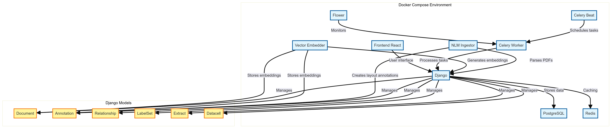
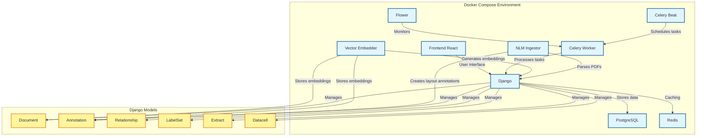

# Container Data Flow

You'll notice that we have a number of containers in our docker compose file (**Note** the local.yml is up-to-date. The
production file needs some work to be production grade, and we may switch to [Tilt](https://tilt.dev/).). 

Here, you can see how these containers relate to some of the core data elements powering the application - such as 
parsing structural and layout annotations from PDFs (which powers the vector store) and generating vector embeddings.

## PNG Diagram

## Mermaid Version

