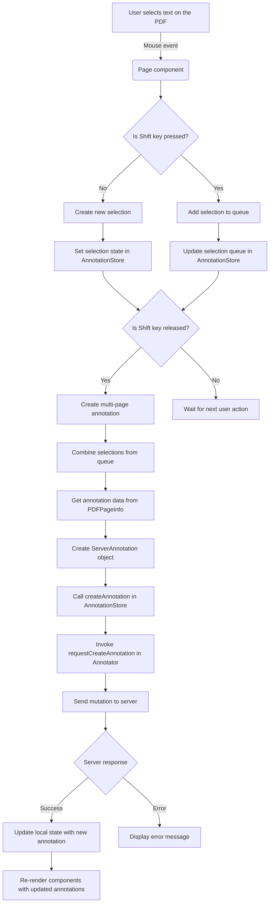

# How Annotations are Handled

## Overview

Here's a step-by-step explanation of the flow:

1. The user selects text on the PDF by clicking and dragging the mouse. This triggers a mouse event in the `Page` component.
2. The `Page` component checks if the Shift key is pressed.
   - If the Shift key is not pressed, it creates a new selection and sets the selection state in the `AnnotationStore`.
   - If the Shift key is pressed, it adds the selection to the selection queue in the `AnnotationStore`.
3. The `AnnotationStore` updates its internal state with the new selection or the updated selection queue.
4. If the Shift key is released, the `Page` component triggers the creation of a multi-page annotation. If the Shift key is still pressed, it waits for the next user action.
5. To create a multi-page annotation, the `Page` component combines the selections from the queue.
6. The `Page` component retrieves the annotation data from the `PDFPageInfo` object for each selected page.
7. The `Page` component creates a `ServerAnnotation` object with the combined annotation data.
8. The `Page` component calls the `createAnnotation` function in the `AnnotationStore`, passing the `ServerAnnotation` object.
9. The `AnnotationStore` invokes the `requestCreateAnnotation` function in the `Annotator` component.
10. The `Annotator` component sends a mutation to the server to create the annotation.
11. If the server responds with success, the `Annotator` component updates the local state with the new annotation. If there's an error, it displays an error message.
12. The updated annotations trigger a re-render of the relevant components, reflecting the newly created annotation on the PDF.

## Flowchart

