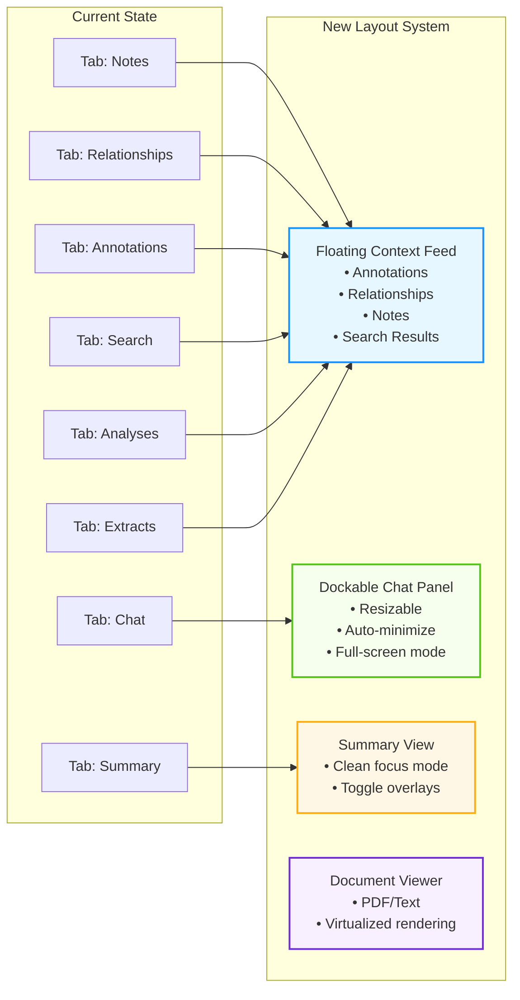

```mermaid
graph LR
    subgraph "Current State"
        A1[Tab: Summary]
        A2[Tab: Chat]
        A3[Tab: Notes]
        A4[Tab: Relationships]
        A5[Tab: Annotations]
        A6[Tab: Search]
        A7[Tab: Analyses]
        A8[Tab: Extracts]
    end
    
    subgraph "New Layout System"
        B1[Floating Context Feed<br/>• Annotations<br/>• Relationships<br/>• Notes<br/>• Search Results]
        B2[Dockable Chat Panel<br/>• Resizable<br/>• Auto-minimize<br/>• Full-screen mode]
        B3[Summary View<br/>• Clean focus mode<br/>• Toggle overlays]
        B4[Document Viewer<br/>• PDF/Text<br/>• Virtualized rendering]
    end
    
    A1 --> B3
    A2 --> B2
    A3 --> B1
    A4 --> B1
    A5 --> B1
    A6 --> B1
    A7 --> B1
    A8 --> B1
    
    style B1 fill:#e6f7ff,stroke:#1890ff,stroke-width:2px
    style B2 fill:#f6ffed,stroke:#52c41a,stroke-width:2px
    style B3 fill:#fff7e6,stroke:#faad14,stroke-width:2px
    style B4 fill:#f9f0ff,stroke:#722ed1,stroke-width:2px
```