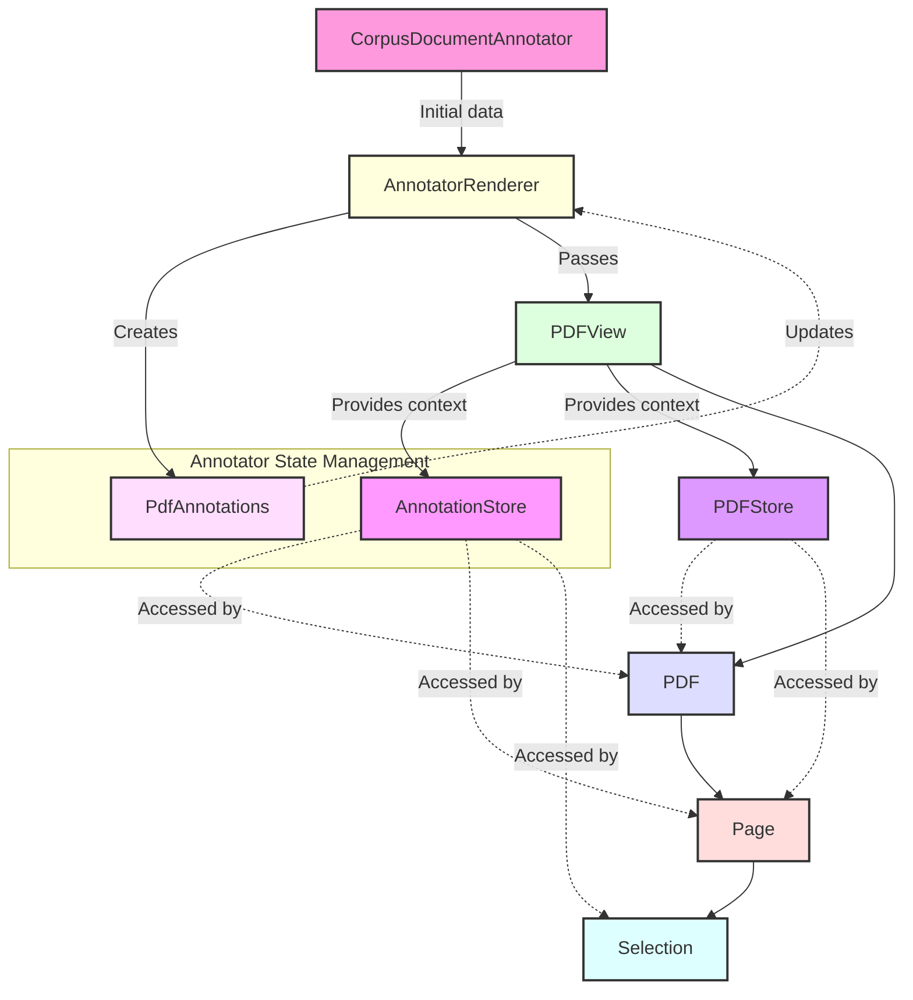

# Annotator System: Data Flow and State Management

## Table of Contents

1. [Overview](#overview)
2. [Component Hierarchy](#component-hierarchy)
3. [Data Flow](#data-flow)
   3.1 [Initial Data Fetching](#initial-data-fetching)
   3.2 [Local State Management](#local-state-management)
4. [Key Components](#key-components)
   4.1 [CorpusDocumentAnnotator](#corpusdocumentannotator)
   4.2 [AnnotatorRenderer](#annotatorrenderer)
   4.3 [PDFView](#pdfview)
   4.4 [PdfAnnotations](#pdfannotations)
5. [Context Providers](#context-providers)
   5.1 [AnnotationStore](#annotationstore)
   5.2 [PDFStore](#pdfstore)
6. [Server Interactions](#server-interactions)
7. [Optimizations and Considerations](#optimizations-and-considerations)
8. [Roadmap](#roadmap)

## 1. Overview

The Annotator system is designed to efficiently manage and display annotations on PDF documents. It utilizes a
combination of server-fetched data and local state management to provide a responsive user experience while minimizing
unnecessary server requests.

## 2. Component Hierarchy

The main components of the Annotator system, in hierarchical order, are:

1. CorpusDocumentAnnotator
2. AnnotatorRenderer
3. PDFView
4. PDF
5. Page
6. Selection

## 3. Data Flow

## Diagram

### 3.1 Initial Data Fetching

1. When the CorpusDocumentAnnotator mounts, it fetches initial annotation data from the server.
2. This data includes:
    - annotation_objs
    - relationship_annotations
    - doc_type_annotations
3. The fetched data is passed to the AnnotatorRenderer component.

### 3.2 Local State Management

1. AnnotatorRenderer creates a PdfAnnotations object using the initial data.
2. PdfAnnotations serves as the central state management object for annotations.
3. Local updates to annotations are managed through the AnnotationStore context.
4. These updates are reflected in the PdfAnnotations object without triggering server requests.

## 4. Key Components

### 4.1 CorpusDocumentAnnotator

- Responsible for initial data fetching from the server.
- Passes the fetched data to AnnotatorRenderer.
- Does not actively manage annotations after initial load.

### 4.2 AnnotatorRenderer

- Creates and manages the PdfAnnotations object.
- Provides change functions to AnnotationStore for local state updates.
- Passes the PdfAnnotations object to PDFView.
- Ensures local component state stays in sync with the initial server data.

### 4.3 PDFView

- Receives the PdfAnnotations object from AnnotatorRenderer.
- Provides AnnotationStore and PDFStore contexts to its children.
- Renders the PDF component and manages the display of annotations.

### 4.4 PdfAnnotations

- Central object for managing annotation state.
- Created and updated by AnnotatorRenderer.
- Holds the current state of all annotations, relationships, and document type annotations.

## 5. Context Providers

### 5.1 AnnotationStore

- Provided by PDFView.
- Contains change functions from AnnotatorRenderer.
- Allows child components to access and modify annotation data.
- Facilitates local state updates without server interactions.

### 5.2 PDFStore

- Provided by PDFView.
- Contains PDF-related data and functions.
- Accessed by PDF and Page components for rendering and layout purposes.

## 6. Server Interactions

- Initial data is fetched when CorpusDocumentAnnotator mounts.
- While the Annotator is open, no further data is fetched from the server.
- Local changes are managed in the PdfAnnotations object and AnnotationStore.
- Server synchronization (if implemented) would typically occur when the Annotator is closed or explicitly requested by
  the user.

## 7. Optimizations and Considerations

- The system minimizes server requests by managing annotations locally once loaded.
- PdfAnnotations object serves as a single source of truth for annotation data during the Annotator session.
- Context providers (AnnotationStore and PDFStore) allow efficient access to data and functions throughout the component
  tree.
- Consider implementing a strategy for syncing local changes back to the server, either periodically or on Annotator
  close.
- For large documents or numerous annotations, consider implementing virtualization or pagination to improve
  performance.

This README provides a comprehensive overview of the Annotator system's data flow and state management. It explains how
the various components interact, how data is initially loaded and subsequently managed locally, and the role of key
objects like PdfAnnotations in maintaining system state.

## 8. Roadmap

### 8.1 Migration to Apollo Cache

A key upcoming enhancement to the Annotator system is the planned migration of local state management to Apollo cache.
This change aims to leverage Apollo's powerful caching and state management capabilities to further optimize our
application.

#### Objectives:

1. **Centralized State Management**: Move the local state currently managed by PdfAnnotations and AnnotationStore into
   Apollo's cache.

2. **Improved Data Consistency**: Utilize Apollo's cache normalization to ensure data consistency across the
   application.

3. **Reactive Updates**: Take advantage of Apollo's reactive variables for real-time updates across components.

4. **Optimized Performance**: Leverage Apollo's caching mechanisms to reduce unnecessary re-renders and improve overall
   performance.

5. **Simplified Data Flow**: Streamline the data flow by using Apollo's query and mutation hooks for both local and
   server state management.

#### Implementation Considerations:

- **Cache Policies**: Define appropriate cache policies for annotations, relationships, and document types.
- **Local-only Fields**: Utilize Apollo's local-only fields for managing UI state that doesn't need to be persisted to
  the server.
- **Pagination Handling**: Implement effective pagination strategies using Apollo's fetchMore functionality for large
  documents or numerous annotations.
- **Offline Support**: Explore Apollo's offline capabilities to enhance the system's resilience to network issues.
- **Type Safety**: Leverage Apollo's code generation features to ensure type safety across our GraphQL operations.

#### Challenges and Mitigations:

- **Learning Curve**: There may be a learning curve for developers unfamiliar with Apollo's local state management.
  We'll provide comprehensive documentation and training sessions to ease the transition.
- **Refactoring Effort**: Significant refactoring of existing components will be necessary. We'll approach this
  incrementally, starting with isolated components and gradually expanding.
- **Performance Monitoring**: We'll need to closely monitor performance during and after the migration to ensure the new
  system meets or exceeds the performance of the current implementation.
