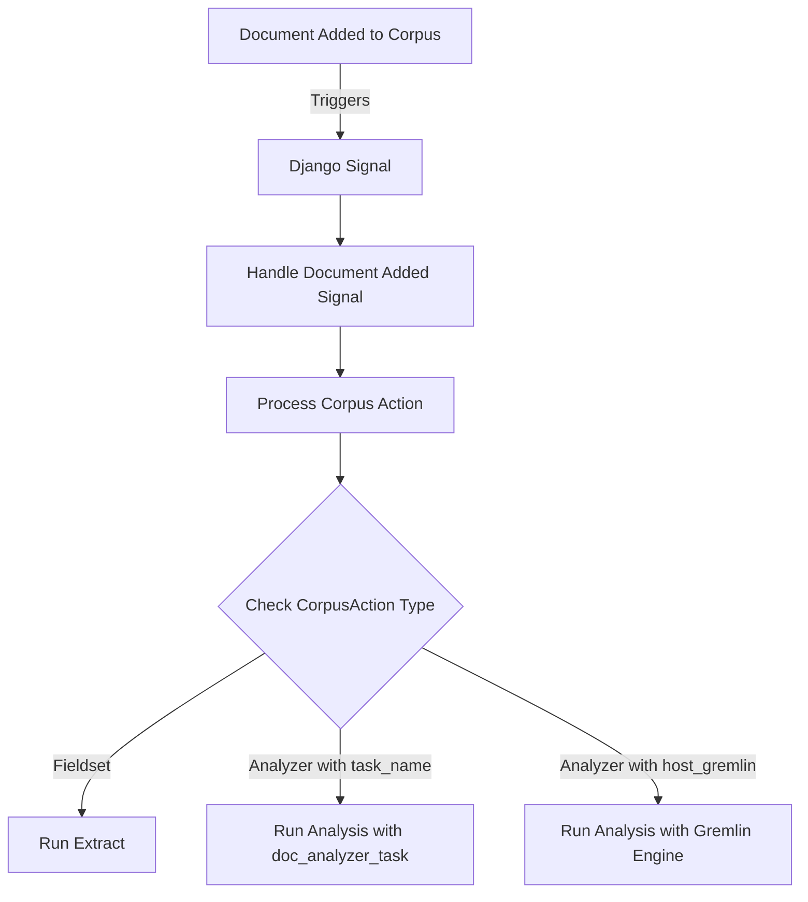

# CorpusAction System in OpenContracts: Revised Explanation

The CorpusAction system in OpenContracts automates document processing when new documents are added to a corpus. This
system is designed to be flexible, allowing for different types of actions to be triggered based on the configuration.

Within this system, users have three options for registering actions to run automatically on new documents:

1. Custom data extractors
2. Analyzer microservices
3. Celery tasks decorated with @doc_analyzer_task (a "task-based Analyzer")

The @doc_analyzer_task decorator is specifically designed for the third option, providing a straightforward way to
implement simple, span-based analytics directly within the OpenContracts ecosystem.

## Action Execution Overview

The following flowchart illustrates the CorpusAction system in OpenContracts, demonstrating the process that occurs when
a new document is added to a corpus. This automated workflow begins with the addition of a document, which triggers a
Django signal. The signal is then handled, leading to the processing of the corpus action. At this point, the system
checks the type of CorpusAction configured for the corpus. Depending on this configuration, one of three paths is taken:
running an Extract with a Fieldset, executing an Analysis with a doc_analyzer_task, or submitting an Analysis to a
Gremlin Engine. This diagram provides a clear visual representation of how the CorpusAction system automates document
processing based on predefined rules, enabling efficient and flexible handling of new documents within the OpenContracts
platform.



## Key Components

1. **CorpusAction Model**: Defines the action to be taken, including:
    - Reference to the associated corpus
    - Trigger type (e.g., ADD_DOCUMENT)
    - Reference to either an Analyzer or a Fieldset

2. **CorpusActionTrigger Enum**: Defines trigger events (ADD_DOCUMENT, EDIT_DOCUMENT)

3. **Signal Handlers**: Detect when documents are added to a corpus

4. **Celery Tasks**: Perform the actual processing asynchronously

## Process Flow

1. **Document Addition**: A document is added to a corpus, triggering a Django signal.

2. **Signal Handling**:
   ```python
   @receiver(m2m_changed, sender=Corpus.documents.through)
   def handle_document_added_to_corpus(sender, instance, action, pk_set, **kwargs):
       if action == "post_add":
           process_corpus_action.si(
               corpus_id=instance.id,
               document_ids=list(pk_set),
               user_id=instance.creator.id,
           ).apply_async()
   ```

3. **Action Processing**: The `process_corpus_action` task is called, which determines the appropriate action based on
   the CorpusAction configuration.

4. **Execution Path**: One of three paths is taken based on the CorpusAction configuration:

   a) **Run Extract with Fieldset**
    - If the CorpusAction is associated with a Fieldset
    - Creates a new Extract object
    - Runs the extract process on the new document(s)

   b) **Run Analysis with doc_analyzer_task**
    - If the CorpusAction is associated with an Analyzer that has a task_name
    - The task_name must refer to a function decorated with @doc_analyzer_task
    - Creates a new Analysis object
    - Runs the specified doc_analyzer_task on the new document(s)

   c) **Run Analysis with Gremlin Engine**
    - If the CorpusAction is associated with an Analyzer that has a host_gremlin
    - Creates a new Analysis object
    - Submits the analysis job to the specified Gremlin Engine

Here's the relevant code snippet showing these paths:

```python
@shared_task
def process_corpus_action(corpus_id: int, document_ids: list[int], user_id: int):
    corpus = Corpus.objects.get(id=corpus_id)
    actions = CorpusAction.objects.filter(
        corpus=corpus, trigger=CorpusActionTrigger.ADD_DOCUMENT
    )

    for action in actions:
        if action.fieldset:
            # Path a: Run Extract with Fieldset
            extract = Extract.objects.create(
                name=f"Extract for {corpus.title}",
                corpus=corpus,
                fieldset=action.fieldset,
                creator_id=user_id,
            )
            extract.documents.add(*document_ids)
            run_extract.si(extract_id=extract.id).apply_async()
        elif action.analyzer:
            analysis = Analysis.objects.create(
                analyzer=action.analyzer,
                analyzed_corpus=corpus,
                creator_id=user_id,
            )
            if action.analyzer.task_name:
                # Path b: Run Analysis with doc_analyzer_task
                task = import_string(action.analyzer.task_name)
                for doc_id in document_ids:
                    task.si(doc_id=doc_id, analysis_id=analysis.id).apply_async()
            elif action.analyzer.host_gremlin:
                # Path c: Run Analysis with Gremlin Engine
                start_analysis.si(analysis_id=analysis.id).apply_async()

```

This system provides a flexible framework for automating document processing in OpenContracts. By configuring
CorpusAction objects appropriately, users can ensure that newly added documents are automatically processed according to
their specific needs, whether that involves running extracts, local analysis tasks, or submitting to external Gremlin
engines for processing.
