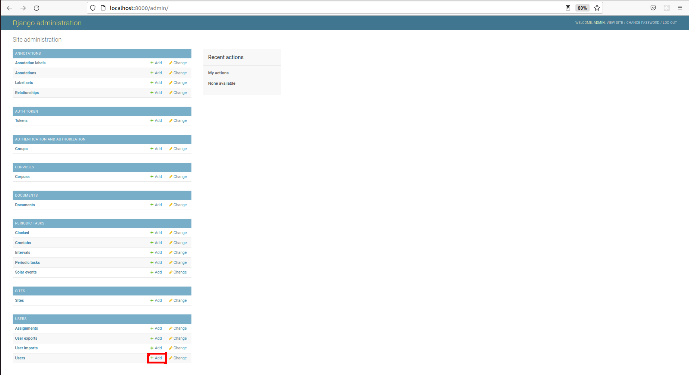
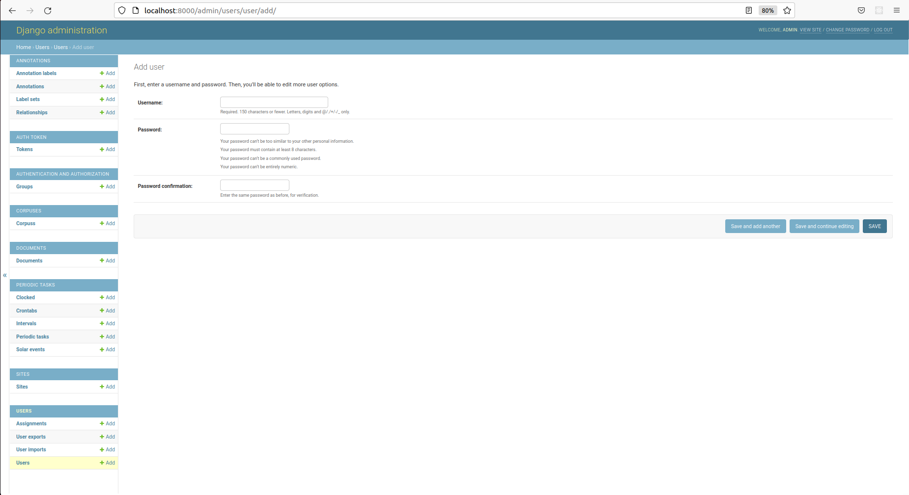

## Adding More Users

You can use the same User admin page described above to create new users. Alternatively, go back to the main admin page
`http://localhost:8000/admin` and, under the User section, click the "+Add" button:

Then, follow the on-screen instructions:

When you're done, the username and password you provided can be used to login.

OpenContracts is currently not built to allow users to self-register unless you use the Auth0 authentication. When managing
users yourself, you'll need to add, remove and modify users via the admin panels.
