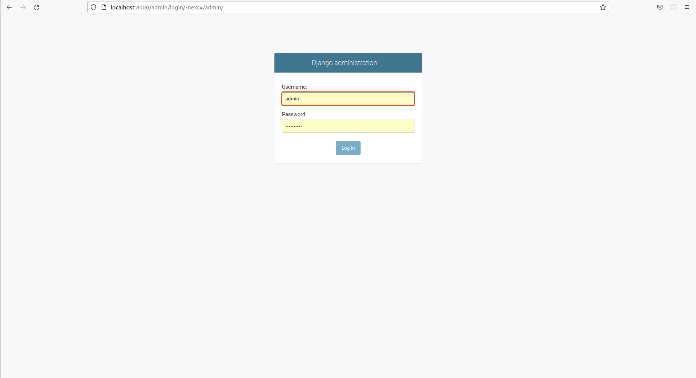
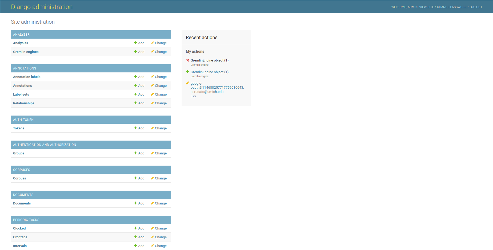
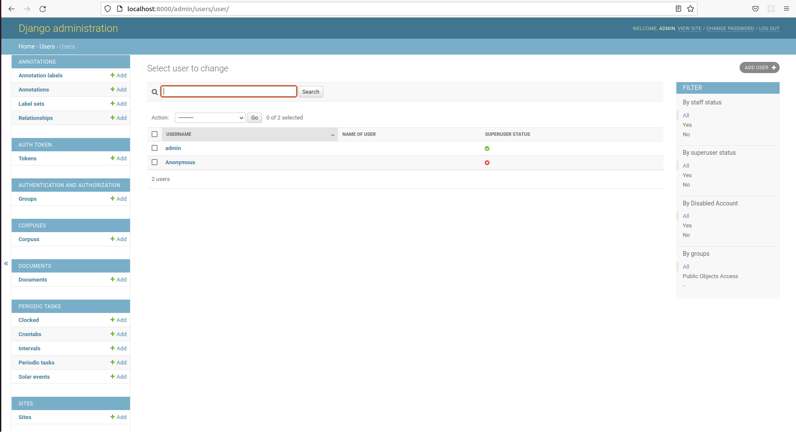
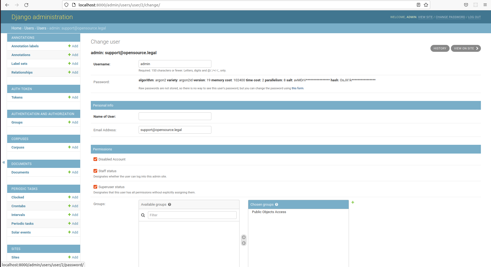

## Gremlin Admin Dashboard

Gremlin's backend is built on Django, which has its own powerful admin dashboard. This dashboard is not meant for end-users
and should only be used by admins. You can access the admin dashboard by going to the `/admin` page - e,g,
`opencontracts.opensource.legal/admin` or `http://localhost:8000/admin`. For the most part, you shouldn't need to use
the admin dashboard and should only go in here if you're experience errors or unexpected behavior and
want to look at the detailed contents of the database to see if it sheds any light on what's happening with a give
corpus, document, etc.

By default, Gremlin creates an admin user for you. If you don't specify the username and password
in your environment on first boot, it'll use system defaults. You can customize the default
username and password via environment variables or after the system boots using the admin dash.

## Configure Username and Password Prior to First Deployment

If the variable `DJANGO_SUPERUSER_USERNAME` is set, that will be the default admin user created on startup (the first
time your run `docker-compose -f local.yml up`). The repo ships with a default superuser username of `admin`.
The default password is set using the `DJANGO_SUPERUSER_PASSWORD` variable. The environment files for local deployments
(**but not production**) include a default password of `Openc0ntracts_def@ult`. **You should change this in the
environment file *before* the first start OR, follow the instructions below to change it *after* the first start.**

If you modify these environment variables in the environment file BEFORE running the docker-compose `up` command
for the first time, your initial superuser will have the username, email and/or password you specify. If you don't
modify the defaults, you can change them after you have created them via the admin dashboard (see below).

## After First Deployment via Admin Dashboard

Once the default superuser has been created, you'll need to use the admin dashboard to modify it.

To manage users, including changing the password, you'll need to access the backend admin dashboard. OpenContracts
is built on Django, which ships with [Django Admin](https://docs.djangoproject.com/en/4.0/ref/contrib/admin/), a tool
to manage low-level object data and users. It doesn't provide the rich, document focused UI/UX our frontend does, but
it does let you edit and delete objects created on the frontend if, for any reason, you are unable to fix something
done by a frontend user (e.g. a corrupt file is uploaded and cannot be parsed or rendered properly on the frontend).

To update your users, first login to the admin panel:

Then, in the lefthand navbar, find the entry for "Users" and click on it

Then, you'll see a list of all users for this instance. You should see your admin user
and an "Anonymous" user. The Anonymous user is required for public browsing of objcets with their `is_public` field set
to True. The Anonymous user cannot see other objects.

Click on the admin user to bring up the detailed user view:

Now you can click the "WHAT AM I CALLED" button to bring up a dialog to change the user password.
