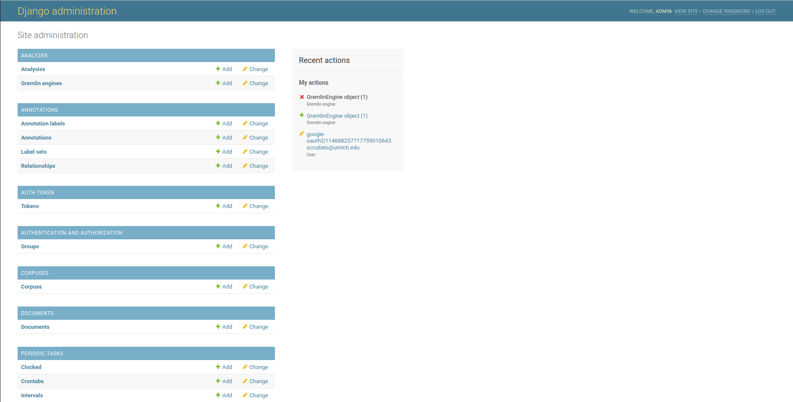

[Gremlin](https://github.com/JSv4/GremlinEngine) is a separate project by OpenSource Legal to provide a standard API to
access NLP capabilities. This lets us wrap multiple NLP engines / techniques in the same API which lets us build tools
that can readily consume the outputs of very different NLP libraries (etc. a Transformers-based
model like BERT, and tools like SPACY and LexNLP can be deployed on Gremlin and the outputs from all three can
readily be rendered in OpenContracts).

OpenContracts is designed to work with Gremlin out-of-the-box. We have a sample compose yaml file showing how to do
this on a local machine `local_deploy_with_gremlin.yaml` and as a web-facing application
`production_deploy_with_gremlin.yaml`.

When you add a new Gremlin Engine to the database, OpenContracs will automatically query it for its installed
analyzers and labels. These will then be available within OpenContracts, and you can use an analyzer to analyze
any OpenContracts corpus.

While we have plans to automatically "install" the default Gremlin on first boot, currently **you must manually go
into the OpenContracts admin dash and add the Gremlin.** Thankfully, this is an easy process:

1. In your environment file, make sure you set `CALLBACK_ROOT_URL_FOR_ANALYZER`
       1. For local deploy, use `CALLBACK_ROOT_URL_FOR_ANALYZER=http://localhost:8000`
       2. For production deploy, use `http://django:5000`. Why the change? Well, in our local
          docker compose stack, the host the localhost and the django development server runs on port 8000. In
          production, we want Gremlin to communicate with the OpenContracts container ("django") via its
          hostname on the docker compose stack's network. The production OpenContracts container also uses
          gunicorn on port 5000 instead of the development server on port 8000, so the port changes too.
2. Go to the admin page:
   
3. Click "Add+" in the Gremlin row to bring up the *Add Gremlin Engine* form. You just need to set the creator
   Url fields (the url for our default config is `http://gremlinengine:5000`). If, for some reason, you don't want
   the analyzer to be visible to any unauthenticated user, unselect the `is_public` box :
   
4. This will automatically kick off an install process that runs in the background. When it's complete, you'll see the
   "Install Completed" Field change. It should take a second or two. At the moment, we don't handle errors in this
   process, so, if it doesn't complete successfully in 30 seconds, there is probably a misconfiguration somewhere. We
   plan to improve our error handling for these backend installation processes.

Note, in our example implementations, Gremlin is NOT encrypted or API Key secured to outside traffic. It's not exposed
to outside traffic either per our docker compose config, so this shouldn't be a major concern. If you do expose the
container to the host via your Docker Compose file, you should ensure you run the traffic through Treafik and setup
API Key authentication.
