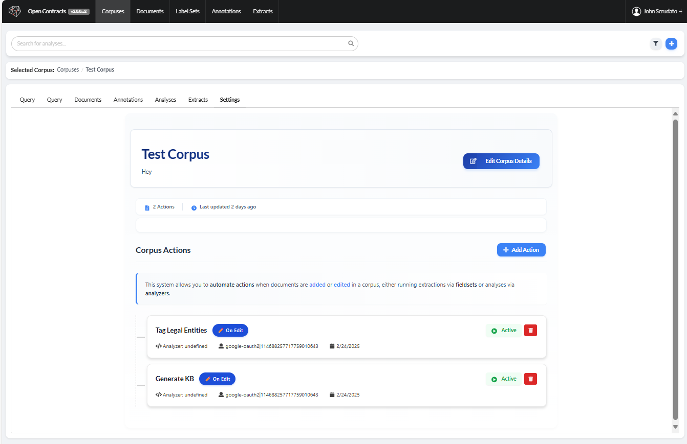

# Using Corpus Actions

This system allows you to automate actions when documents are added or edited in a corpus, either running extractions via fieldsets or analyses via analyzers.

## Via the GUI

For Corpuses you *own*, you can go to the Corpus settings tab and view configured actions or configure new actions:



## Via API

### 1. Querying Document Actions

First, you can query the available actions for a document in a corpus using the `document_corpus_actions` query:

```graphql
query GetDocumentActions($documentId: ID!, $corpusId: ID!) {
  document_corpus_actions(documentId: $documentId, corpusId: $corpusId) {
    corpus_actions {
      id
      name
      trigger
      disabled
      run_on_all_corpuses
      fieldset {
        id
        name
      }
      analyzer {
        id
        name
      }
    }
    extracts {
      id
      name
    }
    analysis_rows {
      id
    }
  }
}
```

### 2. Creating a New Corpus Action

To create a new action that triggers when documents are added or edited, use the `create_corpus_action` mutation:

```graphql
mutation CreateCorpusAction(
  $corpusId: ID!,
  $trigger: String!,
  $name: String,
  $fieldsetId: ID,
  $analyzerId: ID,
  $disabled: Boolean,
  $runOnAllCorpuses: Boolean
) {
  create_corpus_action(
    corpusId: $corpusId,
    trigger: $trigger,
    name: $name,
    fieldsetId: $fieldsetId,
    analyzerId: $analyzerId,
    disabled: $disabled,
    runOnAllCorpuses: $runOnAllCorpuses
  ) {
    ok
    message
    obj {
      id
      name
      trigger
      disabled
      run_on_all_corpuses
    }
  }
}
```

#### Key Points:

1. **Required Fields**:
   - `corpusId`: The ID of the corpus to attach the action to
   - `trigger`: Must be either "add_document" or "edit_document"
   - Either `fieldsetId` OR `analyzerId` (but not both)

2. **Optional Fields**:
   - `name`: Custom name for the action (defaults to "Corpus Action")
   - `disabled`: Whether the action is initially disabled (defaults to false)
   - `runOnAllCorpuses`: Whether to run on all corpuses (defaults to false)

3. **Permissions**:
   - User must have UPDATE permission on the corpus
   - User must have READ permission on the fieldset (if using a fieldset)

#### Example Usage:

```graphql
# Create an action that runs a fieldset when documents are added
mutation {
  create_corpus_action(
    corpusId: "Q29ycHVzVHlwZTox",
    name: "Extract Contract Data",
    trigger: "add_document",
    fieldsetId: "RmllbGRzZXRUeXBlOjE=",
    disabled: false
  ) {
    ok
    message
    obj {
      id
      name
    }
  }
}

# Create an action that runs an analyzer when documents are edited
mutation {
  create_corpus_action(
    corpusId: "Q29ycHVzVHlwZTox",
    name: "Analyze Changes",
    trigger: "edit_document",
    analyzerId: "QW5hbHl6ZXJUeXBlOjE=",
    disabled: false
  ) {
    ok
    message
    obj {
      id
      name
    }
  }
}
```

#### Error Handling:

The mutation returns:
- `ok`: Boolean indicating success
- `message`: Description of the result or error
- `obj`: The created CorpusAction if successful, null if failed

Common error cases:
```graphql
{
  "ok": false,
  "message": "You don't have permission to create actions for this corpus",
  "obj": null
}

{
  "ok": false,
  "message": "Exactly one of fieldset_id or analyzer_id must be provided",
  "obj": null
}

{
  "ok": false,
  "message": "You don't have permission to use this fieldset",
  "obj": null
}
```
