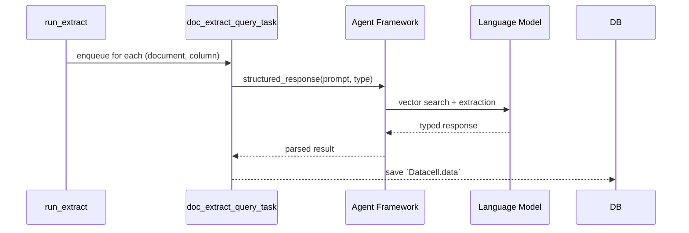

# Extracting Structured Data from Documents

> **Status: up-to-date for `JSv4/context-aware-layout` branch**
>
> The documentation below reflects the implementation that ships with this branch.  If you continue to see discrepancies please file an issue so we can correct them.

---

## High-level idea

OpenContracts can turn any collection of documents into a **spread-sheet-like data grid**.  You decide *what* you want to extract (via a **Fieldset**) and the system will:

1. Fan-out work across documents and columns using Celery.
2. Use our battle-tested **structured extraction API** powered by advanced LLM agents.
3. Enforce constraints (e.g., `must_contain_text`, `limit_to_label`) through intelligent prompting.
4. Parse results into Python primitives or Pydantic models with guaranteed type safety.

Everything is orchestrated by two Celery tasks:

* **`run_extract`** – creates the individual cells and queues work.
* **`doc_extract_query_task`** – performs the actual extraction using our agent framework.


## Orchestration (`run_extract`)

```18:54:opencontractserver/tasks/extract_orchestrator_tasks.py
@shared_task
def run_extract(extract_id: Optional[str | int], user_id: str | int):
    ...  # creates Datacells and queues doc_extract_query_task for each
```

Key facts verified in the code-above:

* One **`Datacell`** is created per *document × column* pair.
* Each cell's `column.task_name` is used to look up the Celery task to invoke (defaults to `opencontractserver.tasks.data_extract_tasks.doc_extract_query_task`).
* A `chord(group(*tasks))` waits for all cells then calls `mark_extract_complete`.


## Per-cell pipeline (`doc_extract_query_task`)

```309:330:opencontractserver/tasks/data_extract_tasks.py
async def doc_extract_query_task(
    cell_id: int, similarity_top_k: int = 10, max_token_length: int = 64000
) -> None:
    """OpenContracts' BLAZING FAST agent-based data extraction pipeline."""
```

The task performs **six** steps:

1. **Set-up** – fetch the `Datacell`, mark it *started*, and validate corpus membership.
2. **Type parsing** – convert `column.output_type` string to a Python type (handling `extract_is_list`).
3. **Prompt construction** – build extraction prompt from `query` or `match_text`.
4. **System prompt** – craft constraints from `must_contain_text` and `limit_to_label`.
5. **Extract!** – call `agents.get_structured_response_from_document()` with PydanticAI framework.
6. **Save results** – convert response to appropriate format and mark cell complete.

### Key improvements

* **No more flaky marvin parsing** – structured extraction is handled by our proven agent framework
* **Better error handling** – extraction failures are properly tracked with meaningful messages
* **Type safety** – the framework ensures responses match the requested type
* **Constraint enforcement** – `must_contain_text` and `limit_to_label` are baked into the system prompt

### Source tracking

While the structured response API doesn't expose sources directly (by design – sources are for conversational agents), the extraction is grounded in document content through vector search under the hood.

## Sequence diagram



## Column configuration

The `Column` model drives extraction behavior:

* **`query`** or **`match_text`** – the extraction prompt (one required)
* **`output_type`** – Python type as string (e.g., "str", "int", "list[str]")
* **`extract_is_list`** – whether to wrap the type in `List[]`
* **`must_contain_text`** – only extract from sections containing this text
* **`limit_to_label`** – only extract from annotations with this label
* **`instructions`** – additional context passed as `extra_context`
* **`task_name`** – defaults to our new extraction task

Note: The `agentic` field has been removed – all extractions now use our powerful agent framework!

## Next steps

* **Complex types** – expand `output_type` to support JSON schemas for Pydantic models
* **Multi-step extraction** – leverage conversation history for dependent extractions
* **Cross-document** – use corpus agents for aggregating data across documents
* **Custom models** – allow users to register their own Pydantic models for extraction

## Async Task Decorators

The `doc_extract_query_task` task uses our `@celery_task_with_async_to_sync()` decorator to handle async functions in Celery:

```python
@celery_task_with_async_to_sync()
async def doc_extract_query_task(
    cell_id: int, similarity_top_k: int = 10, max_token_length: int = 64000
) -> None:
    # ... async implementation
```

This decorator pattern:
* Converts async functions to sync using `asgiref.sync.async_to_sync`
* Properly handles database connections without forcibly closing them
* Works seamlessly in both test environments and production Celery workers
* Avoids complex event loop management

### Important for Testing

When testing async Celery tasks:
1. Use `TransactionTestCase` instead of `TestCase` for better transaction handling
2. Call tasks with `.apply()` for synchronous execution in tests
3. The decorator handles all async-to-sync conversion automatically

Example test pattern:
```python
from django.test import TransactionTestCase

class ExtractionTestCase(TransactionTestCase):
    def test_extraction(self):
        # Create datacell...
        doc_extract_query_task.si(datacell.id).apply()
        # Assert results...
```

This approach is more reliable than manual event loop management and prevents database connection issues that can occur with other async patterns.
