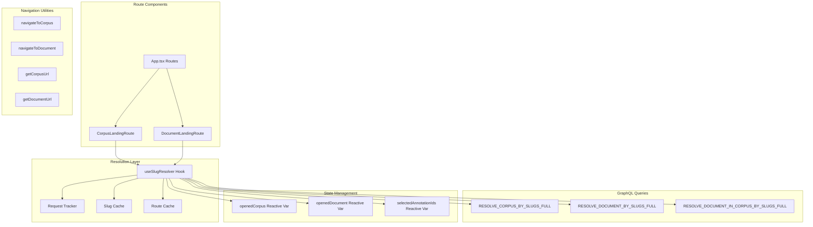
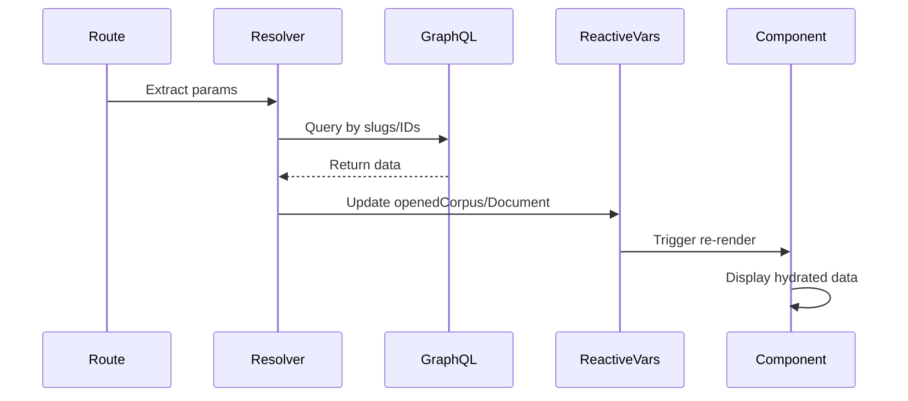

# OpenContracts Routing System Documentation

## Table of Contents

1. [Overview](#overview)
2. [Architecture](#architecture)
3. [Route Patterns](#route-patterns)
4. [Core Components](#core-components)
5. [Data Hydration](#data-hydration)
6. [Navigation Utilities](#navigation-utilities)
7. [GraphQL Integration](#graphql-integration)
8. [Annotation Handling](#annotation-handling)
9. [ID-Based Navigation & Redirection](#id-based-navigation--redirection)
10. [Performance & Caching](#performance--caching)
11. [Error Handling](#error-handling)
12. [Testing Guide](#testing-guide)
13. [Migration Guide](#migration-guide)
14. [Best Practices](#best-practices)

## Overview

The OpenContracts routing system uses explicit, deterministic slug-based routing with clear URL prefixes to eliminate ambiguity. Every route clearly indicates its content type through `/c/` (corpus) and `/d/` (document) prefixes. The system supports both slug-based and ID-based navigation, with IDs automatically redirecting to canonical slug URLs.

### Key Principles

- **Explicit Routes**: Clear patterns with `/c/` and `/d/` prefixes eliminate ambiguity
- **Slug-First**: Slugs are preferred for SEO and readability, IDs redirect to slug URLs
- **Deterministic**: Each URL pattern maps to exactly one route handler
- **Graceful Fallback**: ID-based URLs automatically resolve and redirect to canonical URLs
- **No Page Reloads**: Navigation uses React Router for smooth SPA transitions
- **Performant**: Single GraphQL query per route with efficient caching strategies

### Design Decisions

- **Hybrid Support**: Both slug and ID-based navigation work seamlessly
- **Canonical URLs**: IDs always redirect to slug-based canonical URLs for SEO
- **No Ambiguity**: Routes use explicit prefixes to avoid pattern conflicts
- **Smart Resolution**: Automatically detects IDs vs slugs and handles appropriately
- **Clear Intent**: URLs clearly communicate content type to users and crawlers

## Architecture



## Route Patterns

### Primary URL Patterns

| Pattern                                 | Example                       | Component            | Description                    |
| --------------------------------------- | ----------------------------- | -------------------- | ------------------------------ |
| **Corpus Routes**                      |                               |                      |                                |
| `/c/:userIdent/:corpusIdent`           | `/c/john/my-corpus`           | CorpusLandingRoute | Slug-based corpus route        |
| **Document Routes**                    |                               |                      |                                |
| `/d/:userIdent/:docIdent`              | `/d/john/my-document`         | DocumentLandingRoute | Standalone document            |
| `/d/:userIdent/:corpusIdent/:docIdent` | `/d/john/my-corpus/contract` | DocumentLandingRoute | Document within corpus context |
| **List Views**                         |                               |                      |                                |
| `/corpuses`                            | `/corpuses`                   | Corpuses             | Browse all corpuses            |
| `/documents`                           | `/documents`                  | Documents            | Browse all documents           |

### Query Parameters

| Parameter | Purpose                     | Example                        | Component Handling   |
| --------- | --------------------------- | ------------------------------ | -------------------- |
| `?ann=`   | Select specific annotations | `/d/john/doc?ann=123`          | DocumentLandingRoute |
|           | Multiple annotations        | `/d/john/doc?ann=123,456,789` | Comma-separated IDs  |

### Route Configuration (App.tsx)

```typescript
// Document routes - explicit /d/ prefix
<Route path="/d/:userIdent/:corpusIdent/:docIdent" element={<DocumentLandingRoute />} />
<Route path="/d/:userIdent/:docIdent" element={<DocumentLandingRoute />} />

// Corpus routes - explicit /c/ prefix
<Route path="/c/:userIdent/:corpusIdent" element={<CorpusLandingRoute />} />

// List views
<Route path="/corpuses" element={<Corpuses />} />
<Route path="/documents" element={<Documents />} />
```

### ID-Based Navigation (Auto-Redirect)

These patterns automatically redirect to canonical slug URLs:

- ✅ `/c/john/123` → `/c/john/my-corpus` (corpus ID redirects to slug)
- ✅ `/d/john/456` → `/d/john/my-document` (document ID redirects to slug)
- ✅ `/d/john/corpus/789` → `/d/john/corpus/doc` (mixed ID/slug supported)
- ✅ `/d/456` → `/d/john/my-document` (single ID redirects with user context)

### Deprecated Patterns

These patterns are NO LONGER SUPPORTED:

- ❌ `/corpuses/:corpusId` (use `/c/user/corpus`)
- ❌ `/documents/:documentId` (use `/d/user/document`)
- ❌ `/corpus/:corpusId/document/:documentId` (use new patterns)
- ❌ `/:userIdent/:secondIdent` (ambiguous - use explicit prefixes)

## Core Components

### DocumentLandingRoute

Handles all document routes with explicit `/d/` prefix.

**Route patterns:**
- `/d/:userIdent/:corpusIdent/:docIdent` - Document within a corpus
- `/d/:userIdent/:docIdent` - Standalone document

**Key Features:**
- Simple parameter extraction from route
- Uses `useSlugResolver` for data fetching
- Handles both standalone and corpus-context documents
- Clean error handling and loading states
- Automatic annotation selection from query params

### CorpusLandingRoute

Handles corpus routes with explicit `/c/` prefix.

**Route pattern:**
- `/c/:userIdent/:corpusIdent`

**Key Features:**
- Single route pattern to handle
- Uses `useSlugResolver` for data fetching
- Clean, minimal implementation
- Proper meta tags for SEO
- Automatic stats loading

### useSlugResolver Hook

Central hub for all slug resolution logic, handling both slug and ID-based navigation.

```typescript
interface SlugResolverOptions {
  userIdent?: string;
  corpusIdent?: string;
  documentIdent?: string;
  annotationIds?: string[];
  onResolved?: (result: SlugResolverResult) => void;
}

interface SlugResolverResult {
  loading: boolean;
  error: Error | undefined;
  corpus: CorpusType | null;
  document: DocumentType | null;
}
```

**Resolution Strategy:**

1. **Document in Corpus (3 identifiers)**
   - Pattern: `userIdent + corpusIdent + documentIdent`
   - Query: `RESOLVE_DOCUMENT_IN_CORPUS_BY_SLUGS_FULL`
   - Returns both corpus and document

2. **Standalone Document (2 identifiers)**
   - Pattern: `userIdent + documentIdent`
   - Query: `RESOLVE_DOCUMENT_BY_SLUGS_FULL`
   - Returns document only

3. **Corpus (2 identifiers)**
   - Pattern: `userIdent + corpusIdent`
   - Query: `RESOLVE_CORPUS_BY_SLUGS_FULL`
   - Returns corpus only

## Data Hydration

### State Management

The routing system manages global state through Apollo reactive variables:

```typescript
// Reactive variables for global state
export const openedCorpus = makeVar<CorpusType | null>(null);
export const openedDocument = makeVar<DocumentType | null>(null);
export const selectedAnnotationIds = makeVar<string[]>([]);
```

### Hydration Flow



### Hydration Guards

The system includes guards to prevent incomplete data from being set:

```typescript
// Never set incomplete corpus objects
if (corpus && corpus.id && corpus.slug && corpus.title) {
  openedCorpus(corpus);
}

// Never set incomplete document objects
if (document && document.id && document.slug && document.title) {
  openedDocument(document);
}
```

### Component Unmount Cleanup

Components clean up global state on unmount:

```typescript
useEffect(() => {
  return () => {
    // Clear reactive vars on unmount
    openedDocument(null);
    selectedAnnotationIds([]);
  };
}, []);
```

## Navigation Utilities

### URL Generation

```typescript
// Builds corpus URL - always with /c/ prefix
getCorpusUrl(corpus); // Returns: /c/john/my-corpus

// Builds document URL - always with /d/ prefix
getDocumentUrl(document, corpus); // Returns: /d/john/my-corpus/doc
getDocumentUrl(document); // Returns: /d/john/doc
```

**Important**: These functions return `"#"` if slugs are missing, preventing navigation to invalid routes.

### Smart Navigation

```typescript
// Navigate to corpus (won't navigate if already there)
navigateToCorpus(corpus, navigate, currentPath);

// Navigate to document (won't navigate if already there)
navigateToDocument(document, corpus, navigate, currentPath);
```

These functions:
- Check if already at destination
- Prevent navigation without slugs
- Use replace navigation for cleaner history
- Use React Router's `navigate()` to avoid full page reloads

### Document Closing Behavior

When closing a document:

```typescript
const handleClose = () => {
  // Uses React Router navigation (no page reload)
  if (corpus) {
    navigate(`/c/${corpus.creator.slug}/${corpus.slug}`);
  } else {
    navigate("/documents");
  }
};
```

Benefits:
- **No Page Reload**: Smooth SPA transition
- **State Preservation**: App state remains intact
- **Fast Navigation**: Instant UI updates
- **Proper Cleanup**: Reactive vars cleared on unmount

## GraphQL Integration

### Query Strategy

The resolver selects queries based on available parameters:

```typescript
// Document in corpus - full context
if (userIdent && corpusIdent && documentIdent) {
  // Uses RESOLVE_DOCUMENT_IN_CORPUS_BY_SLUGS_FULL
  // Returns both corpus and document
}

// Standalone document
else if (userIdent && documentIdent && !corpusIdent) {
  // Uses RESOLVE_DOCUMENT_BY_SLUGS_FULL
  // Returns document only
}

// Corpus only
else if (userIdent && corpusIdent && !documentIdent) {
  // Uses RESOLVE_CORPUS_BY_SLUGS_FULL
  // Returns corpus only
}
```

### GraphQL Queries

#### Corpus Resolution

```graphql
query ResolveCorpusBySlugsFull($userSlug: String!, $corpusSlug: String!) {
  corpusBySlugs(userSlug: $userSlug, corpusSlug: $corpusSlug) {
    id
    slug
    title
    description
    mdDescription
    created
    modified
    isPublic
    myPermissions
    creator {
      id
      username
      slug
    }
    labelSet {
      id
      title
      description
    }
    descriptionRevisions(first: 5) {
      edges {
        node {
          id
          description
          created
        }
      }
    }
  }
}
```

#### Document Resolution

```graphql
query ResolveDocumentBySlugsFull($userSlug: String!, $documentSlug: String!) {
  documentBySlugs(userSlug: $userSlug, documentSlug: $documentSlug) {
    id
    slug
    title
    description
    pdfFile {
      id
      url
      name
      size
    }
    creator {
      id
      username
      slug
    }
    corpus {
      id
      slug
      title
      creator {
        id
        username
        slug
      }
    }
    # ... other fields
  }
}
```

### Fetch Policies

```typescript
fetchPolicy: "cache-first"
nextFetchPolicy: "cache-and-network"
```

- Initial load uses cache if available
- Subsequent loads check network for updates
- Provides fast initial render with fresh data updates

## Annotation Handling

### Overview

The navigation system supports deep linking to specific annotations within documents through query parameters.

### URL Format

```
/d/john/my-document?ann=annotation-id
/d/john/my-corpus/doc?ann=id1,id2,id3
```

### Parameter Processing

```typescript
// Extract annotation IDs from URL
const [searchParams] = useSearchParams();
const annParam = searchParams.get("ann");
const annotationIds = annParam ? annParam.split(",").filter(Boolean) : [];

// Set global state
if (annotationIds.length > 0) {
  selectedAnnotationIds(annotationIds);
}
```

### Navigation with Annotations

```typescript
// Navigate to annotation
const url = getDocumentUrl(document, corpus);
navigate(`${url}?ann=${annotation.id}`);

// Navigate to multiple annotations
const annotationIds = [id1, id2, id3].join(",");
navigate(`${url}?ann=${annotationIds}`);
```

### Components That Navigate with Annotations

- **QueryResultsViewer**: Navigate to annotation from query results
- **AnnotationCards**: Navigate to selected annotation
- **ExtractCellFormatter**: Navigate to source annotations
- **DataCell**: Navigate to extract source annotations

## ID-Based Navigation & Redirection

### Overview

The system supports GraphQL ID-based navigation with automatic redirection to canonical slug URLs, ensuring backward compatibility while maintaining SEO-friendly URLs.

### ID Detection

The system automatically detects GraphQL IDs:

- Numeric IDs (e.g., `123`, `456789`)
- Base64 encoded IDs (e.g., `Q29ycHVzOjEyMw==`)
- GID prefixed IDs (e.g., `gid://app/Corpus/123`)

### Resolution Process

```typescript
// When an ID is detected in the URL
if (isValidGraphQLId(identifier)) {
  // 1. Query for entity by ID
  const entity = await resolveEntityById(identifier);
  
  // 2. Extract slug information
  const slugUrl = buildCanonicalUrl(entity);
  
  // 3. Redirect to slug URL (preserving query params)
  navigate(slugUrl, { replace: true });
}
```

### Supported ID Patterns

| Pattern     | Example              | Resolution             | Final URL                    |
| ----------- | -------------------- | ---------------------- | ---------------------------- |
| Corpus ID   | `/c/john/123`        | Queries corpus by ID   | `/c/john-doe/my-corpus`      |
| Document ID | `/d/john/456`        | Queries document by ID | `/d/john-doe/my-document`    |
| Mixed       | `/d/john/corpus/789` | Queries document by ID | `/d/john/corpus/my-document` |
| Single ID   | `/d/789`             | Queries document by ID | `/d/john-doe/my-document`    |

### ID Resolution Queries

```graphql
# Corpus ID resolution
query GetCorpusByIdForRedirect($id: ID!) {
  corpus(id: $id) {
    id
    slug
    title
    creator {
      id
      slug
      username
    }
  }
}

# Document ID resolution
query GetDocumentByIdForRedirect($id: String!) {
  document(id: $id) {
    id
    slug
    title
    creator {
      id
      slug
      username
    }
    corpus {
      id
      slug
      title
      creator {
        id
        slug
        username
      }
    }
  }
}
```

## Performance & Caching

### Three-Layer Caching Strategy

1. **Route Cache** (In-Memory)
```typescript
// Prevents re-processing of same route
const routeCache = new Map<string, ProcessedRoute>();
```

2. **Slug Cache** (In-Memory)
```typescript
// Caches slug resolutions
const slugCache = new Map<string, { corpus?: string; document?: string }>();
```

3. **Apollo Cache** (GraphQL)
- Normalized cache for GraphQL responses
- Shared across all components
- Automatic cache updates on mutations

### Request Deduplication

```typescript
class RequestTracker {
  private pendingRequests = new Map<string, Promise<any>>();
  
  // Prevents duplicate simultaneous requests
  // Returns existing promise if request pending
  async track(key: string, request: () => Promise<any>) {
    if (this.pendingRequests.has(key)) {
      return this.pendingRequests.get(key);
    }
    
    const promise = request();
    this.pendingRequests.set(key, promise);
    
    try {
      const result = await promise;
      return result;
    } finally {
      this.pendingRequests.delete(key);
    }
  }
}
```

### Performance Monitoring

```typescript
performanceMonitor.startMetric("slug-resolution", {
  userIdent,
  corpusIdent,
  documentIdent,
});

// ... resolution logic ...

performanceMonitor.endMetric("slug-resolution", {
  success: true,
  cacheHit: fromCache,
});
```

Tracks:
- Resolution time
- Success/failure rates
- Cache hit rates
- Query performance

## Error Handling

### Error States

1. **Missing Slugs**
```typescript
if (!corpus.slug || !corpus.creator?.slug) {
  console.warn("Cannot generate corpus URL without slugs");
  return "#"; // Safe fallback
}
```

2. **Not Found**
```typescript
if (!document) {
  navigate("/404", { replace: true });
  return;
}
```

3. **Invalid Routes**
```typescript
if (!userIdent) {
  setState({
    error: new Error("Missing required route parameters"),
    loading: false,
  });
}
```

4. **Network Errors**
```typescript
catch (error) {
  console.error("Failed to resolve route:", error);
  navigate("/404", { replace: true });
}
```

### User Experience

- Clear error messages in console
- Graceful fallbacks to safe states
- 404 page for not found content
- Loading states during resolution
- Network error handling with retries

## Testing Guide

### Unit Tests

```typescript
describe("Navigation URLs", () => {
  it("generates corpus URL with prefix", () => {
    const corpus = {
      id: "1",
      slug: "my-corpus",
      creator: { slug: "john" },
    };
    expect(getCorpusUrl(corpus)).toBe("/c/john/my-corpus");
  });

  it("returns safe fallback without slugs", () => {
    const corpus = { id: "1" };
    expect(getCorpusUrl(corpus)).toBe("#");
  });
});
```

### Integration Tests

```typescript
describe("Route Resolution", () => {
  it("resolves corpus route", async () => {
    render(<CorpusLandingRoute />, {
      route: "/c/john/my-corpus",
    });

    await waitFor(() => {
      expect(screen.getByText("My Corpus")).toBeInTheDocument();
    });
  });

  it("redirects ID to slug", async () => {
    const { result } = renderHook(() => useSlugResolver({
      userIdent: "john",
      corpusIdent: "123", // ID
    }));

    await waitFor(() => {
      expect(mockNavigate).toHaveBeenCalledWith(
        "/c/john/my-corpus",
        { replace: true }
      );
    });
  });
});
```

### Component Tests (Playwright)

```typescript
test("navigates to document with annotation", async ({ mount, page }) => {
  await mount(<DocumentCard document={mockDocument} />);
  
  await page.click('[data-testid="annotation-link"]');
  
  await expect(page).toHaveURL(/\/d\/.*\?ann=\d+/);
});
```

### E2E Test Scenarios

1. **Corpus Navigation**
   - Navigate to `/c/john/my-corpus`
   - Verify corpus loads
   - Check meta tags

2. **Document Navigation**
   - Navigate to `/d/john/doc`
   - Verify document loads
   - Test close navigation

3. **Document in Corpus**
   - Navigate to `/d/john/corpus/doc`
   - Verify both corpus and document load
   - Check breadcrumbs

4. **Annotation Navigation**
   - Navigate to `/d/john/doc?ann=123`
   - Verify annotation selected
   - Test multiple annotations

5. **ID Redirection**
   - Navigate to `/c/john/123`
   - Verify redirect to `/c/john/my-corpus`
   - Check query params preserved

6. **Error Handling**
   - Navigate to invalid routes
   - Verify 404 page
   - Check console warnings

## Migration Guide

### From Legacy Routes

All legacy routes must be updated to use the new explicit patterns:

| Old Pattern                          | New Pattern                           |
| ------------------------------------ | ------------------------------------- |
| `/corpuses/[id]`                     | `/c/[user]/[corpus]`                  |
| `/documents/[id]`                    | `/d/[user]/[document]`                |
| `/corpus/[id]/document/[id]`        | `/d/[user]/[corpus]/[document]`       |
| `/[user]/[item]`                    | `/c/[user]/[corpus]` or `/d/[user]/[document]` |

### Backend Requirements

1. **Slugs Required**
   - All entities must have `slug` field
   - All entities must have `creator.slug`

2. **GraphQL Queries**
   - Implement slug-based resolution queries
   - Support ID-based fallback queries

3. **URL Generation**
   - Use utility functions for all URL generation
   - Never hardcode URLs

### Component Updates

```typescript
// Old
const url = `/corpuses/${corpus.id}`;

// New
import { getCorpusUrl } from "utils/navigationUtils";
const url = getCorpusUrl(corpus);
```

### Handling Missing Slugs

```typescript
// Check before navigation
const url = getDocumentUrl(document);
if (url === "#") {
  console.error("Cannot navigate: missing slugs");
  return;
}
navigate(url);
```

## Best Practices

### DO

- ✅ Always use navigation utility functions
- ✅ Use explicit route prefixes (`/c/`, `/d/`)
- ✅ Handle missing slugs gracefully
- ✅ Use TypeScript types for route params
- ✅ Test navigation flows thoroughly
- ✅ Preserve annotation parameters when navigating
- ✅ Use comma-separated IDs for multiple annotations
- ✅ Clean up reactive vars on component unmount
- ✅ Check for "#" return from URL generators

### DON'T

- ❌ Hardcode navigation URLs
- ❌ Assume slugs exist
- ❌ Use raw IDs for navigation (they will redirect)
- ❌ Create ambiguous routes
- ❌ Add fallback logic for legacy routes
- ❌ Forget to append `?ann=` when navigating to annotations
- ❌ Navigate without checking URL generation success
- ❌ Set incomplete objects in reactive vars
- ❌ Skip cleanup on component unmount

### Code Examples

#### Correct Navigation

```typescript
// Good - uses utility function
const handleNavigate = () => {
  const url = getCorpusUrl(corpus);
  if (url !== "#") {
    navigate(url);
  }
};

// Good - preserves annotations
const navigateWithAnnotation = (annotationId: string) => {
  const baseUrl = getDocumentUrl(document, corpus);
  navigate(`${baseUrl}?ann=${annotationId}`);
};
```

#### Incorrect Navigation

```typescript
// Bad - hardcoded URL
navigate(`/corpuses/${corpus.id}`);

// Bad - assumes slug exists
navigate(`/c/${corpus.creator.slug}/${corpus.slug}`);

// Bad - doesn't check for valid URL
navigate(getCorpusUrl(corpus)); // Could be "#"
```

## Summary

The OpenContracts routing system provides:

- **Explicit Routes**: Clear `/c/` and `/d/` prefixes eliminate ambiguity
- **Simple Implementation**: Minimal code, easy to understand
- **Deterministic Behavior**: Each URL maps to exactly one handler
- **Performance**: Single query per route, efficient caching
- **Maintainability**: Clean separation of concerns
- **SEO Friendly**: Canonical slug-based URLs with ID redirection
- **Developer Experience**: TypeScript types, utility functions, clear patterns
- **User Experience**: Fast navigation, deep linking, error handling

The system requires slugs for canonical URLs but supports ID-based navigation through automatic redirection, providing both backward compatibility and forward-looking clean URLs.