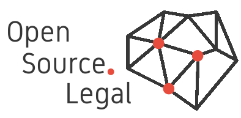

# OpenContracts

### The Free and Open Source Document Analysis Platform
---

{ align="left" width="300" role="img" }

| |                                                                                                                                                                                                                                                                                                                                                                                                                                                                                                               |
| --- |---------------------------------------------------------------------------------------------------------------------------------------------------------------------------------------------------------------------------------------------------------------------------------------------------------------------------------------------------------------------------------------------------------------------------------------------------------------------------------------------------------------|
| CI/CD | { loading=lazy }                                                                                                                                                                                                                                                                                                                                       |
| Meta | [{ loading=lazy }](https://github.com/psf/black) [{ loading=lazy }](https://github.com/python/mypy) [{ loading=lazy }](https://github.com/pycqa/isort) [{ loading=lazy }](https://spdx.org/licenses/) |

## What Does it Do?

OpenContracts is an **Apache-2 Licensed** software application to label, share and search annotate documents.
It's  designed specifically to label documents with complex layouts such as contracts, scientific papers, newspapers,
etc.

When combine with a NLP processing engine like Gremlin Engine (another of our open source projects),
OpenContracts not only lets humans collaborate on and share document annotations, it also can analyze and export data
from contracts using state-of-the-art NLP technology.

## Why Does it Exist?

The OpenContracts stack is designed to provide a cutting edge frontend experience while providing access to the
incredible machine learning and natural language processing capabilities of Python. For this reason, our frontend is
based on React. We use a GraphQL API to connect it to a django-based backend. Django is a incredibly mature,
battle-tested framework that is written in Python, so integrating all the amazing Python-based AI and NLP libraries out
there is super easy.

We'd like to give credit to AllenAI's PAWLs project for our document annotating component. We rewrote most of the
code base and replaced their backend entirely, so it was hard to keep , but we believe in giving credit where it's due!
We are relying on their document parser, however, as it produces a really excellent text and x-y coordinate layer that
we'd encourage others to use as well in similar applications that require you to interact with complex text layouts.

## Limitations

At the moment, it only works with PDFs. In the future, it will be able to convert other document types to PDF for
storage and labeling. PDF is an excellent format for this as it introduces a consistent, repeatable format which we can
use to generate a text and x-y coordinate layer from scratch. Formats like .docx and .html are too complex and varied
to provide an easy, consistent format. Likewise, the output quality of many converters and tools is sub-par and these
tools can produce very different document structures for the same inputs.

## About OpenSource.Legal

OpenSource.Legal believes that the effective, digital transformation of the legal services industry and the execution of
"the law", broadly speaking, requires shared solutions and tools to solve some of the problems that are common to almost
every legal workflow. The current splintering of service delivery into dozens of incompatible platforms with limited
configurations threatens to put software developers and software vendors in the driver seat of the industry. We firmly
believe that lawyers and legal engineers, armed with easily configurable and *extensible* tools can much more effectively
design the workflows and user experiences that they need to deliver and scale their expertise.

Visit us at https://opensource.legal for a directory of open source legal projects and an overview of our
projects.
