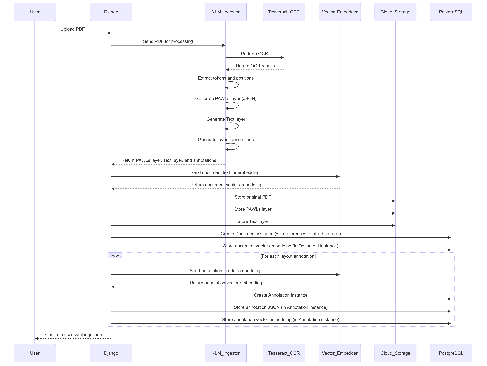

# Open Contracts

## The Free and Open Source Document Analytics Platform

---

| |                                                                                                                                                                                                                                                                                                                                                                                                                                                                                            |
| --- |--------------------------------------------------------------------------------------------------------------------------------------------------------------------------------------------------------------------------------------------------------------------------------------------------------------------------------------------------------------------------------------------------------------------------------------------------------------------------------------------|
| CI/CD |                                                                                                                                                                                                                                                                                                                   |
| Meta |     |

## What Does it Do?

OpenContracts is an **Apache-2 Licensed** enterprise document analytics tool. It provides several key features:

1. **Manage Documents** - Manage document collections (`Corpuses`)
2. **Custom Metadata Schemas** - Define structured metadata fields with validation for consistent data collection
3. **Layout Parser** - Automatically extracts layout features from PDFs
4. **Automatic Vector Embeddings** - generated for uploaded PDFs and extracted layout blocks
5. **Pluggable microservice analyzer architecture** - to let you analyze documents and automatically annotate them
6. **Human Annotation Interface** - to manually annotated documents, including multi-page annotations.
7. **LlamaIndex Integration** - Use our vector stores (powered by pgvector) and any manual or automatically annotated features
   to let an LLM intelligently answer questions.
8. **Data Extract** - ask multiple questions across hundreds of documents using complex LLM-powered querying behavior.
   Our sample implementation uses our battle-tested agent framework for precise data extraction and natural language querying.
9. **Custom Data Extract** - Custom data extract pipelines can be used on the frontend to query documents in bulk.

## Key Docs

1. [Quickstart Guide](quick-start.md) - You'll probably want to get started quickly. Setting up locally should be
   pretty painless if you're already running Docker.
2. [Basic Walkthrough](walkthrough/key-concepts.md) - Check out the walkthrough to step through basic usage of the
   application for document and annotation management.
3. [Metadata System](features/metadata-overview.md) - Learn how to define custom metadata schemas for your documents
   with comprehensive validation and type safety.
4. [PDF Annotation Data Format Overview](architecture/PDF-data-layer.md) - You may be interested how we map text to
   PDFs visually and the underlying data format we're using.
5. [Django + Pgvector Powered Hybrid Vector Database](extract_and_retrieval/intro_to_django_annotation_vector_store.md)
   We've used the latest open source tooling for vector storage in postgres to make it almost trivially easy to
   combine structured metadata and vector embeddings with an API-powered application.
6. [LlamaIndex Integration Walkthrough](extract_and_retrieval/intro_to_django_annotation_vector_store.md) - We wrote a
   wrapper for our backend database and vector store to make it simple to load our parsed annotations, embeddings and
   text into LlamaIndex. Even better, if you have additional annotations in the document, the LLM can access those too.
7. [Write Custom Data Extractors](walkthrough/advanced/write-your-own-extractors.md) - Custom data extract tasks (which
   can use LlamaIndex or can be totally bespoke) are automatically loaded and displayed on the frontend to let user's
   select how to ask questions and extract data from documents.

## Architecture and Data Flows at a Glance

### Core Data Standard

The core idea here - besides providing a platform to analyze contracts - is an open and standardized architecture that
makes data extremely portable. Powering this is a set of data standards to describe the text and layout blocks on a PDF
page:

### Robust PDF Processing Pipeline

We have a robust PDF processing pipeline that is horizontally scalable and generates our standardized data
consistently for PDF inputs (We're working on adding additional formats soon):

Special thanks to Nlmatics and [nlm-ingestor](https://github.com/nlmatics/nlm-ingestor) for powering the layout parsing
and extraction.

## Limitations

At the moment, it only works with PDFs. In the future, it will be able to convert other document types to PDF for
storage and labeling. PDF is an excellent format for this as it introduces a consistent, repeatable format which we can
use to generate a text and x-y coordinate layer from scratch.

**Adding OCR and ingestion for other enterprise documents is a priority**.

## Acknowledgements

Special thanks to AllenAI's [PAWLS project](https://github.com/allenai/pawls) and Nlmatics
[nlm-ingestor](https://github.com/nlmatics/nlm-ingestor). They've pioneered a number of features and flows, and we are
using their code in some parts of the application.
