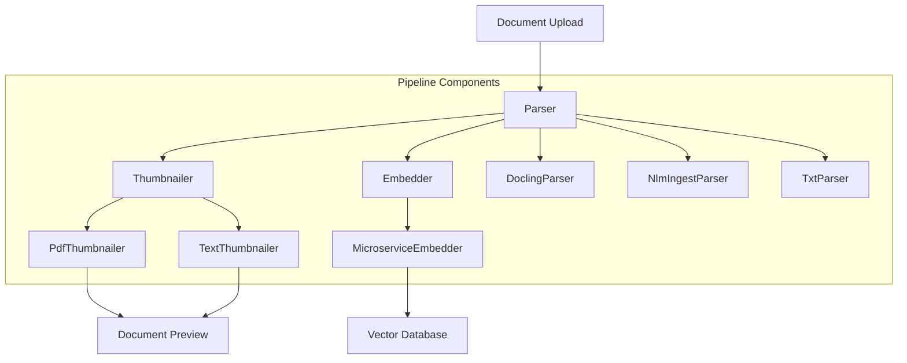

# OpenContracts Pipeline Architecture

The OpenContracts pipeline system is a modular and extensible architecture for processing documents through various stages: parsing, thumbnail generation, and embedding. This document provides an overview of the system architecture and guides you through creating new pipeline components.

## Architecture Overview

The pipeline system consists of three main component types:

1. **Parsers**: Extract text and structure from documents
2. **Thumbnailers**: Generate visual previews of documents
3. **Embedders**: Create vector embeddings for semantic search

Each component type has a base abstract class that defines the interface and common functionality:



### Component Registration

Components are registered in `settings/base.py` through configuration dictionaries:

```python
PREFERRED_PARSERS = {
    "application/pdf": "opencontractserver.pipeline.parsers.docling_parser.DoclingParser",
    "text/plain": "opencontractserver.pipeline.parsers.oc_text_parser.TxtParser",
    # ... other mime types
}

THUMBNAIL_TASKS = {
    "application/pdf": "opencontractserver.tasks.doc_tasks.extract_pdf_thumbnail",
    "text/plain": "opencontractserver.tasks.doc_tasks.extract_txt_thumbnail",
    # ... other mime types
}

PREFERRED_EMBEDDERS = {
    "application/pdf": "opencontractserver.pipeline.embedders.sent_transformer_microservice.MicroserviceEmbedder",
    # ... other mime types
}
```

## Component Types

### Parsers

Parsers inherit from `BaseParser` and implement the `parse_document` method:

```python
class BaseParser(ABC):
    title: str = ""
    description: str = ""
    author: str = ""
    dependencies: list[str] = []
    supported_file_types: list[FileTypeEnum] = []

    @abstractmethod
    def parse_document(
        self, user_id: int, doc_id: int, **kwargs
    ) -> Optional[OpenContractDocExport]:
        pass
```

Current implementations:
- **DoclingParser**: Advanced PDF parser using machine learning
- **NlmIngestParser**: Alternative PDF parser using NLM ingestor
- **TxtParser**: Simple text file parser

### Thumbnailers

Thumbnailers inherit from `BaseThumbnailGenerator` and implement the `_generate_thumbnail` method:

```python
class BaseThumbnailGenerator(ABC):
    title: str = ""
    description: str = ""
    author: str = ""
    dependencies: list[str] = []
    supported_file_types: list[FileTypeEnum] = []

    @abstractmethod
    def _generate_thumbnail(
        self,
        txt_content: Optional[str],
        pdf_bytes: Optional[bytes],
        height: int = 300,
        width: int = 300,
    ) -> Optional[tuple[bytes, str]]:
        pass
```

Current implementations:
- **PdfThumbnailer**: Generates thumbnails from PDF first pages
- **TextThumbnailer**: Creates text-based preview images

### Embedders

Embedders inherit from `BaseEmbedder` and implement the `embed_text` method:

```python
class BaseEmbedder(ABC):
    title: str = ""
    description: str = ""
    author: str = ""
    dependencies: list[str] = []
    vector_size: int = 0
    supported_file_types: list[FileTypeEnum] = []

    @abstractmethod
    def embed_text(self, text: str) -> Optional[list[float]]:
        pass
```

Current implementations:
- **MicroserviceEmbedder**: Generates embeddings using a remote service

## Creating New Components

To create a new pipeline component:

1. Choose the appropriate base class (`BaseParser`, `BaseThumbnailGenerator`, or `BaseEmbedder`)
2. Create a new class inheriting from the base class
3. Implement required abstract methods
4. Set component metadata (title, description, author, etc.)
5. Register the component in the appropriate settings dictionary

Example of a new parser:

```python
from opencontractserver.pipeline.base.parser import BaseParser
from opencontractserver.pipeline.base.file_types import FileTypeEnum

class MyCustomParser(BaseParser):
    title = "My Custom Parser"
    description = "Parses documents in a custom way"
    author = "Your Name"
    dependencies = ["custom-lib>=1.0.0"]
    supported_file_types = [FileTypeEnum.PDF]

    def parse_document(
        self, user_id: int, doc_id: int, **kwargs
    ) -> Optional[OpenContractDocExport]:
        # Implementation here
        pass
```

Then register it in settings:

```python
PREFERRED_PARSERS = {
    "application/pdf": "path.to.your.MyCustomParser",
    # ... other parsers
}
```

## Best Practices

1. **Error Handling**: Always handle exceptions gracefully and return None on failure
2. **Dependencies**: List all required dependencies in the component's `dependencies` list
3. **Documentation**: Provide clear docstrings and type hints
4. **Testing**: Create unit tests for your component in the `tests` directory
5. **Metadata**: Fill out all metadata fields (title, description, author)

## Advanced Topics

### Parallel Processing

The pipeline system supports parallel processing through Celery tasks. Each component can be executed asynchronously:

```python
from opencontractserver.tasks.doc_tasks import process_document

# Async document processing
process_document.delay(user_id, doc_id)
```

### Custom File Types

To add support for new file types:

1. Add the MIME type to `ALLOWED_DOCUMENT_MIMETYPES` in settings
2. Update `FileTypeEnum` in `base/file_types.py`
3. Create appropriate parser/thumbnailer/embedder implementations
4. Register the implementations in settings

### Error Handling

Components should implement robust error handling:

```python
def parse_document(self, user_id: int, doc_id: int, **kwargs):
    try:
        # Implementation
        return result
    except Exception as e:
        logger.error(f"Error parsing document {doc_id}: {e}")
        return None
```

## Contributing

When contributing new pipeline components:

1. Follow the project's coding style
2. Add comprehensive tests
3. Update this documentation
4. Submit a pull request with a clear description

For questions or support, please open an issue on the GitHub repository. 