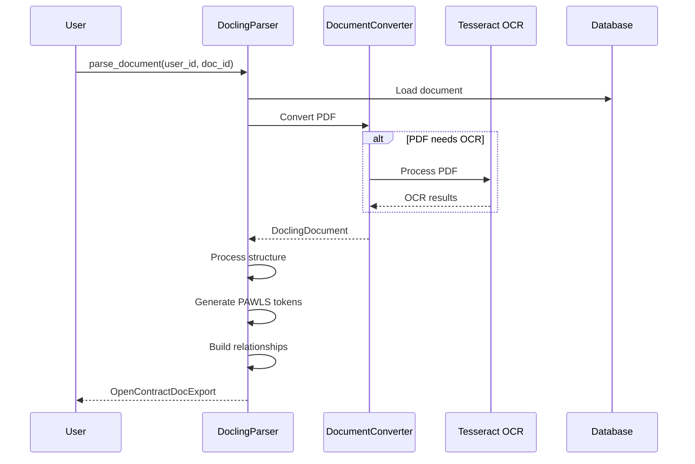

# Docling Parser

The Docling Parser is an advanced PDF document parser that uses machine learning to extract structured information from PDF documents. It's the primary parser for PDF documents in OpenContracts.

## Overview



## Features

- **Intelligent OCR**: Automatically detects when OCR is needed
- **Hierarchical Structure**: Extracts document structure (headings, paragraphs, lists)
- **Token-based Annotations**: Creates precise token-level annotations
- **Relationship Detection**: Builds relationships between document elements
- **PAWLS Integration**: Generates PAWLS-compatible token data

## Configuration

The Docling Parser requires model files to be present in the path specified by `DOCLING_MODELS_PATH` in your settings:

```python
DOCLING_MODELS_PATH = env.str("DOCLING_MODELS_PATH", default="/models/docling")
```

## Usage

Basic usage:

```python
from opencontractserver.pipeline.parsers.docling_parser import DoclingParser

parser = DoclingParser()
result = parser.parse_document(user_id=1, doc_id=123)
```

With options:

```python
result = parser.parse_document(
    user_id=1,
    doc_id=123,
    force_ocr=True,  # Force OCR processing
    roll_up_groups=True,  # Combine related items into groups
)
```

## Input

The parser expects:
- A PDF document stored in Django's storage system
- A valid user ID and document ID
- Optional configuration parameters

## Output

The parser returns an `OpenContractDocExport` dictionary containing:

```python
{
    "title": str,  # Extracted document title
    "description": str,  # Generated description
    "content": str,  # Full text content
    "page_count": int,  # Number of pages
    "pawls_file_content": List[dict],  # PAWLS token data
    "labelled_text": List[dict],  # Structural annotations
    "relationships": List[dict],  # Relationships between annotations
}
```

## Processing Steps

1. **Document Loading**
   - Loads PDF from storage
   - Creates DocumentStream for processing

2. **Conversion**
   - Converts PDF using Docling's DocumentConverter
   - Applies OCR if needed
   - Extracts document structure

3. **Token Generation**
   - Creates PAWLS-compatible tokens
   - Builds spatial indices for token lookup
   - Transforms coordinates to screen space

4. **Annotation Creation**
   - Converts Docling items to annotations
   - Assigns hierarchical relationships
   - Creates group relationships

5. **Metadata Extraction**
   - Extracts document title
   - Generates description
   - Counts pages

## Advanced Features

### OCR Processing

The parser can use Tesseract OCR when needed:

```python
# Force OCR processing
result = parser.parse_document(user_id=1, doc_id=123, force_ocr=True)
```

### Group Relationships

Enable group relationship detection:

```python
# Enable group rollup
result = parser.parse_document(user_id=1, doc_id=123, roll_up_groups=True)
```

### Spatial Processing

The parser uses Shapely for spatial operations:
- Creates STRtrees for efficient spatial queries
- Handles coordinate transformations
- Manages token-annotation mapping

## Error Handling

The parser includes robust error handling:
- Validates model file presence
- Checks conversion status
- Handles OCR failures
- Manages coordinate transformation errors

## Dependencies

Required Python packages:
- `docling`: Core document processing
- `pytesseract`: OCR support
- `pdf2image`: PDF rendering
- `shapely`: Spatial operations
- `numpy`: Numerical operations

## Performance Considerations

- OCR processing can be time-intensive
- Large documents may require significant memory
- Spatial indexing improves token lookup performance
- Group relationship processing may impact performance with `roll_up_groups=True`

## Best Practices

1. **OCR Usage**
   - Let the parser auto-detect OCR needs
   - Only use `force_ocr=True` when necessary

2. **Group Relationships**
   - Start with `roll_up_groups=False`
   - Enable if hierarchical grouping is needed

3. **Error Handling**
   - Always check return values
   - Monitor logs for conversion issues

4. **Memory Management**
   - Process large documents in batches
   - Monitor memory usage with large PDFs

## Troubleshooting

Common issues and solutions:

1. **Missing Models**
   ```
   FileNotFoundError: Docling models path does not exist
   ```
   - Verify DOCLING_MODELS_PATH setting
   - Check model file permissions

2. **OCR Failures**
   ```
   Error: Tesseract not found
   ```
   - Install Tesseract OCR
   - Verify system PATH

3. **Memory Issues**
   ```
   MemoryError during processing
   ```
   - Reduce concurrent processing
   - Increase system memory
   - Process smaller batches 