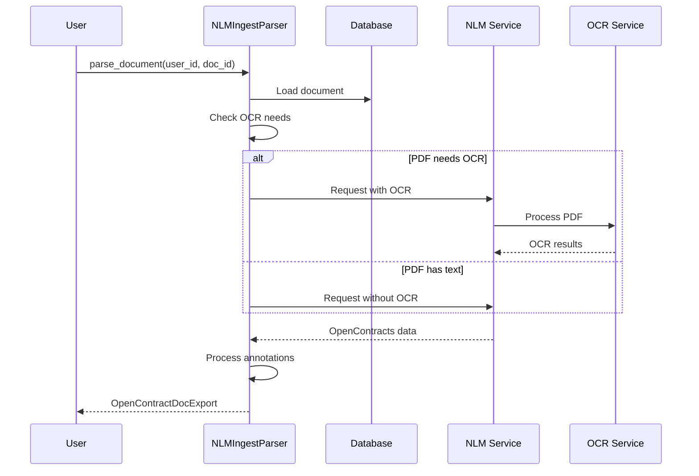

# NLM Ingest Parser

The NLM Ingest Parser is a lightweight alternative to the Docling Parser that uses an NLM-Ingest REST parser for PDF document processing. Like Docling, it provides structural labels and relationships. Unlike Docling, it uses heuristics and a rules-based approach to determine the structure of the document. *Note*: The relationships _between_ annotations are not yet implemented in our conversion.

## Overview



## Features

- **Automatic OCR Detection**: Intelligently determines OCR needs
- **Token-based Annotations**: Provides token-level annotations
- **Rules-Based Relationships**: Provides relationships between annotations especially well-suited to contract layouts.
- **Simple Integration**: Easy to set up and use
- **Configurable API**: Supports custom API endpoints and keys

## Configuration

Configure the NLM Ingest Parser in your settings:

```python
# Enable/disable NLM ingest
NLM_INGESTOR_ACTIVE = env.bool("NLM_INGESTOR_ACTIVE", False)

# OCR configuration
NLM_INGEST_USE_OCR = True

# Service endpoint
NLM_INGEST_HOSTNAME = "http://nlm-ingestor:5001"

# Optional API key
NLM_INGEST_API_KEY = None  # or your API key
```

## Usage

Basic usage:

```python
from opencontractserver.pipeline.parsers.nlm_ingest_parser import NLMIngestParser

parser = NLMIngestParser()
result = parser.parse_document(user_id=1, doc_id=123)
```

## Input

The parser requires:
- A PDF document in Django's storage
- A valid user ID and document ID
- Proper NLM service configuration

## Output

Returns an `OpenContractDocExport` dictionary:

```python
{
    "content": str,  # Full text content
    "page_count": int,  # Number of pages
    "pawls_file_content": List[dict],  # PAWLS token data
    "labelled_text": List[dict],  # Structural annotations
}
```

## Processing Steps

1. **Document Loading**
   - Retrieves PDF from storage
   - Checks if OCR is needed

2. **Service Request**
   - Prepares API headers and parameters
   - Sends document to NLM service
   - Handles OCR configuration

3. **Response Processing**
   - Validates service response
   - Extracts OpenContracts data
   - Processes annotations

4. **Annotation Enhancement**
   - Sets structural flags
   - Assigns token label types
   - Prepares final output

## API Integration

### Request Format

```python
# Headers
headers = {"API_KEY": settings.NLM_INGEST_API_KEY} if settings.NLM_INGEST_API_KEY else {}

# Parameters
params = {
    "calculate_opencontracts_data": "yes",
    "applyOcr": "yes" if needs_ocr else "no"
}

# Files
files = {"file": pdf_file}
```

### Endpoint

```
POST {NLM_INGEST_HOSTNAME}/api/parseDocument
```

## Error Handling

The parser includes error handling for:
- Service connection issues
- Invalid responses
- Missing data
- OCR failures

Example error handling:

```python
if response.status_code != 200:
    logger.error(f"NLM ingest service returned status code {response.status_code}")
    response.raise_for_status()

if open_contracts_data is None:
    logger.error("No 'opencontracts_data' found in NLM ingest service response")
    return None
```

## Dependencies

Required configurations:
- Working NLM ingest service
- Network access to service
- Optional API key
- Optional OCR service

## Performance Considerations

- Network latency affects processing time
- OCR processing adds significant time
- Service availability is critical
- Consider rate limiting
- Monitor service response times

## Best Practices

1. **Service Configuration**
   - Use HTTPS for security
   - Configure timeouts
   - Handle service outages

2. **OCR Usage**
   - Enable OCR only when needed
   - Monitor OCR processing time
   - Consider OCR quality settings

3. **Error Handling**
   - Implement retries for failures
   - Log service responses
   - Monitor error rates

4. **Security**
   - Use API keys when available
   - Validate service certificates
   - Protect sensitive documents

## Troubleshooting

Common issues and solutions:

1. **Service Connection**
   ```
   ConnectionError: Failed to connect to NLM service
   ```
   - Check service URL
   - Verify network connectivity
   - Check firewall settings

2. **Authentication**
   ```
   401 Unauthorized
   ```
   - Verify API key
   - Check key configuration
   - Ensure key is active

3. **OCR Issues**
   ```
   OCR processing failed
   ```
   - Check OCR service status
   - Verify PDF quality
   - Monitor OCR logs

4. **Response Format**
   ```
   KeyError: 'opencontracts_data'
   ```
   - Check service version
   - Verify response format
   - Update parser if needed

## Comparison with Docling Parser

| Feature | NLM Ingest Parser | Docling Parser |
|---------|------------------|----------------|
| Processing | Remote | Local |
| Setup | Simple | Complex |
| Dependencies | Minimal | Many |
| Control | Limited | Full |
| Scalability | Service-dependent | Resource-dependent |
| Customization | Limited | Extensive |

## When to Use

Choose the NLM Ingest Parser when:
- You want to offload processing
- You need simple setup
- You have reliable network access
- You prefer managed services
- You don't need extensive customization

Consider alternatives when:
- You need offline processing
- You require custom processing logic
- You have network restrictions
- You need full control over the pipeline
