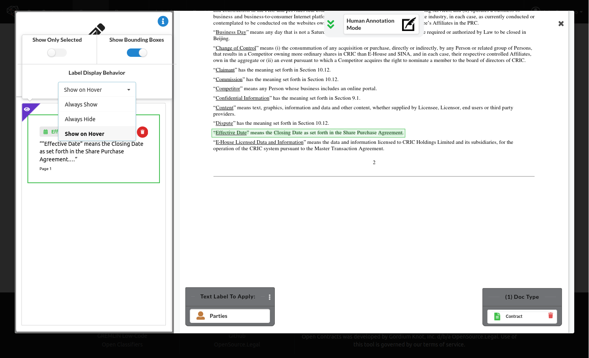

Annotations are composed of tokens (basically text in a line surrounded by whitespace). The tokens have a highlight.
OpenContracts also has a "BoundingBox" around the tokens which is the smallest rectangle that can cover all of the
tokens in an Annotation.

In the Annotator view, you'll see a purple-colored "eye" icon in the top left of the annotation list in the
sidebar. Click the icon to bring up a series of configurations for how annotations are displayed:

There are three different settings that can be combined to significantly change how you see the annotations:
1. **Show only selected** - You will only see the annotation selected, either by clicking on it in the sidebar or when you
   clicked into an annotation from the Corpus view. All other annotations will be completely hidden.
2. **Show bounding boxes** - If you unselect this, only the tokens will be visible. This is recommended where you large
   numbers of overlapping annotations or annotations that are sparse - e.g. a few words scattered throughout a paragraph.
   In either of these cases, the bounding boxes can cover other bounding boxes and this can be confusing. Where you have
   too many overlapping bounding boxes, it's easier to hide them and just look at the tokens.
3. **Label Display Behavior** - has three options:

   1. **Always Show** - Always show the label for an annotation when it's displayed (remember, you can choose to only
          display selected annotations).
   2. **Always Hide** - Never show the label for an annotation, regardless of its visiblity.
   3. **Show on Hover** - If an annotation is visible, when you hover over it, you'll see the label.
