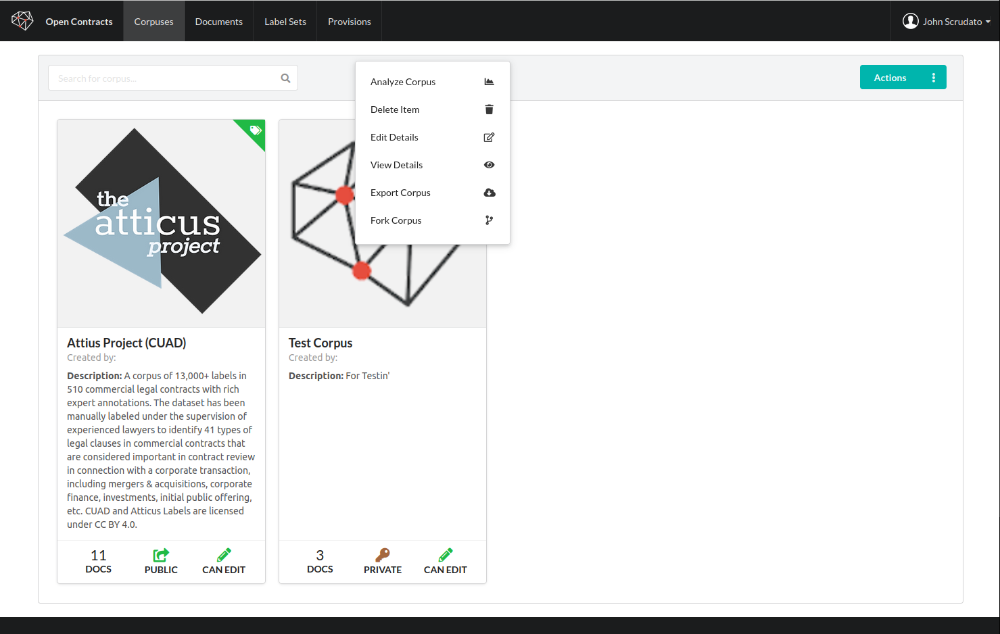

## Exports

OpenContracts support both exporting and importing corpuses. This functionality is disabled on the public
demo as it can be bandwidth intensive. If you want to experiment with these features on your own, you'll see
the export action when you right-click on a corpus:

You can access your exports from the user dropdown menu in the top right corner of the screen. Once your
export is complete, you should be able to download a zip containing all the documents, their PAWLs layers, and
the corpus data you created - including all annotations.

## Imports

If you've enabled corpus imports (see the **frontend** env file for the boolean toggle to do this - it's
`REACT_APP_ALLOW_IMPORTS`), you'll see an import action when you click the action button on the corpus page.
