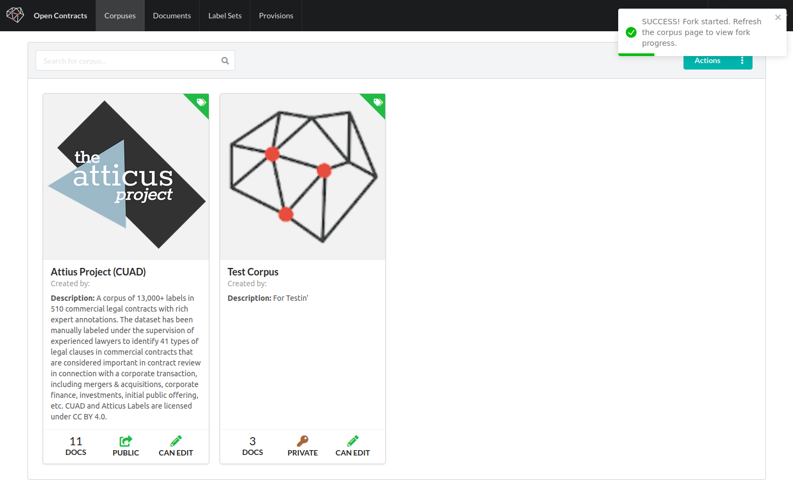
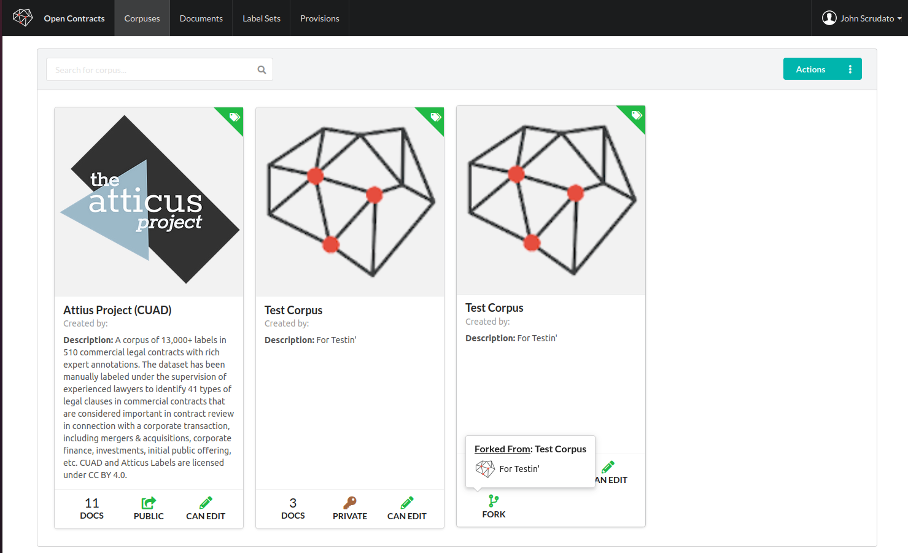

## To Fork or Not to Fork?

One of the amazing things about Open Source collaboration is you can stand on the shoulder of giants - we can share
techniques and data and collectively achieve what we could never do alone. OpenContracts is designed to make it
super easy to share and re-use annotation data.

In OpenContracts, we introduce the concept of "forking" a corpus - basically creating a copy of public or private corpus,
complete with its documents and annotations, which you can edit and tweak as needed. This opens up some
interesting possibilities. For example, you might have a base corpus with annotations common to many types of
AI models or annotation projects which you can fork as needed and layer task or domain-specific annotations on top of.

## Fork a Corpus

Forking a corpus is easy.

1. Again, right-click on a corpus to bring up the context menu. You'll see an entry to "Fork Corpus":
   
2. Click on it to start a fork. You should see a confirmation in the top right of the screen:
   
3. Once the fork is complete, the next time you go to your Corpus page, you'll see a new Corpus with a Fork
   icon in the icon bar at the bottom. If you hover over it, you'll be able to see a summary of the corpus it was
   forked from. This is tracked in the database, so, long-term, we'd like to have corpus version control similar to how
   git works:
   
