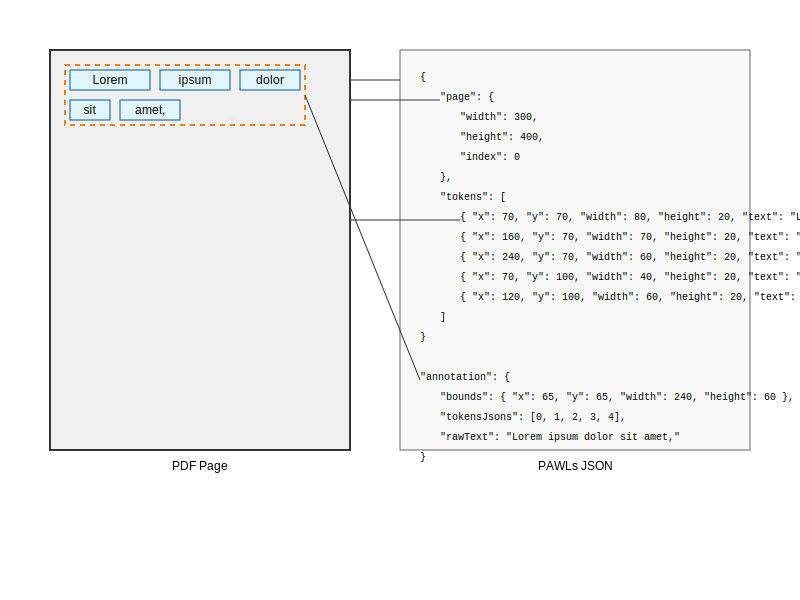

# Understanding Document Ground Truth in OpenContracts

OpenContracts utilizes the [PAWLs format](https://github.com/allenai/pawls) for representing documents and
their annotations. PAWLs was designed by AllenAI to provide a consistent and structured way to store text and layout
information for complex documents like contracts, scientific papers, and newspapers.

AllenAI has largely stopped maintaining this project and this project evolved into something very different than its
PAWLs namesake, but we've kept the name (and contributed a few PRs back to the PAWLs project).

## Standardized PDF Data Layers

In OpenContracts, every document is processed through a pipeline that extracts and structures text and layout
information into three files:

1. **Original PDF**: The original PDF document.
2. **PAWLs Layer (JSON)**: A JSON file containing the text and positional data for each token (word) in the document.
3. **Text Layer**: A text file containing the full text extracted from the document.
4. **Structural Annotations**: Thanks to [nlm-ingestor](https://github.com/nlmatics/nlm-ingestor), we now use Nlmatics'
   parser to generate the PAWLs layer and turn the layout blocks - like header, paragraph, table, etc. - into Open
   Contracts `Annotation` objs that represent the visual blocks for each PDF. Upon creation, we create embeddings
   for each Annotation which are stored in Postgres via pgvector.

The PAWLs layer serves as the source of truth for the document, allowing seamless translation between text and
positional information.

## Visualizing How PDFs are Converted to Data & Annotations

Here's a rough diagram showing how a series of tokens - Lorem, ipsum, dolor, sit and amet - are mapped from a PDF to
our various data types.



## PAWLs Processing Pipeline

The PAWLs processing pipeline involves the following steps:

1. **Token Extraction**: The OCRed document is processed using the parsing engine of Grobid to extract "tokens" (text
   surrounded by whitespace, typically a word) along with their page and positional information.
2. **PAWLs Layer Generation**: The extracted tokens and their positional data are stored as a JSON file, referred to as
   the "PAWLs layer."
3. **Text Layer Generation**: The full text is extracted from the PAWLs layer and stored as a separate text file, called
   the "text layer."

## PAWLs Layer Structure

The PAWLs layer JSON file consists of a list of page objects, each containing the necessary tokens and page information
for a given page. Here's the data shape for each page object:

```python
class PawlsPagePythonType(TypedDict):
    page: PawlsPageBoundaryPythonType
    tokens: list[PawlsTokenPythonType]
```

The `PawlsPageBoundaryPythonType` represents the page boundary information:

```python
class PawlsPageBoundaryPythonType(TypedDict):
    width: float
    height: float
    index: int
```

Each token in the `tokens` list is represented by the `PawlsTokenPythonType`:

```python
class PawlsTokenPythonType(TypedDict):
    x: float
    y: float
    width: float
    height: float
    text: str
```

The `x`, `y`, `width`, and `height` fields provide the positional information for each token on the page.

## Annotation Process

OpenContracts allows users to annotate documents using the PAWLs layer. Annotations are stored as a dictionary mapping
page numbers to annotation data:

```python
Dict[int, OpenContractsSinglePageAnnotationType]
```

The `OpenContractsSinglePageAnnotationType` represents the annotation data for a single page:

```python
class OpenContractsSinglePageAnnotationType(TypedDict):
    bounds: BoundingBoxPythonType
    tokensJsons: list[TokenIdPythonType]
    rawText: str
```

The `bounds` field represents the bounding box of the annotation, while `tokensJsons` contains a list of token IDs that
make up the annotation. The `rawText` field stores the raw text of the annotation.

## Advantages of PAWLs

The PAWLs format offers several advantages for document annotation and NLP tasks:

1. **Consistent Structure**: PAWLs provides a consistent and structured representation of documents, regardless of the
   original file format or structure.
2. **Layout Awareness**: By storing positional information for each token, PAWLs enables layout-aware text analysis and
   annotation.
3. **Seamless Integration**: The PAWLs layer allows easy integration with various NLP libraries and tools, whether they
   are layout-aware or not.
4. **Reproducibility**: The re-OCR process ensures consistent output across different documents and software versions.

## Conclusion

The PAWLs format in OpenContracts provides a powerful and flexible way to represent and annotate complex documents. By
extracting and structuring text and layout information, PAWLs enables efficient and accurate document analysis and
annotation tasks. The consistent structure and layout awareness of PAWLs make it an essential component of the
OpenContracts project.

# Example PAWLs File

Here's an example of what a PAWLs layer JSON file might look like:

```json
[
  {
    "page": {
      "width": 612.0,
      "height": 792.0,
      "index": 0
    },
    "tokens": [
      {
        "x": 72.0,
        "y": 720.0,
        "width": 41.0,
        "height": 12.0,
        "text": "Lorem"
      },
      {
        "x": 113.0,
        "y": 720.0,
        "width": 35.0,
        "height": 12.0,
        "text": "ipsum"
      },
      {
        "x": 148.0,
        "y": 720.0,
        "width": 31.0,
        "height": 12.0,
        "text": "dolor"
      },
      {
        "x": 179.0,
        "y": 720.0,
        "width": 18.0,
        "height": 12.0,
        "text": "sit"
      },
      {
        "x": 197.0,
        "y": 720.0,
        "width": 32.0,
        "height": 12.0,
        "text": "amet,"
      },
      {
        "x": 72.0,
        "y": 708.0,
        "width": 66.0,
        "height": 12.0,
        "text": "consectetur"
      },
      {
        "x": 138.0,
        "y": 708.0,
        "width": 60.0,
        "height": 12.0,
        "text": "adipiscing"
      },
      {
        "x": 198.0,
        "y": 708.0,
        "width": 24.0,
        "height": 12.0,
        "text": "elit."
      }
    ]
  },
  {
    "page": {
      "width": 612.0,
      "height": 792.0,
      "index": 1
    },
    "tokens": [
      {
        "x": 72.0,
        "y": 756.0,
        "width": 46.0,
        "height": 12.0,
        "text": "Integer"
      },
      {
        "x": 118.0,
        "y": 756.0,
        "width": 35.0,
        "height": 12.0,
        "text": "vitae"
      },
      {
        "x": 153.0,
        "y": 756.0,
        "width": 39.0,
        "height": 12.0,
        "text": "augue"
      },
      {
        "x": 192.0,
        "y": 756.0,
        "width": 45.0,
        "height": 12.0,
        "text": "rhoncus"
      },
      {
        "x": 237.0,
        "y": 756.0,
        "width": 57.0,
        "height": 12.0,
        "text": "fermentum"
      },
      {
        "x": 294.0,
        "y": 756.0,
        "width": 13.0,
        "height": 12.0,
        "text": "at"
      },
      {
        "x": 307.0,
        "y": 756.0,
        "width": 29.0,
        "height": 12.0,
        "text": "quis."
      }
    ]
  }
]
```

In this example, the PAWLs layer JSON file contains an array of two page objects. Each page object has a `page` field
with the page dimensions and index, and a `tokens` field with an array of token objects.

Each token object represents a word or a piece of text on the page, along with its positional information. The `x`
and `y` fields indicate the coordinates of the token's bounding box, while `width` and `height` specify the dimensions
of the bounding box. The `text` field contains the actual text content of the token.

The tokens are ordered based on their appearance on the page, allowing for the reconstruction of the document's text
content while preserving the layout information.

This sample demonstrates the structure and content of a PAWLs layer JSON file, which serves as the foundation for
annotation and analysis tasks in the OpenContracts project.
