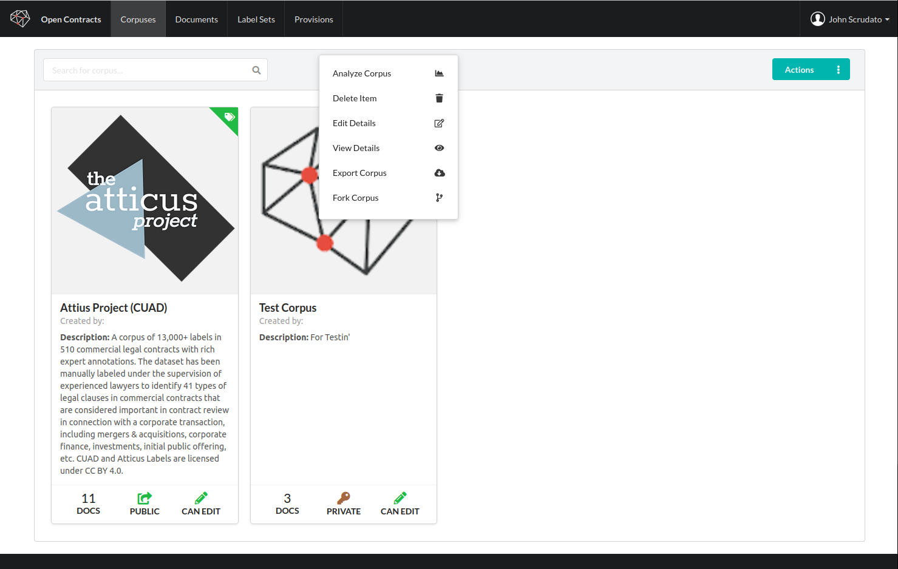
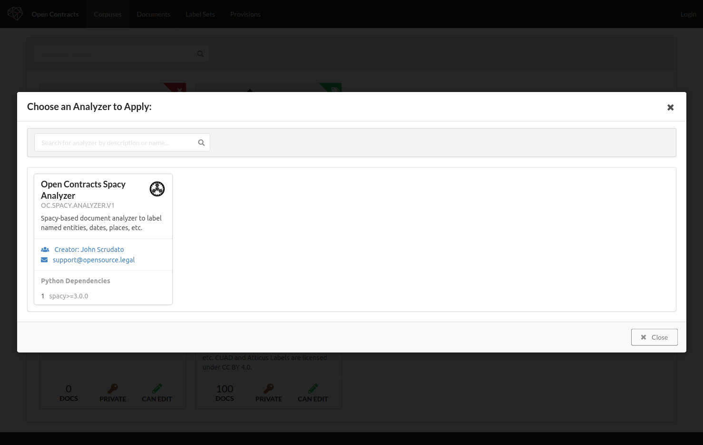
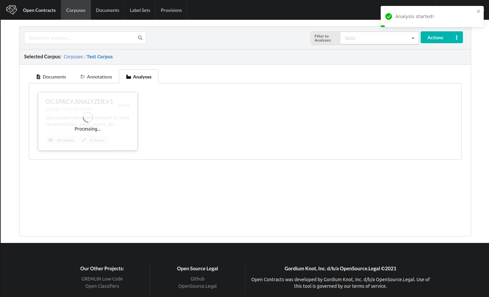
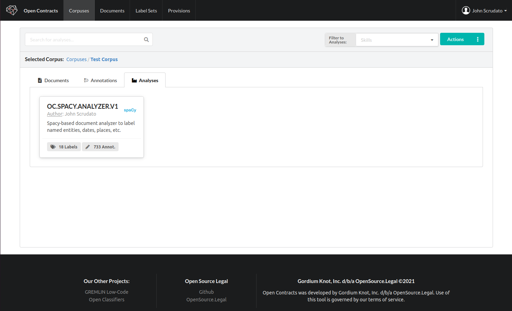
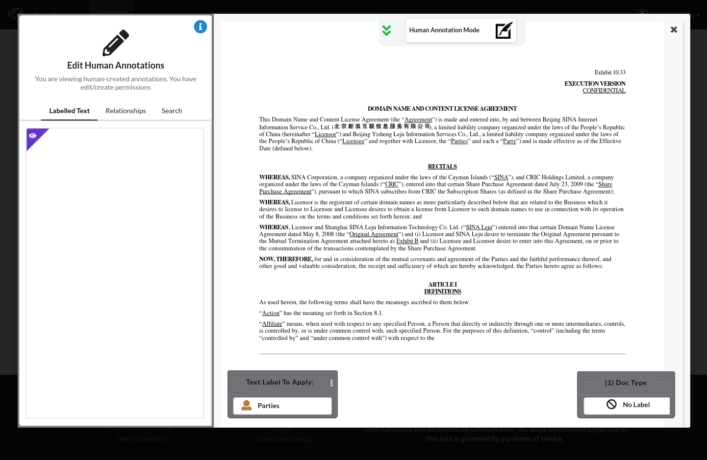
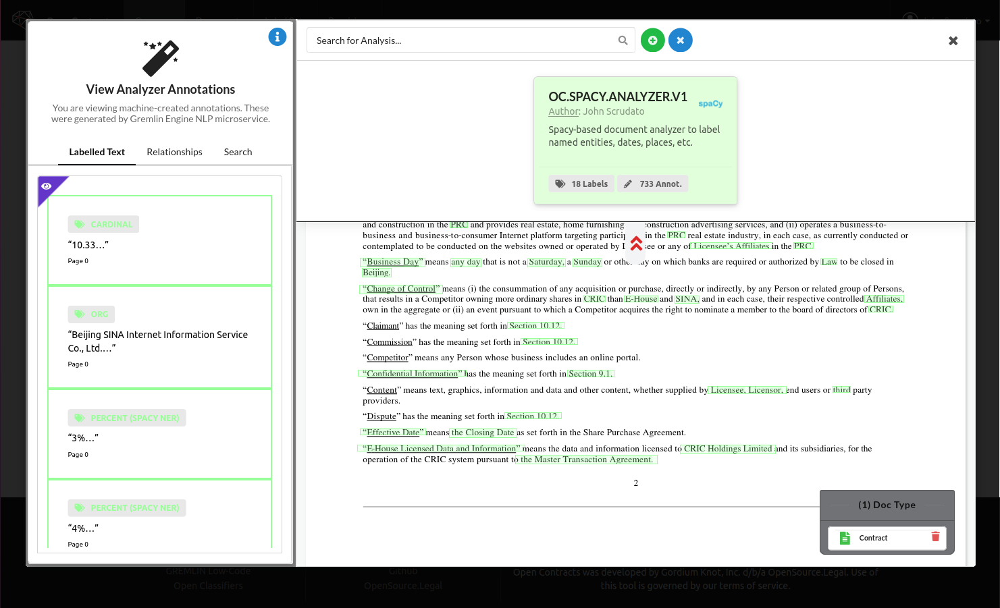

## Introduction to Gremlin Integration

OpenContracts integrates with a powerful NLP engine called Gremlin Engine ("Gremlin"). If you run a Gremlin analyzer
on a Corpus, it will create annotations of its own that you can view and export (e.g. automatically
applying document labels or labeling parties, dates, and places, etc.). It's meant to provide a consistent API to deliver
and render NLP and machine learning capabilities to end-users. As discussed in the configuration section, you need to
install Gremlin Analyzers through the admin dashboard.

Once you've installed Gremlin Analyzers, however, it's easy to apply them.

## Using an Installed Gremlin Analyzer
1. **If analysis capabilities are enabled for instance**, when you right-click on a Corpus, you'll see an option to
   "Analyze Corpus":
  

2. Clicking on this item will bring up a dialog where you can browse available analyzers:
  

3. Select one and hit "Analyze" to submit a corpus for processing. When you go to the Analysis tab of your
   Corpus now, you'll see the analysis. Most likely, if you just clicked there, it will say processing:
   

4. When the Analysis is complete, you'll see a summary of the number of labels and annotations applied by the analyzer:
   

## Note on Processing Time
Large Corpuses of hundreds of documents can take a long time to process (10 minutes or more). It's hard to predict
processing time up front, because it's dependent on the number of total pages and the specific analysis being
performed. At the moment, there is not a great mechanism in place to detect and handle failures in a Gremlin analyzer
and reflect this in OpenContracts. It's on our roadmap to improve this integration. In the meantime, the example analyzers
we've released with Gremlin should be very stable, so they should run predictably.

## Viewing the Outputs
Once an Analysis completes, you'll be able to browse the annotations from the analysis in several ways.

1. First, they'll be available in the "Annotation" tab, and you can easily filter to annotations from a
   specific analyzer.
2. Second, when you load a Document, in the Annotator view, there's a small widget in the top of the annotator
   that has three downwards-facing arrows and says "Human Annotation Mode".
   
3. Click on the arrows open a tray showing the analyses applied to this document.
4. Click on an analysis to load the annotations and view them in the document.
   

**Note**: You can delete an analysis, but you cannot edit it. The annotations are machine-created and cannot be edited by human
users.
