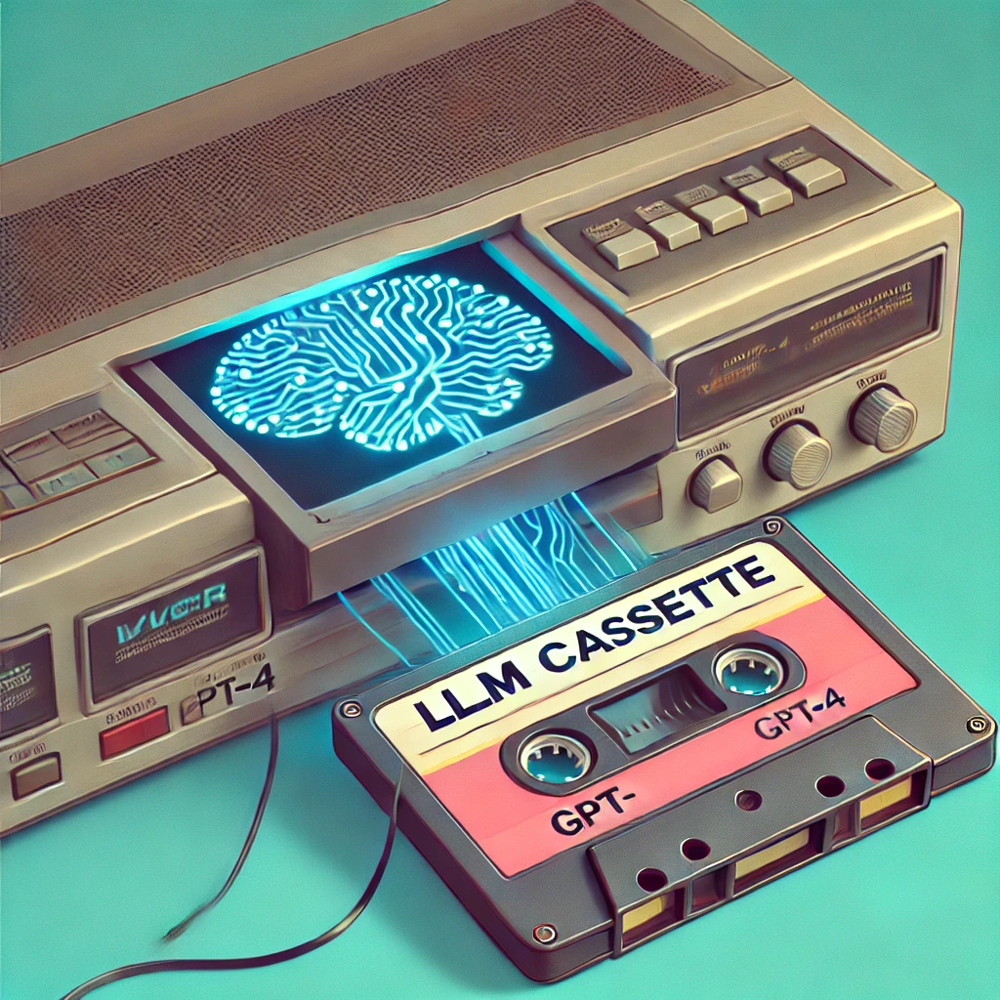

# Testing Complex LLM Applications



I've built a number of full-stack, LLM-powered applications at this point.
A persistent challenge is testing the underlying LLM query pipelines in a deterministic and isolated way.

A colleague and I eventually hit on a way to make testing complex LLM behavior deterministic
and decoupled from upstream LLM API providers. This tutorial walks you through the problem and solution to this testing
issue.

In this guide, you'll learn:

1. Why testing LLM applications is particularly challenging
2. How to overcome common testing obstacles like API dependencies and resource limitations
3. An innovative approach using VCR.py to record and replay LLM interactions
4. How to implement this solution with popular frameworks like LlamaIndex and Django
5. Potential pitfalls to watch out for when using this method

Whether you're working with RAG models, multi-hop reasoning loops, or other complex LLM architectures, this tutorial
will show you how to create fast, deterministic, and accurate tests without relying on expensive resources or
compromising the integrity of your test suite.

By the end of this guide, you'll have a powerful new tool in your AI development toolkit, enabling you to build
more robust and reliable LLM-powered applications. Let's dive in!

## Problem

To understand why testing complex LLM-powered applications is challenging, let's break down the components and processes
involved in a typical RAG (Retrieval-Augmented Generation) application using a framework like LlamaIndex:

1. **Data Ingestion**: Your application likely starts by ingesting large amounts of data from various sources (documents,
   databases, APIs, etc.).

2. **Indexing**: This data is then processed and indexed, often using vector embeddings, to allow for efficient retrieval.

3. **Query Processing**: When a user submits a query, your application needs to:
   a) Convert the query into a suitable format (often involving embedding the query)
   b) Search the index to retrieve relevant information
   c) Format the retrieved information for use by the LLM

4. **LLM Interaction**: The processed query and retrieved information are sent to an LLM (like GPT-4) for generating a
   response.

5. **Post-processing**: The LLM's response might need further processing or validation before being returned to the user.

Now, consider the challenges in testing such a system:

1. **External Dependencies**: Many of these steps rely on external APIs or services. The indexing and query embedding often
   use one model (e.g., OpenAI's embeddings API), while the final response generation uses another (e.g., GPT-4).
   Traditional testing approaches would require mocking or stubbing these services, which can be complex and may not
   accurately represent real-world behavior.

2. **Resource Intensity**: Running a full RAG pipeline for each test can be extremely resource-intensive and time-consuming.
   It might involve processing large amounts of data and making multiple API calls to expensive LLM services.

3. **Determinism**: LLMs can produce slightly different outputs for the same input, making it difficult to write
   deterministic tests. This variability can lead to flaky tests that sometimes pass and sometimes fail.

4. **Complexity of Interactions**: In more advanced setups, you might have multi-step reasoning processes or agent-based
   systems where the LLM is called multiple times with intermediate results. This creates complex chains of API calls
   that are difficult to mock effectively.

5. **Sensitive Information**: Your tests might involve querying over proprietary or sensitive data. You don't want to
   include this data in your test suite, especially if it's going to be stored in a version control system.

6. **Cost**: Running tests that make real API calls to LLM services can quickly become expensive, especially when running
   comprehensive test suites in CI/CD pipelines.

7. **Speed**: Tests that rely on actual API calls are inherently slower, which can significantly slow down your development
   and deployment processes.

Traditional testing approaches fall short in addressing these challenges:

- Unit tests with mocks may not capture the nuances of LLM behavior.
- Integration tests with real API calls are expensive, slow, and potentially non-deterministic.
- Dependency injection can help but becomes unwieldy with complex, multi-step processes.

What's needed is a way to capture the behavior of the entire system, including all API interactions, in a reproducible
manner that doesn't require constant re-execution of expensive operations. This is where the VCR approach comes in, as
we'll explore in the next section.

## Solution

Over a couple years of working with the LLM and RAG application stack, a solution has emerged to this problem. A
former colleague of mine pointed out a library for Ruby called [VCR](https://github.com/vcr/vcr) with the following
goal:

```
Record your test suite's HTTP interactions and replay them during future test runs for fast, deterministic, accurate
tests.
```

This sounds like _exactly_ the sort of solution we're looking for! We have numerous API calls to third-party API
endpoints. They are deterministic IF the responses from each step of the LLM reasoning loop is identical to a previous
run of the same loop. If we _could_ record each LLM call and response from one run of a specific LLamaIndex pipeline,
for example, and then intercept future calls to the same endpoints and replay the old responses, in theory we'd have
exactly the same results.

It turns out there's a Python version of VCR called [VCR.py](https://github.com/kevin1024/vcrpy). It comes with nice
pytest fixtures and lets you decorate an entire Django test. If you call a LlamaIndex pipeline from your test, if
no "cassette" filed is found in your fixtures directory, your HTTPS calls will go out to actual API

## Example

Using VCR.py + LlamaIndex, for example, is super simple. In a Django test, for example, you just write a test function
per usual:

```python
import vcr
from django.test import TransactionTestCase


class ExtractsTaskTestCase(TransactionTestCase):

    def test_run_extract_task(self):
        print(f"{self.extract.documents.all()}")
        ...

```

Add a vcr.py decorator naming the target fixture location:

```python
import vcr
from django.test import TransactionTestCase


class ExtractsTaskTestCase(TransactionTestCase):

    @vcr.use_cassette("fixtures/vcr_cassettes/test_run_extract_task.yaml", filter_headers=['authorization'])
    def test_run_extract_task(self):
        print(f"{self.extract.documents.all()}")

        # Call your LLMs or LLM framework here
        # If testing async Celery tasks, use .apply() for synchronous execution
        # your_async_task.si(task_id).apply()
        ...

```

Now you can call LlamaIndex query engines, retrievers, agents, etc. On the first run, all of your API calls and
responses are capture. You'll obviously need to provide your API credentials, where required, or these calls will fail.
**As noted below** if you omit the filter_headers parameter, this will result in your API key being in the recorded
'cassette'.

On subsequent runs, VCR will intercept calls to recorded endpoints with identical data and return
the recorded responses, letting you full test your use of LlamaIndex without needing to patch the library or its
dependencies.

## Important Notes for Async Tasks

When testing async Celery tasks with VCR:

1. **Use `TransactionTestCase`** instead of `TestCase` for better database transaction handling
2. **Call tasks synchronously** with `.apply()` method in tests
3. **The new async decorators** (`@celery_task_with_async_to_sync`) handle async-to-sync conversion automatically
4. **Database connections** are properly managed without manual intervention

## Pitfalls

This approach has been used for production applications. We have seen a couple things worth noting:

1. Be warned that if you don't use the `filter_headers=['authorization']` in your decorators, your API keys will be in
   the cassette. You can replace these with fake credentials or you can just de-auth the now-public keys.
2. If you use any local models and don't preload those, VCR.py will capture the call to download the models weights,
   configuration, etc. Even for small models, this can be a couple hundred megabytes, and it could be gigabytes of
   data for even small models like Phi or Llama3 7B. This is particularly problematic for GitHub as you'll quickly
   exceed file size caps, even if you're using LFS.
3. There is a bug in VCR.py 6.0.1 in some limited circumstances if you use async code.
4. This is obviously Python-only. Presumably there are similar libraries for other languages and web client libraries.
