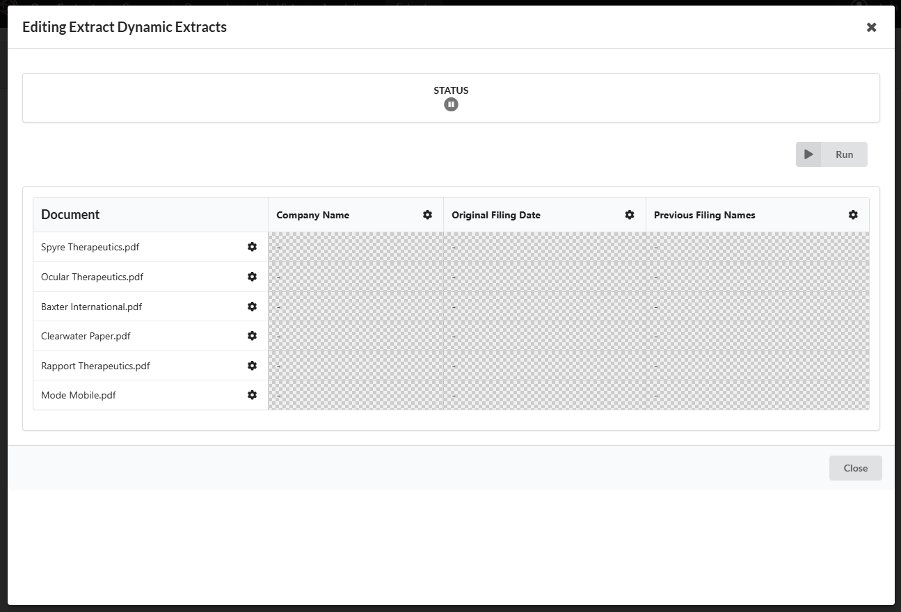
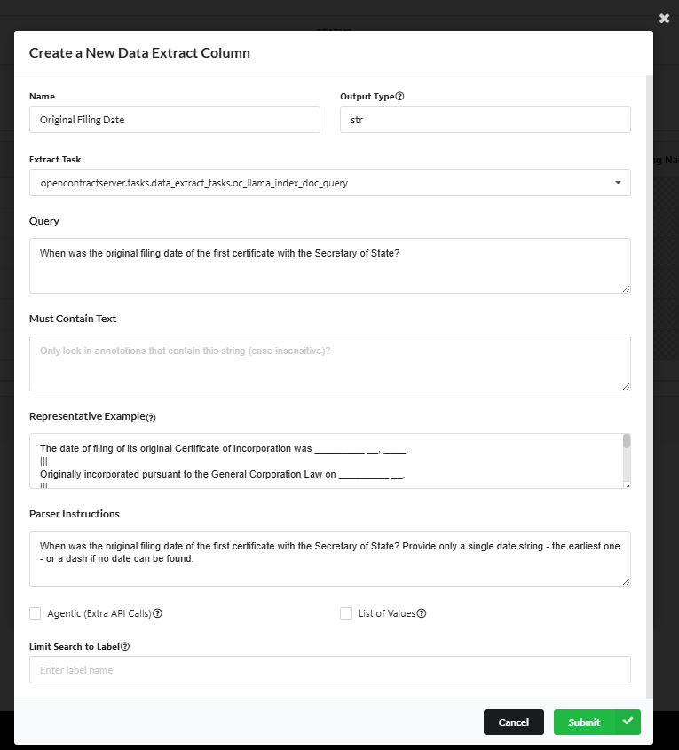
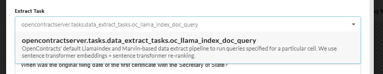
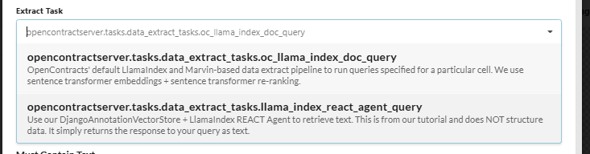
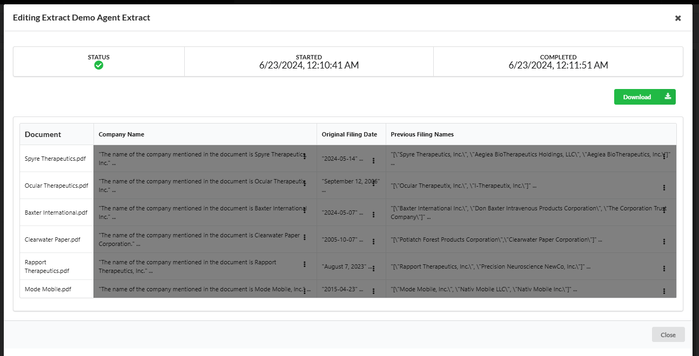

# Write Your Own Agentic, LlamaIndex Data Extractor

## Refresher on What an Open Contracts Data Extractor Does

When you create a new Extract on the frontend, you can build a grid of data field columns and document rows that
the application will traverse, cell-by-cell, to answer the question posed in each column for every document:



You can define the target data shape for each column - e.g. require all outputs match a certain dictionary schema or be
floats. We leverage LLMs to ensure that the retrieved data matches the desired schema.

You'll notice when you add or edit a column, you can configure a number of different things:



Specifically, you can adjust
- **name**: The name of the column.
- **query**: The query used for extraction.
- **match_text**: Text we want to match semantically to process on. We use this instead of the query to find responsive
  text, if this field is provided. If not, we have to fall back to the query.
- **must_contain_text**: Text that must be contained in a returned annotation. This is case insensitive.
- **output_type**: The type of data to be extracted. This can be a python primitive or a simple Pydantic model.
- **instructions**: Instructions for the extraction process. This instructs our parser how to convert retrieved text to
  the target output_type. Not strictly necessary, but recommended, specifically for objects.
- **task_name**: The name of the registered celery extract task to use to process (lets you define and deploy custom
  ones). We'll show you have to create a custom one in this walkthrough.
- **agentic**: Boolean indicating if the extraction is agentic.
- **extract_is_list**: Boolean indicating if the extraction result is a list of the `output_types` you provided.

You'll notice that in the GUI, there is a dropdown to pick the extract task:



This is actually retrieved dynamically from the backend from the tasks in `opencontractsserver.tasks.data_extract_tasks.py`. Every **celery task** in this python module will show up in the GUI,
and the description in the dropdown is actually pulled out of the docstring provided in the code itself:

```python

@shared_task
def oc_llama_index_doc_query(cell_id, similarity_top_k=15, max_token_length: int = 512):
    """
    OpenContracts' default LlamaIndex and Marvin-based data extract pipeline to run queries specified for a
    particular cell. We use sentence transformer embeddings + sentence transformer re-ranking.
    """

    ...
```

**This means you can write your own data extractors!** If you write a new task in data_extract_tasks.py, the next time
the containers are rebuilt, you should see your custom extractor. We'll walk through this in a minute.

## How Open Contracts Integrates with LlamaIndex

You don't have to use LlamaIndex in your extractor - you could just pass an entire document to OpenAI's
GPT-4o, for example, _but_ LlamaIndex provides a tremendous amount of configurability that may yield to faster, better,
cheaper or more reliable performance in many cases. You could even incorporate tools and third-party APIs in agentic
fashion.

We assume you're already familiar wtih [LlamaIndex](https://github.com/run-llama/llama_index), the "data framework for
your LLM applications". It has a rich ecosystem of integrations, prompt templates, agents, retrieval techniques and
more to let you customize how your LLMs interact with data.

### Custom DjangoAnnotationVectorStore

We've written a custom implementation of one of LlamaIndex's core building blocks - the VectorStore - that lets
LlamaIndex use OpenContracts as a vector store. Our `DjangoAnnotationVectorStore` in
`opencontractserver/llms/vector_stores.py` lets you quickly write a LlamaIndex agent or question answering pipeline
that can pull directly from the rich annotations and structural data (like annotation positions, layout class -
e.g. header - and more) in OpenContracts. If you want to learn more about LlamaIndex's vector stores, see more in
[the documentation](https://docs.llamaindex.ai/en/stable/module_guides/indexing/vector_store_guide/) about VectorStores.

### Task Orchestration

As discussed elsewhere, we use celery workers to run most of our analytics and transform logic. It simplifies the
management of complex queues and lets us scale our application compute horizontally in the right environment.

Our data extract functionality has an orchestrator task - `run_extract`. For each data extract column for _each_
document in the extract, we look at the column's `task_name` property and use it to attempt to load the celery task
with that name via the `get_task_by_name` function:

```python
def get_task_by_name(task_name) -> Optional[Callable]:
    """
    Try to get celery task function Callable by name
    """
    try:
        return celery_app.tasks.get(task_name)
    except Exception:
        return None
```

As we loop over the datacells, we store the celery invocation for the cell's column's `task_name` in a task list:
```python
for document_id in document_ids:
        for column in fieldset.columns.all():
            with transaction.atomic():
                cell = Datacell.objects.create(
                    extract=extract,
                    column=column,
                    data_definition=column.output_type,
                    creator_id=user_id,
                    document_id=document_id,
                )

            # Omitting some code here
            ...

            # Get the task function dynamically based on the column's task_name
            task_func = get_task_by_name(column.task_name)
            if task_func is None:
                logger.error(
                    f"Task {column.task_name} not found for column {column.id}"
                )
                continue

            # Add the task to the group
            tasks.append(task_func.si(cell.pk))
```

Upon completing the traversal of the grid, we use a celery workflow to run all the cell extract tasks in parallel:

```commandline
chord(group(*tasks))(mark_extract_complete.si(extract_id))
```

### Our Default Data Extract Task - `oc_llama_index_doc_query`

Our default data extractor uses LlamaIndex to retrieved and structure the data in the DataGrid. Before we write a new
one, let's walk through how we orchestrate tasks and how our default extract works.

`oc_llama_index_doc_query` requires a Datacell id as positional argument. **NOTE** if you were to write your own extract
task, you'd need to follow this same signature (with a name of your choice, of course):

```python
@shared_task
def oc_llama_index_doc_query(cell_id, similarity_top_k=15, max_token_length: int = 512):
    """
    OpenContracts' default LlamaIndex and Marvin-based data extract pipeline to run queries specified for a
    particular cell. We use sentence transformer embeddings + sentence transformer re-ranking.
    """

    ...
```
The frontend pulls the task description from the docstring, so, again, if you write your own, make sure you provide a
useful description.

**Let's walk through how `oc_llama_index_doc_query` works**

#### Step 1 - Mark Datacell as Started

Once the task kicks off, step one is to log in the DB that the task has started:

```python
    try:
    datacell.started = timezone.now()
    datacell.save()
```

- **Exception Handling**: We use a `try` block to handle any exceptions that might occur during the processing.
- **Set Started Timestamp**: We set the `started` field to the current time to mark the beginning of the datacell
  processing.
- **Save Changes**: We save the `Datacell` object to the database.

#### Step 2 - Configure Embeddings and LLM Settings

Then, we create our embeddings module. We actually have a microservice for this to cut down on memory usage and allow
for easier scaling of the compute-intensive parts of the app. For now, though, the task does not call the microservice
so we're using a lightweight sentence tranformer embeddings model:

```python
    document = datacell.document

    embed_model = HuggingFaceEmbedding(
        model_name="multi-qa-MiniLM-L6-cos-v1", cache_folder="/models"
    )
    Settings.embed_model = embed_model

    llm = OpenAI(model=settings.OPENAI_MODEL, api_key=settings.OPENAI_API_KEY)
    Settings.llm = llm
```

- **Retrieve Document**: We fetch the document associated with the datacell.
- **Configure Embedding Model**: We set up the HuggingFace embedding model. This model converts text into embeddings (
  vector representations) which are essential for semantic search.
- **Set Embedding Model in Settings**: We assign the embedding model to `Settings.embed_model` for global access within
  the task.
- **Configure LLM**: We set up the OpenAI model using the API key from settings. This model will be used for language
  processing tasks.
- **Set LLM in Settings**: We assign the LLM to `Settings.llm` for global access within the task.

#### Step 3 - Initialize DjangoAnnotationVectorStore for LlamaIndex

Now, here's the cool part with LlamaIndex. Assuming we have Django models with embeddings produced by the same
embeddings model, we don't need to do any real-time encoding of our source documents, and our Django object store in
Postgres can be loaded as a LlamaIndex vector store. Even better, we can pass in some arguments that let us scope the
store down to what we want. For example, we can limit retrieving text from to document, to annotations containing
certain text, and to annotations with certain labels - e.g. `termination`. This lets us leverage all of the work that's
been done by humans (and machines) in an OpenContracts corpus to label and tag documents. We're getting the best of
both worlds - both human and machine intelligence!

```python
    vector_store = DjangoAnnotationVectorStore.from_params(
        document_id=document.id, must_have_text=datacell.column.must_contain_text
    )
    index = VectorStoreIndex.from_vector_store(vector_store=vector_store)
```

- **Vector Store Initialization**: Here we create an instance of `DjangoAnnotationVectorStore` using parameters
  specific to the document and column.
- **LlamaIndex Integration**: We create a `VectorStoreIndex` from the custom vector store. This integrates the vector
  store with LlamaIndex, enabling advanced querying capabilities.

#### step 4 - Perform Retrieval

Now we use the properties of a configured column to find the proper text. For example, if match_text has been provided,
we search for nearest K annotations to the match_text (rather than searching based on the query itself):

```python
    search_text = datacell.column.match_text
    query = datacell.column.query

    retriever = index.as_retriever(similarity_top_k=similarity_top_k)
    results = retriever.retrieve(search_text if search_text else query)
```

- **Retrieve Search Text and Query**: We fetch the search text and query from the column associated with the datacell.
- **Configure Retriever**: We configure the retriever with the `similarity_top_k` parameter, which determines the number
  of top similar results to retrieve.
- **Retrieve Results**: We perform the retrieval using the search text or query. The retriever fetches the most relevant
  annotations from the vector store.

#### Step 5 - Rerank Results

We use a LlamaIndex reranker (in this case a SentenceTransformer reranker) to rerank the retrieved annotations based
on the query (this is an example of where you could easily customize your own pipeline - you might want to rerank based
on match text, use an LLM-based reranker, or use a totally different reranker like cohere):

```python
sbert_rerank = SentenceTransformerRerank(
    model="cross-encoder/ms-marco-MiniLM-L-2-v2", top_n=5
)
retrieved_nodes = sbert_rerank.postprocess_nodes(
    results, QueryBundle(query)
)
```

- **Reranker Configuration**: We set up the `SentenceTransformerRerank` model. This model is used to rerank the
  retrieved results for better relevance.
- **Rerank Nodes**: We rerank the retrieved nodes using the `SentenceTransformerRerank` model and the original query.
  This ensures that the top results are the most relevant.

#### Step 6 - Process Retrieved Annotations

Now, we determine the Annotation instance ids we retrieved so these can be linked to the datacell. On the OpenContracts
frontend, this lets us readily navigate to the Annotations in the source documents:

```python
        retrieved_annotation_ids = [
            n.node.extra_info["annotation_id"] for n in retrieved_nodes
        ]
        datacell.sources.add(*retrieved_annotation_ids)
```

- **Extract Annotation IDs**: We extract the annotation IDs from the retrieved nodes.
- **Add Sources**: We add the retrieved annotation IDs to the `sources` field of the datacell. This links the relevant
  annotations to the datacell.

#### Step 7 - Format Retrieved Text for Output

Next, we aggregate the retrieved annotations into a single string we can pass to an LLM:

```python
    retrieved_text = "\n".join(
        [f"```Relevant Section:\n\n{n.text}\n```" for n in results]
    )
    logger.info(f"Retrieved text: {retrieved_text}")
```

- **Format Text**: We format the retrieved text for output. Each relevant section is enclosed in Markdown code blocks
  for better readability.
- **Log Retrieved Text**: We log the retrieved text for debugging and tracking purposes.

#### Step 8 - Parse Data

Finally, we dynamically specify the output schema / format of the data. We use
[marvin](https://github.com/prefecthq/marvin) to do the structuring, but you could tweak the pipeline to use
[LlamaIndex's Structured Data Extract](https://docs.llamaindex.ai/en/stable/use_cases/extraction/) or you could roll
your own custom parsers.

```python
        output_type = parse_model_or_primitive(datacell.column.output_type)
        logger.info(f"Output type: {output_type}")

        # If provided, we use the column parse instructions property to instruct Marvin how to parse, otherwise,
        # we give it the query and target output schema. Usually the latter approach is OK, but the former is more
        # intentional and gives better performance.
        parse_instructions = datacell.column.instructions

        result = marvin.cast(
            retrieved_text,
            target=output_type,
            instructions=parse_instructions if parse_instructions else query,
        )

        if isinstance(result, BaseModel):
            datacell.data = {"data": result.model_dump()}
        else:
            datacell.data = {"data": result}
        datacell.completed = timezone.now()
        datacell.save()
```

- **Determine Output Type**: We determine the output type based on the column's output type.
- **Log Output Type**: We log the output type for debugging purposes.
- **Parse Instructions**: We fetch parsing instructions from the column.
- **Parse Result**: We use `marvin.cast` to parse the retrieved text into the desired output type using the parsing
  instructions.
- **Save Result**: We save the parsed result in the `data` field of the datacell. We also mark the datacell as completed
  and save the changes to the database.

#### Step 9 - Save Results

This step is particularly important if you write your own extract. We're planning to write a decorator to make a lot of
this easier and automatic, but, for now, you need to remember to store the output of your extract task as a json of form

```json
{
  "data": <extracted data>
}
```

Here's the code from `oc_llama_index_doc_query`:

```python
 if isinstance(result, BaseModel):
    datacell.data = {"data": result.model_dump()}
else:
    datacell.data = {"data": result}

datacell.completed = timezone.now()
datacell.save()
```

#### Step 10 - Exception Handling

If processign fails, we catch the error and stacktrace. These are store with the Datacell so we can see which extracts
succeded or failed, and, if they failed, why.

```python
    except Exception as e:
        logger.error(f"run_extract() - Ran into error: {e}")
        datacell.stacktrace = f"Error processing: {e}"
        datacell.failed = timezone.now()
        datacell.save()
```

- **Exception Logging**: We log any exceptions that occur during the processing.
- **Save Stacktrace**: We save the error message in the `stacktrace` field of the datacell.
- **Mark as Failed**: We mark the datacell as failed and save the changes to the database.

## Write a Custom LlamaIndex Extractor

Let's write another data extractor based on LlamaIndex's REACT Agent!

### Step 1 - Ensure you Load Datacell

As mentioned above, we'd like to use decorators to make some of this more automatic, but, for now, you need to
load the Datacell instance from the provided id:

```python
@shared_task
def llama_index_react_agent_query(cell_id):
    """
    Use our DjangoAnnotationVectorStore + LlamaIndex REACT Agent to retrieve text.
    """

    datacell = Datacell.objects.get(id=cell_id)

    try:

        datacell.started = timezone.now()
        datacell.save()
```

### Step 2 - Setup Embeddings Model + LLM

OpenContracts uses `multi-qa-MiniLM-L6-cos-v1` to generate its embeddings (for now, we can make this modular as well).
You can use whatever LLM you want, but we're using GPT-4o. Don't forget to isntantiate both of these and configure
LlamaIndex's global settings:

```python
embed_model = HuggingFaceEmbedding(
    model_name="multi-qa-MiniLM-L6-cos-v1", cache_folder="/models"
)  # Using our pre-load cache path where the model was stored on container build
Settings.embed_model = embed_model

llm = OpenAI(model=settings.OPENAI_MODEL, api_key=settings.OPENAI_API_KEY)
Settings.llm = llm
```

### Step 3 - Instantiate Open Contracts Vector Store

Now, let's instantiate a vector store that will only retrieve annotations from the document linked to our loaded
datacell:

```python
document = datacell.document

 vector_store = DjangoAnnotationVectorStore.from_params(
    document_id=document.id, must_have_text=datacell.column.must_contain_text
)
index = VectorStoreIndex.from_vector_store(vector_store=vector_store)
```

### Step 4 - Instantiate Query Engine & Wrap it As LLM Agent Tool

Next, let's use OpenContracts as a LlamaIndex query engine:

```python
doc_engine = index.as_query_engine(similarity_top_k=10)
```

And let's use that engine with an agent tool:

```python
document = datacell.document

query_engine_tools = [
    QueryEngineTool(
        query_engine=doc_engine,
        metadata=ToolMetadata(
            name="doc_engine",
            description=(
                f"Provides detailed annotations and text from within the {document.title}"
            ),
        ),
    )
]
```

### Step 5 - Setup Agent

```python
agent = ReActAgent.from_tools(
    query_engine_tools,
    llm=llm,
    verbose=True,
    # context=context
)
```

### Step 6 - Decide how to Map Column Properties to Retrieval Process

As discussed above, the `Column` model definition has a lot of properties that service slightly different purposes
depending on your RAG implementation. Since we're writing a new extract, you can decide how to map these
inputs here. To keep things simple for starters, let's just take the column's query and pass it directly to the React
Agent. For improvements, we could have a more complex prompt to apps along, for example, parsing instructions.

```python
response = agent.chat("What was Lyft's revenue growth in 2021?")
```

### Step 7 - Post-Process and Store Data

At this stage we _could_ use a structured data parser, or we could just store the answer from the agent. For simplicity,
let's do the latter:

```python
datacell.data = {"data": str(response)}
datacell.completed = timezone.now()
datacell.save()
```

### Step 8 - Rebuild Containers and Look at Your Frontend

The next time you rebuild the containers (in prod, in local env they rebuild automatically), you will see a new entry
in the column configuration modals:



It's that easy! Now, any user in your instance can run your extract and generate outputs - here we've used it for
the Company Name column:



We plan to create decorators and other developer aids to reduce boilerplate here and let you focus
entirely on your retrieval pipeline.

### Conclusion

By breaking down the tasks step-by-step, you can see how the custom vector store integrates with LlamaIndex to provide
powerful semantic search capabilities within a Django application. Even better, if you write your own data extract
tasks you can expose them to users who don't have to know anything at all about how they're built. This is the way
it should be - separation of concerns!
