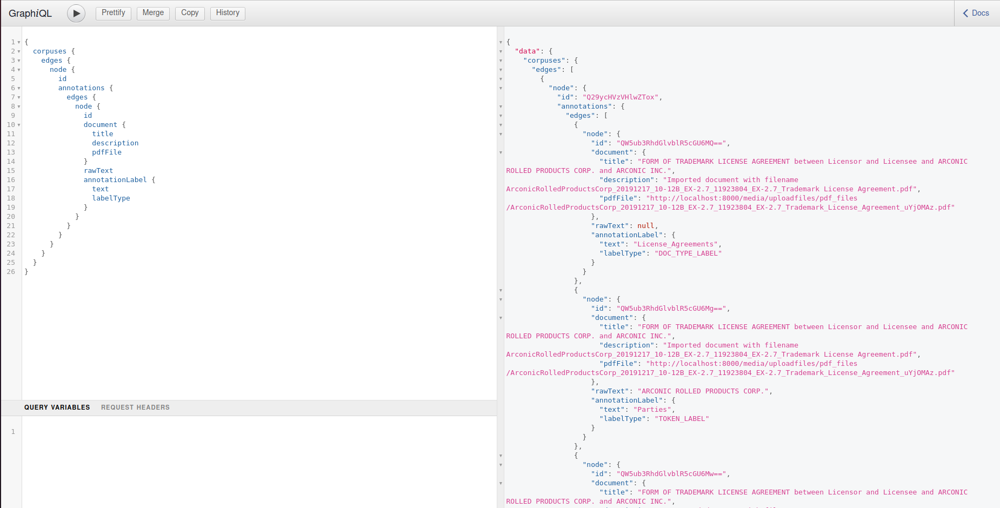

## Data Types

Text annotation data is divided into several concepts:

1. **Corpuses** (or collections of documents). One document can be in multiple corpuses.
2. **Documents**. Currently, these are PDFs ONLY.
3. **Annotations**. These are either document-level annotations (the document type), text-level annotations (highlighted
   text), or relationships (which apply a label between two annotations). Relationships are currently not
   well-supported and may be buggy.
4. **Analyses**. These groups of read-only annotations added by a Gremlin analyzer (see more on that below).

## Permissioning

OpenContracts is built on top of the powerful permissioning framework for Django called `django-guardian`. Each GraphQL
request can add a field to annotate the object-level permissions the current user has for a given object, and the
frontend relies on this to determine whether to make some objects and pages read-only and whether certain features
should be exposed to a given user. The capability of sharing objects with specific users *is* built in, **but**
is not enabled from the frontend at the moment. Allowing such widespread sharing and user lookups could be a security
hole and could also unduly tax the system. We'd like to test these capabilities more fully before letting users used them.

## GraphQL

### Mutations and Queries

OpenContracts uses Graphene and GraphQL to serve data to its frontend. You can access the Graphiql playground by going
to your OpenContracts root url `/graphql` - e.g. `https://opencontracts.opensource.legal/graphql`. Anonymous users have
access to any *public* data. To authenticate and access your own data, you either need to use the login mutation to
create a JWT token *or* login to the admin dashboard to get a Django session and auth cookie that will automatically
authenticate your requests to the GraphQL endpoint.

If you're not familiar with [GraphQL](https://graphql.org/learn/), it's a very powerful way to expose your backend to
the user and/or frontend clients to permit the construction of specific queries with specific data shapes. As an
example, here's a request to get public corpuses and the annotated text and labels in them:

Graphiql comes with a built-in documentation browser. Just click "Docs" in the top-right of the screen to start
browsing. Typically, mutations change things on the server. Queries merely request copies of data from the server.
We've tried to make our schema fairly self-explanatory, but we do plan to add more descriptions and guidance to our
API docs.

### GraphQL-only features

Some of our features are currently not accessible via the frontend. Sharing analyses and corpuses to the public, for
example, can only be achieved via `makeCorpusPublic` and `makeAnalysisPublic` mutations, and *only* admins have this
power at the moment. For our current release, we've done this to prevent large numbers of public corpuses being shared
to cut down on server usage. We'd like to make a fully free and open, collaborative platform with more features to share
anonymously, but this will require additional effort and compute power.
