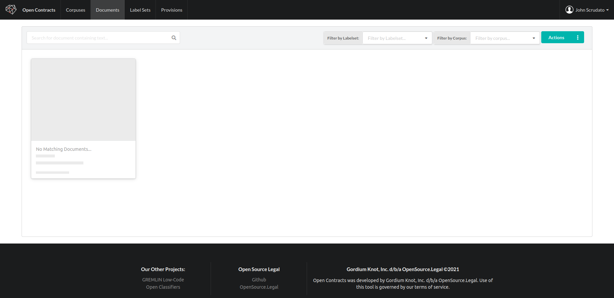
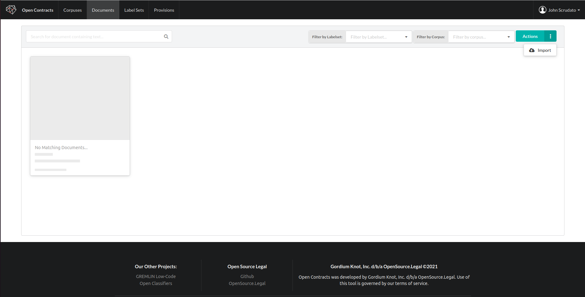
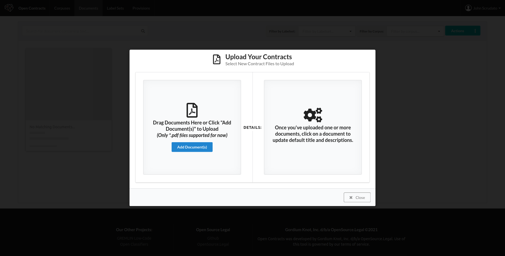
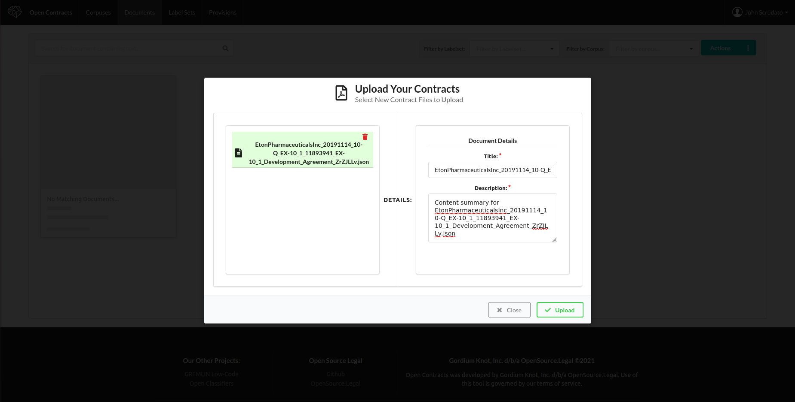
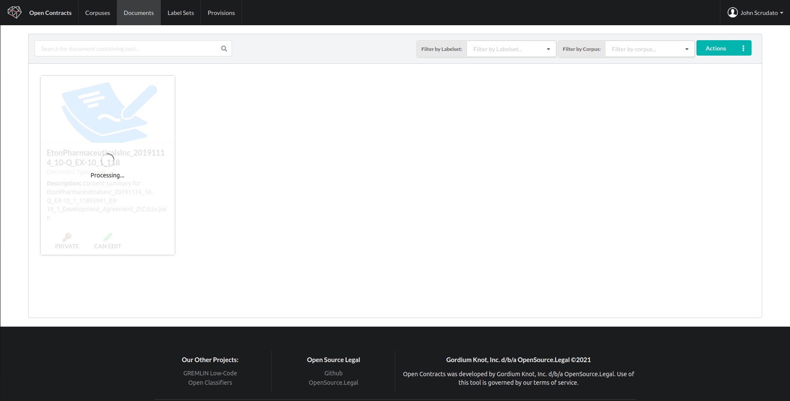

In order to do anything, you need to add some documents to Gremlin.

### Go to the Documents tab

Click on the "Documents" entry in the menu to bring
up a view of all documents you have read and/or write access to:

### Open the Action Menu
Now, click on the "Action" dropdown to open the Action menu for available actions and click "Import":

This will bring up a dialog to load documents:

### Select Documents to Upload
Open Contracts works with PDFs only (as this helps us have a single file type with predictable
data structures, formats, etc.). In the future, we'll add functionality to convert other files to PDF,
but, for now, please use PDFs. It doesn't matter if they are OCRed or not as OpenContracts performs its own
OCR on every PDF anyway to ensure consistent OCR quality and outputs. Once you've added documents for upload,
you'll see a list of documents:

Click on a document to change the description or title:

### Upload Your Documents
Click upload to upload the documents to OpenContracts. **Note** Once the documents are
uploaded, they are automatically processed with Tesseract amd PAWLs to create a layer of
tokens - each one representing a word / symbol in the PDF an its X,Y coordinates on the page. This is what
powers OpenContracts annotator and allows us to create both layout-aware and text-only annotations. **While
the PAWLs processing script is running, the document you uploaded will not be available for viewing and cannot be
added to a corpus. You'll see a loading bar on the document until the pre-processing is complete. This
is only one once and can take a long time (a couple of minutes to a max of 10) depending on the document length,
quality, etc.**

