## Why Labelsets?

Before you can add labels, you need to decide what you want to label. A labelset should reflect the taxonomy or concepts
you want to associate with text in your document. This can be solely for the purpose of human review and retrieval,
but we imagine many of you want to use it to train machine learning models.

At the moment, there's no way to create a label in a corpus without creating a labelset and creating a label for the labelset
(though we'd like to add that and welcome contributions).

## Create Text Labels
Let's say we want to add some labels for "Parties", "Termination Clause", and "Effective Date". To do that, let's
first create a LabelSet to hold the labels.

1. Go to the labelset view and click the action button to bring up the action menu:
   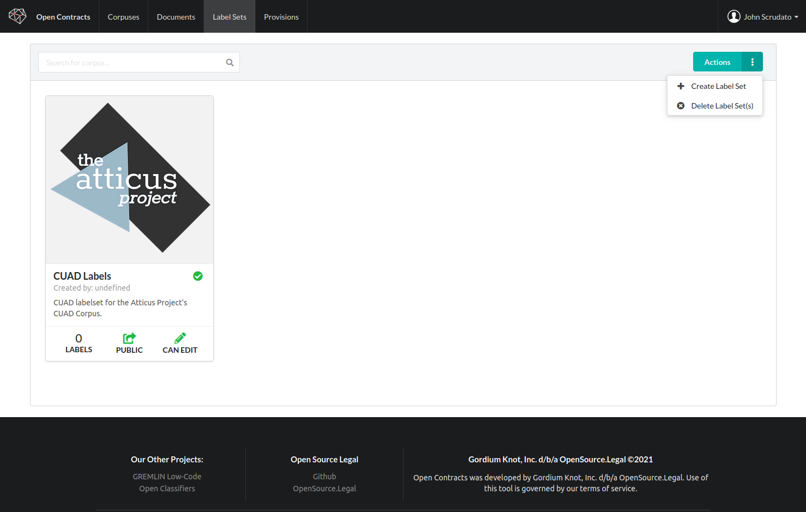
2. Clicking on the "Create Label Set" item will bring up a modal to let you create labels:
   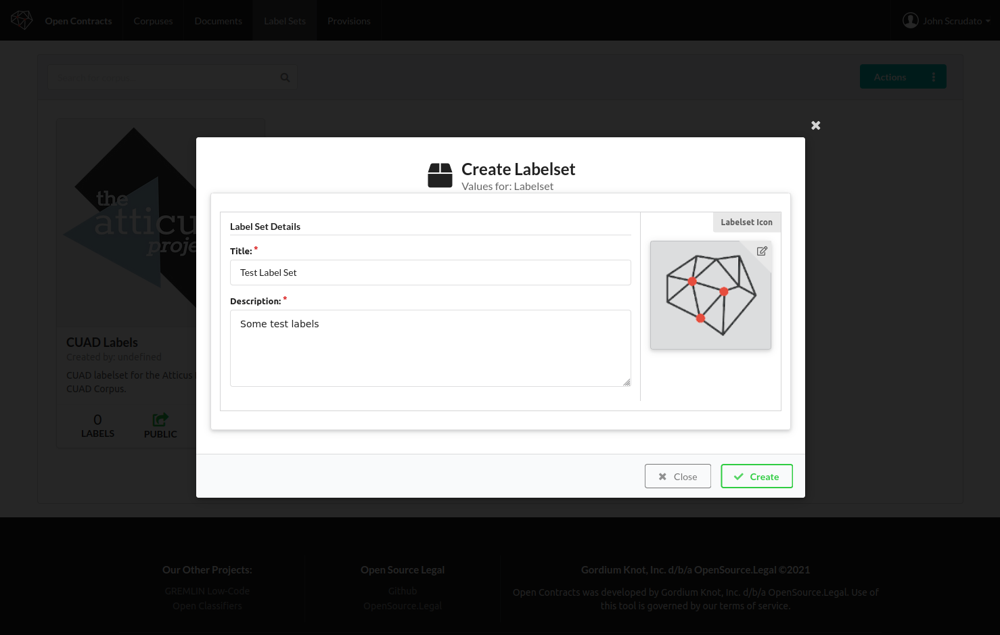
3. Now click on the new label set to edit the labels:
   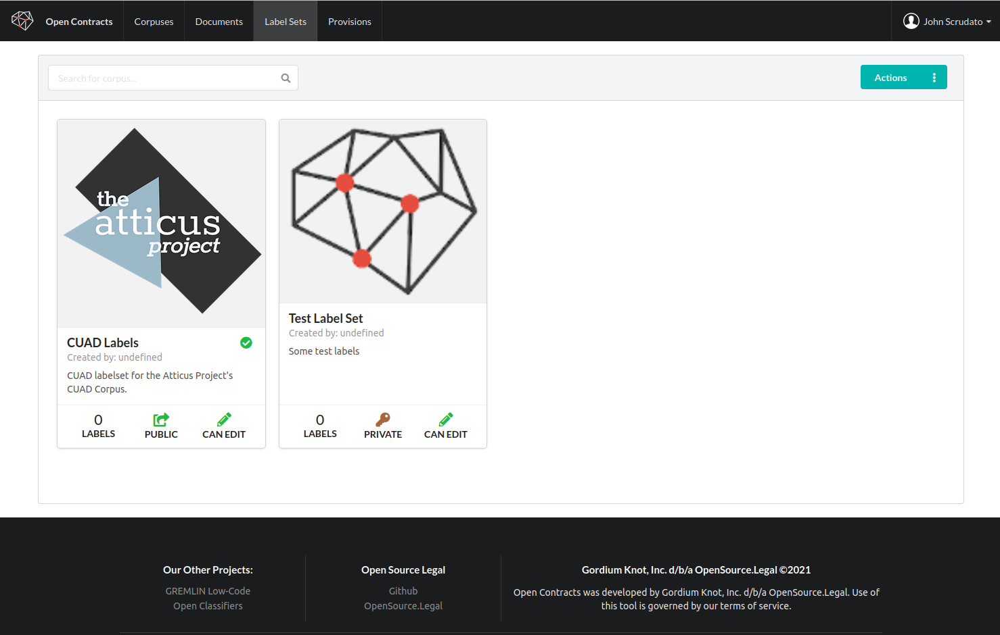
4. A modal comes up that lets you edit three types of labels:
     1. **Text Labels** - are meant to label spans of text ("highlights")
     2. **Relationship Labels** - this feature is still under development, but it labels relationships bewteen text label
        (e.g. one labelled party is the "Parent Company" of another).
     3. **Doc Type Labels** - are meant to label what category the document belongs in - e.g. a "Stock Purchase Agreement"
         or an "NDA"

5. Click the "Text Labels" tab to bring up a view of current labels for text annotations and an action
   button that lets you create new ones. There should be no labels when you first open this view"
   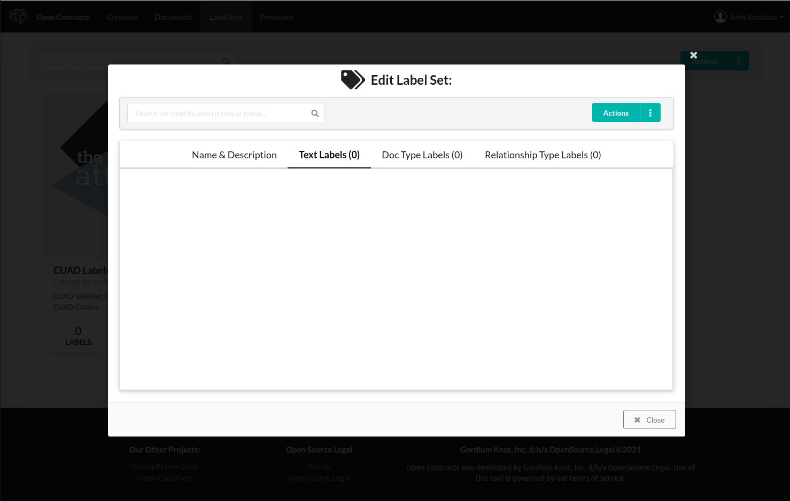
6. Click the action button and then the "Create Text Label" dropdown item:
   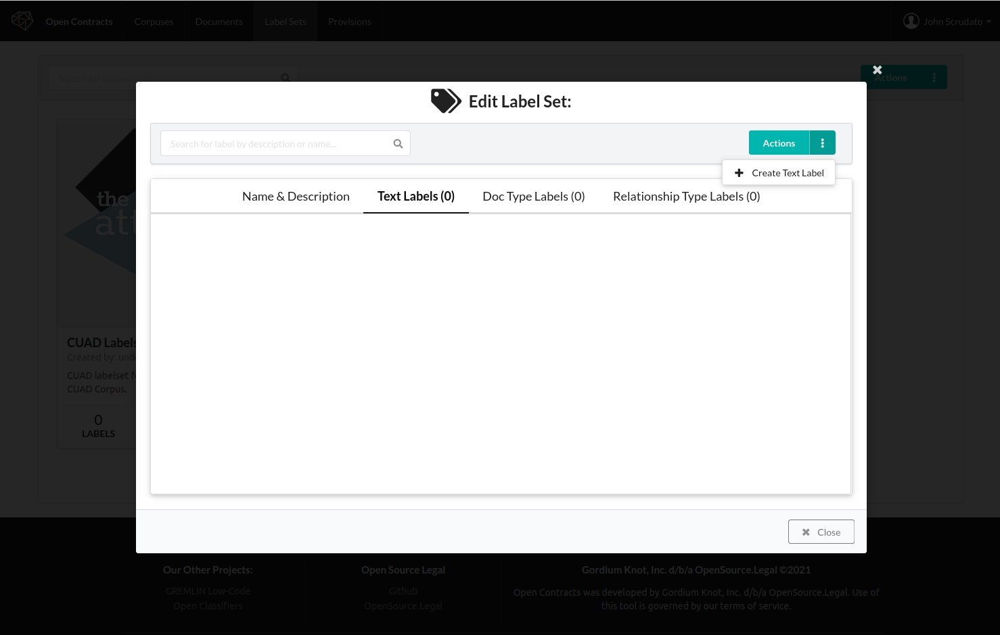
7. You'll see a new, blank label in the list of text labels:
   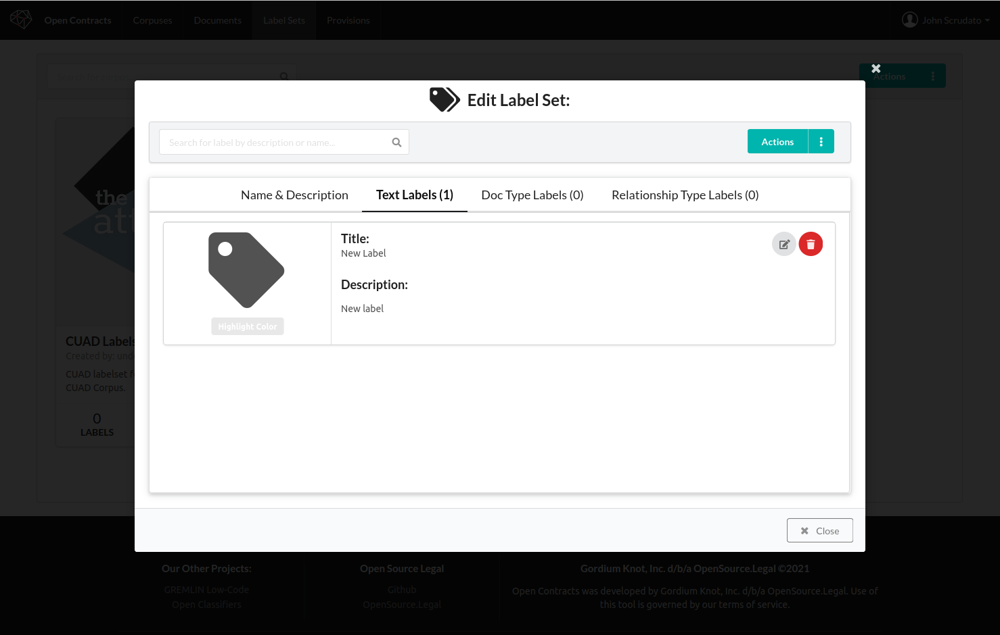
8. Click the edit icon on the label to edit the label title, description, color
   and/or icon. To edit the icon or highlight color, hover over or click the giant
   tag icon on the left side of the label:
   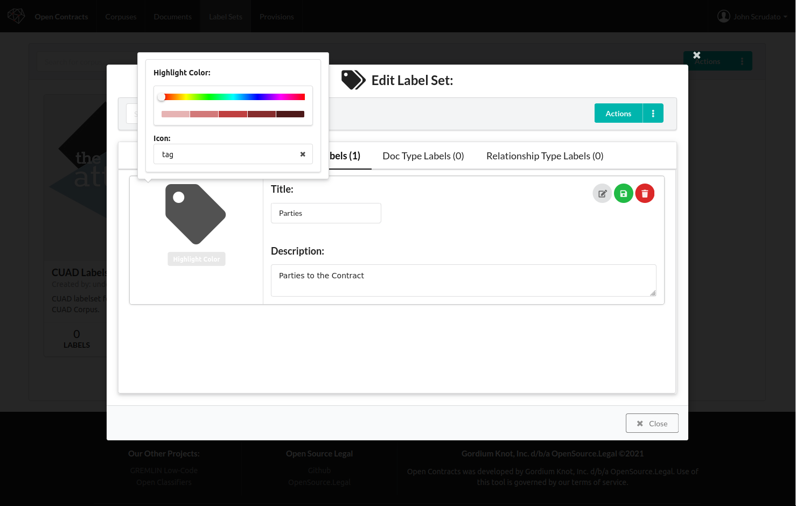
9. Hit save to commit the changes to the database. Repeat for the other labels - "Parties",
   "Termination Clause", and "Effective Date":
   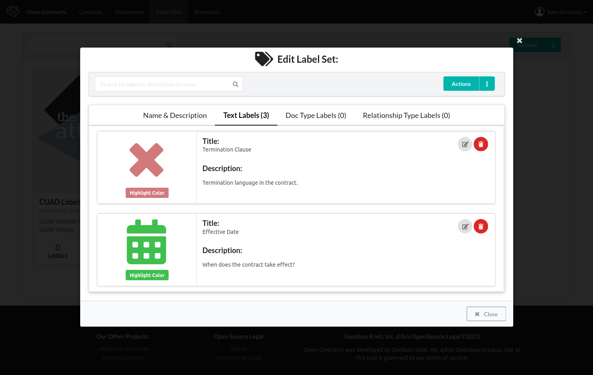

## Create Document-Type Labels

In addition to labelling specific parts of a document, you may want to tag a document itself as a certain type of
document or addressing a certain subject. In this example, let's say we want to label some documents
as "contracts" and others as "not contracts".

1. Let's also create two example document type labels. Click the "Doc Type Labels" tab:
   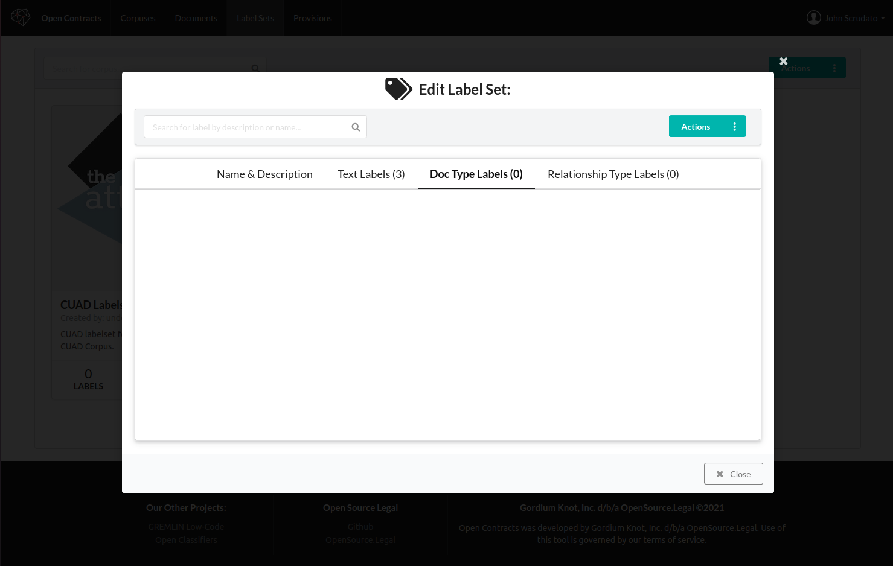
2. As before, click the action button and the "Create Document Type Label" item to create a
   blank document type label:
   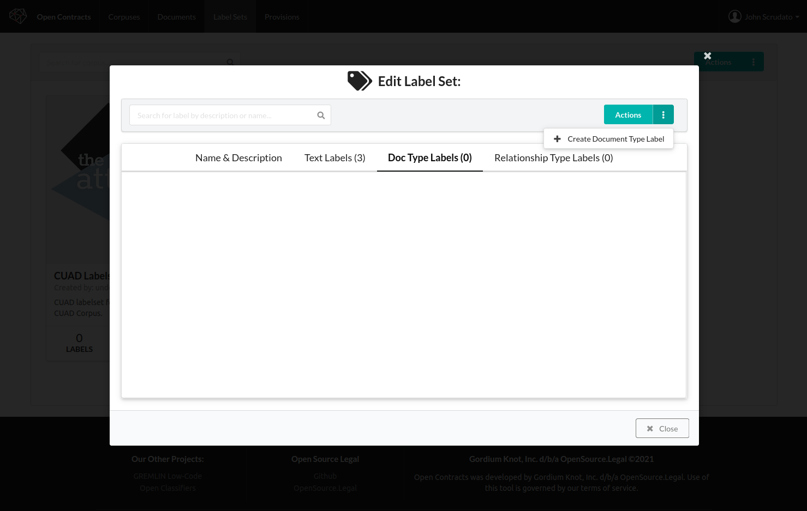
3. Repeat to create two doc type labels - "Contract" and "Not Contract":
   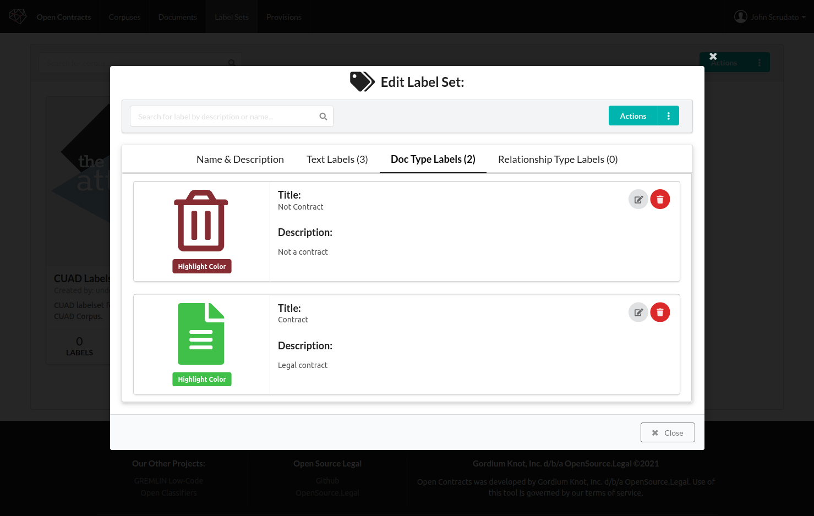
4. Hit "Close" to close the editor.
