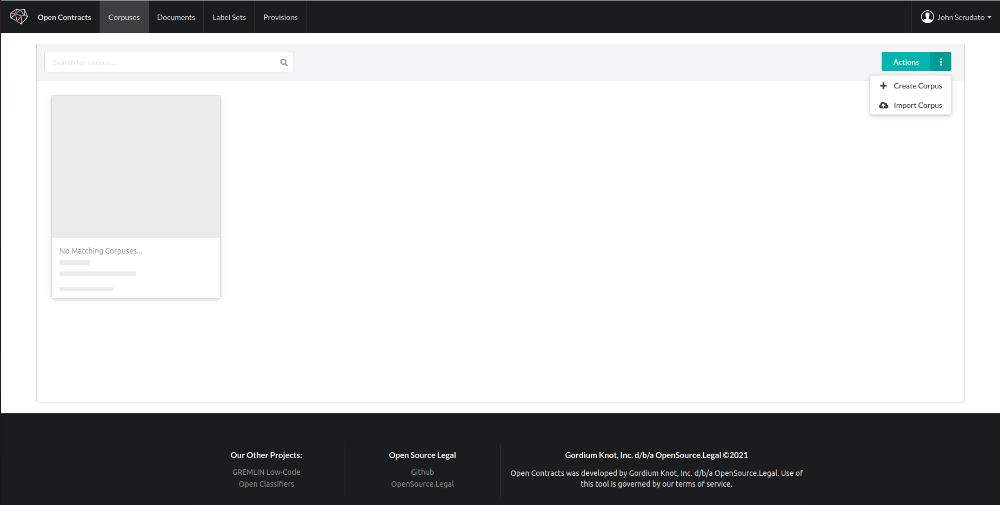
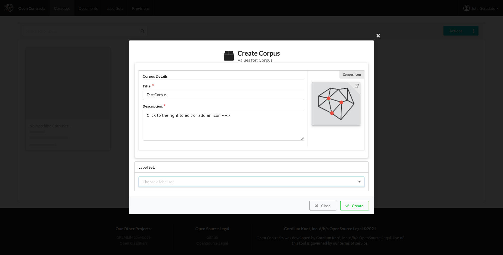
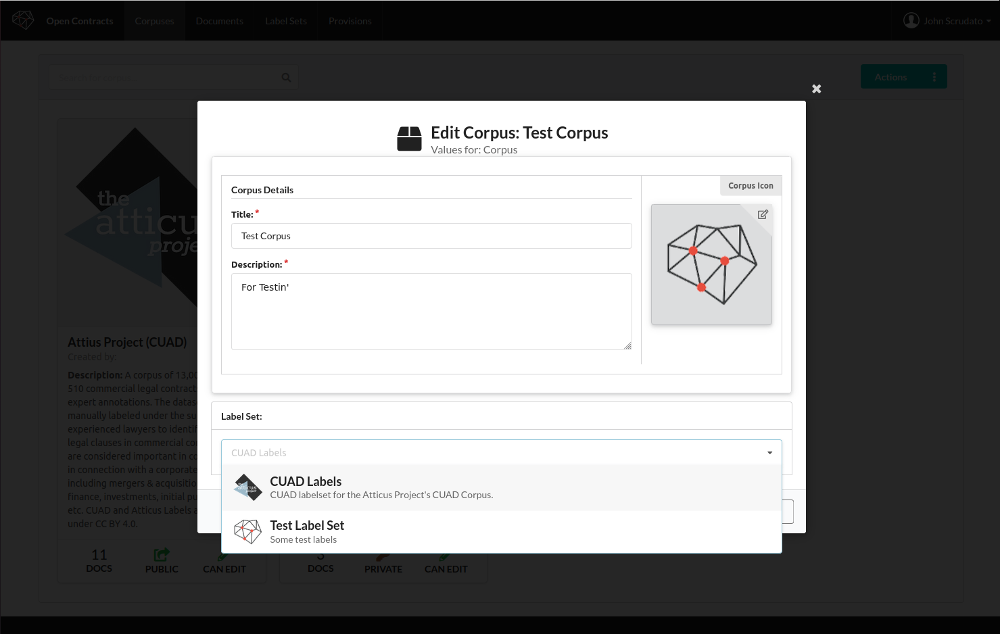
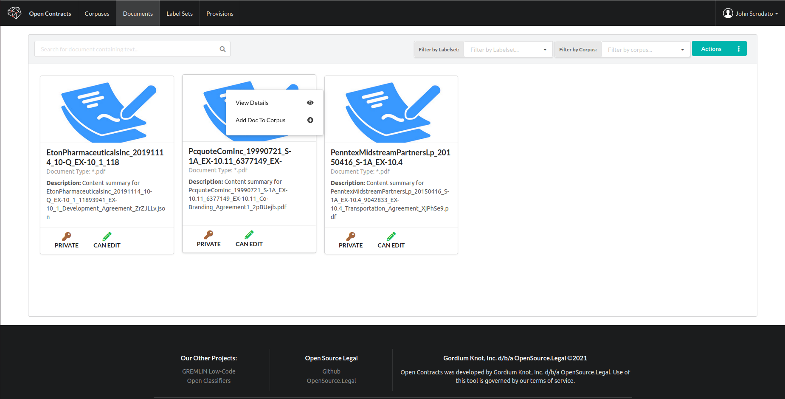
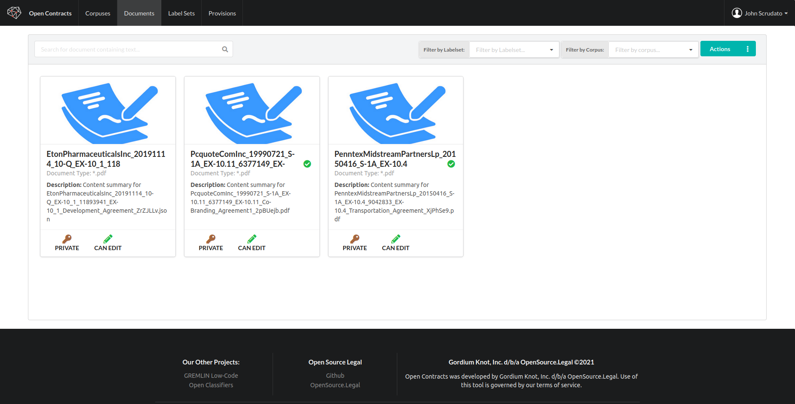
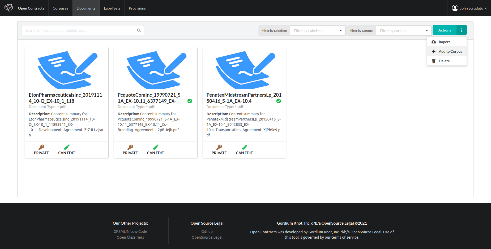
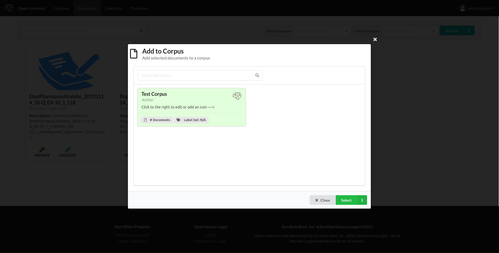
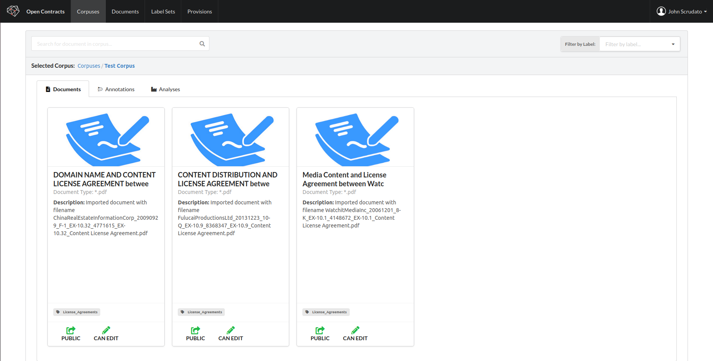

## Purpose of the Corpus

A "Corpus" is a collection of documents that can be annotated by hand or automatically by a "Gremlin" analyzer. In order
to create a Corpus, you first need to create a Corpus and then add documents to it.

## Go to the Corpus Page
1. First, login if you're not already logged in.
2. Then, go the "Corpus" tab and click the "Action" dropdown to bring up
   the action menu:
   
3. Click "Create Corpus" to bring up the Create Corpus dialog. If you've already created a labelset or have a
   pre-existing one, you can select it, otherwise you'll need to create and add one later:
   
4. Assuming you created the labelset you want to use, when you click on the dropdown in the "Label Set" section, you
   should see your new labelset. Click on it to select it:

   

5. You will now be able to open the corpus again, open documents in the corpus and start labelling.

## Add Documents to Corpus

1. Once you have a corpus, go back to the document page to select documents to add. You can do this in one of two ways.
       1. **Right-click** on a document to show a context menu:
          
       2. Or, **SHIFT + click** on the documents you want to select in order to select multiple documents at once. A green
          checkmark will appear on selected documents.
          
2. When you're done, click the "Action"
   
3. A dialog will pop up asking you to select a corpus to add the documents to. Select the desired corpus and
   hit ok.
   
4. You'll get a confirmation dialog. Hit OK.
5. When you click on the Corpus you just added the documents to, you'll get a tabbed view of all of the
   documents, annotations and analyses for that Corpus. At this stage, you should see your documents:
   

Congrats! You've created a corpus to hold annotations or perform an analysis! In order to start labelling it yourself, you
need to create and then select a LabelSet, however. You do not need to do this to run an analyzer, however.

**Note**: If you have an OpenContracts export file and proper permissions, you can also import a corpus, documents,
annotations, and labels. This is disabled on our demo instance, however, to but down on server load and reduce
opportunities to upload potentially malicious files. See the "Advanced" section for more details.
