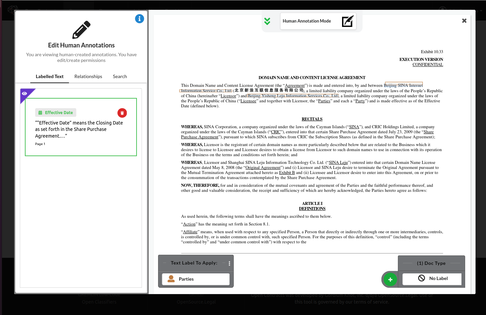
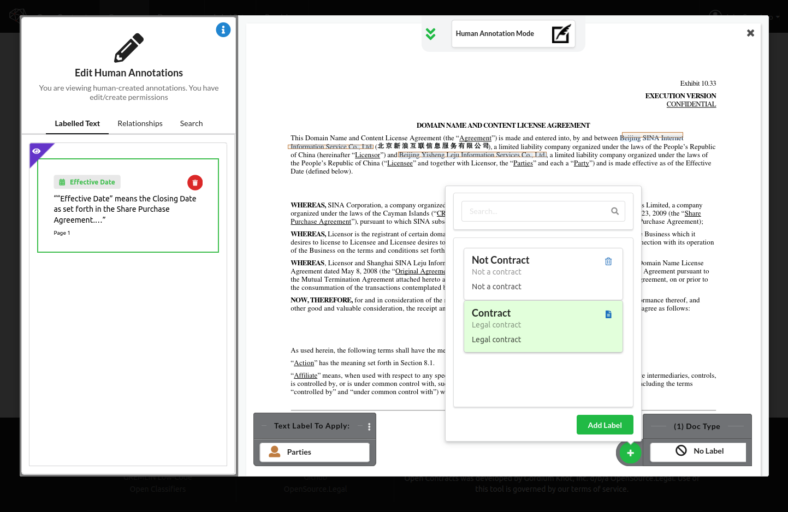
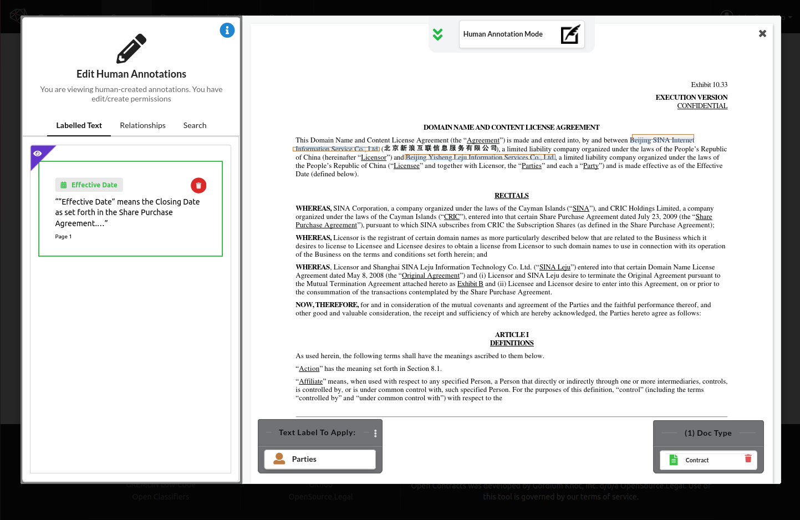

1. If **you want to label the type of document** instead of the text inside it, use the controls in the "Doc Type"
   widget on the bottom right of the Annotator. Hover over it and a green plus button should appear:
   
2. Click the "+" button to bring up a dialog that lets you search and select document type labels (remember, we created
   these earlier in the tutorial):
   
3. Click "Add Label" to actually apply the label, and you'll now see that label displayed in the "Doc Type"
   widget in the annotator:
   
4. As before, you can click the trash can to delete the label.
