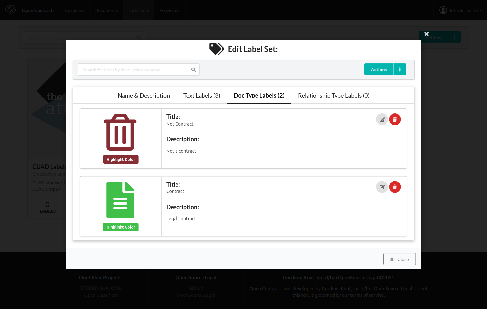

1. Back in the Corpus view, you can see in the document view the document type label you just added:
   
2. You can click on the filter dropdown above to filter the documents to only those with a certain doc type label:
   
3. With the corpus opened, click on the "Annotations" tab instead of the "Documents" tab to get a summary
   of all the current annotations in the Corpus:
   
4. Click on an annotation card to automatically load the document it's in and jump right to the page containing the
   annotation:
   
