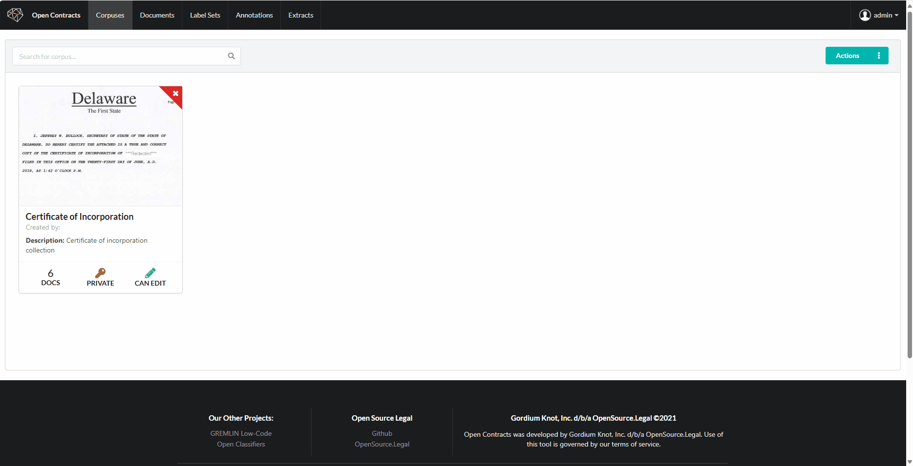

# Querying a Corpus

Once you've created a corpus of documents, you can ask a natural language question and get a natural language answer,
complete with citation and links back to the relevant text in the document(s)

**Note:** We're still working to improve nav and GUI performance, but this is pretty good for a first cut.
