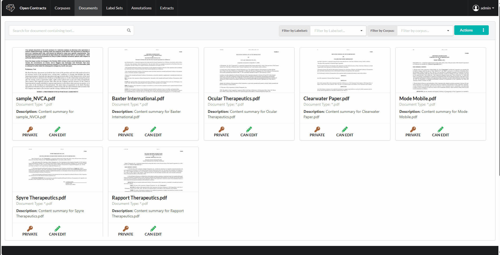
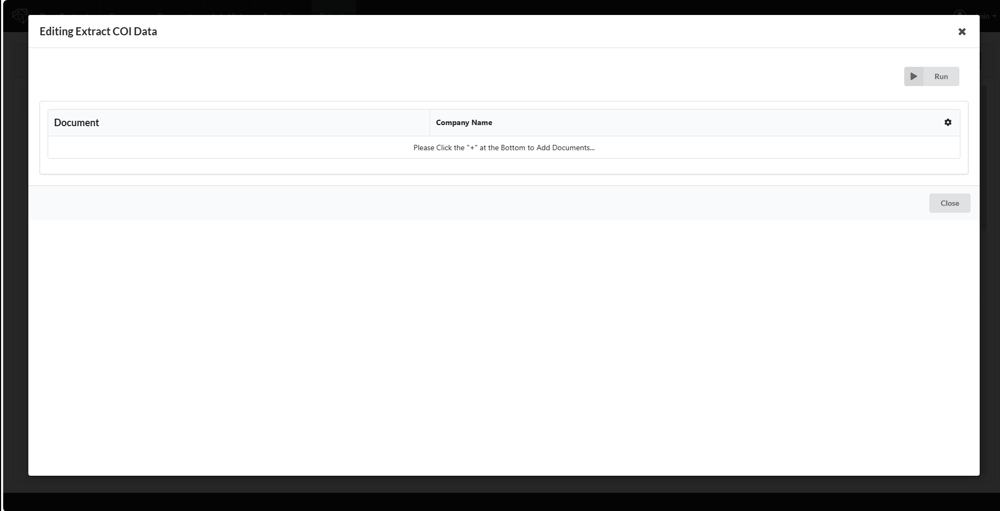
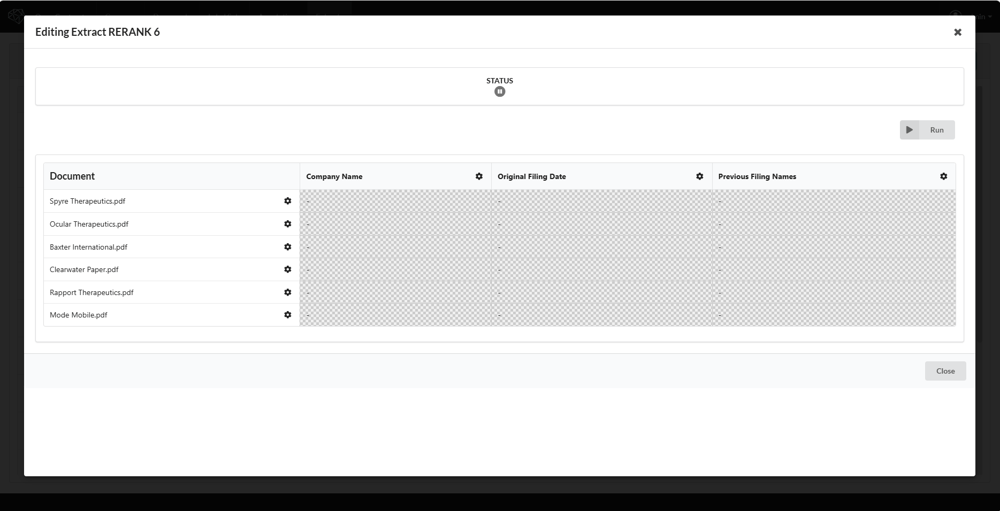
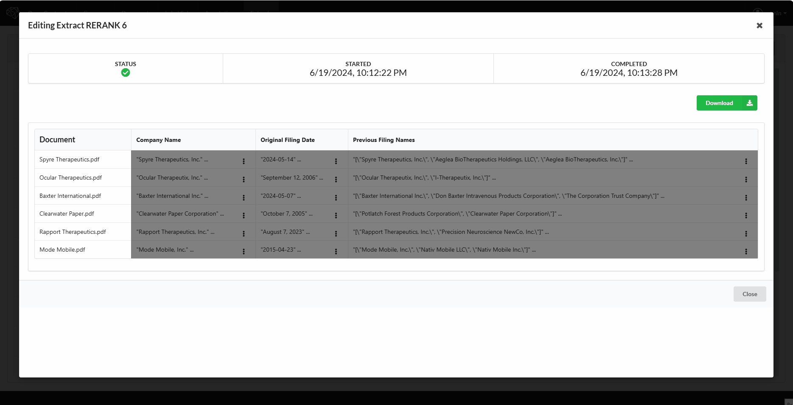

# Build a Datagrid

You can easily use OpenContracts to create an "Extract" - a collection of queries and natural language-specified data
points, represented as columns in a grid, that will be asked of every document in the extract (represented as rows). 
You can define complex extract schemas, including python primitives, Pydantic models (no nesting - yet) and lists. 

## Building a Datagrid

To create a data grid, you can start by adding documents or adding data fields. Your choice. If you selected a corpus
when defining the extract, the documents from that Corpus will be pre-loaded. 

### To add documents:

### And to add data fields:

## Running an Extract

Once you've added all of the documents you want and defined all of the data fields to apply, you can click run to start 
processing the grid:

Extract speed will depend on your underlying LLM and the number of available celery workers provisioned for 
OpenContracts. We hope to do more performance optimization in a v2 minor release. We haven't optimized for performance 
*at all*.

## Reviewing Results

Once an extract is complete, you can click on the hamburger menu in a cell to see a dropdown menu. Click the eye to view
the sources for that datacell. If you click thumbs up or thumbs down, you can log that you approved or rejected the 
value in question. Extract value edits are coming soon. 

See a quick walkthrough here:

