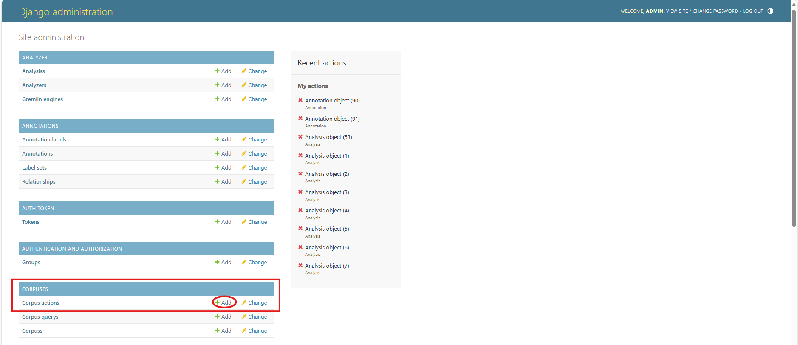
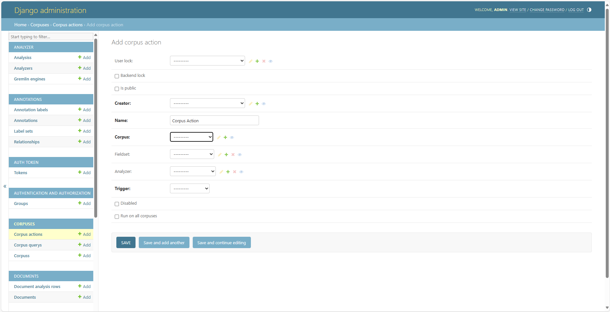
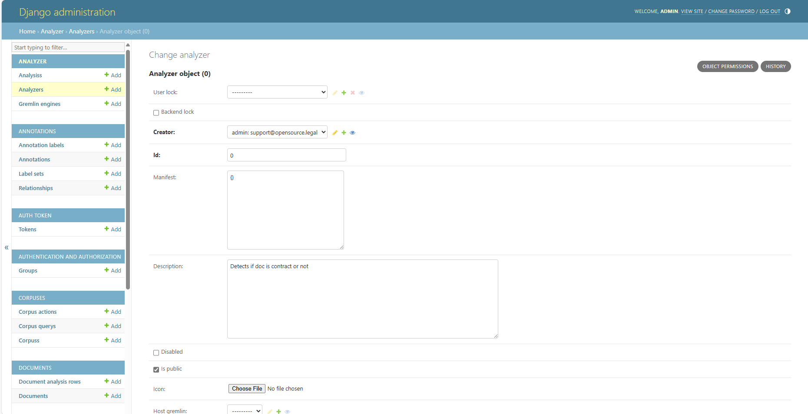

# Corpus Actions

## Introduction

If you're familiar with GitHub actions - user-scripted functions that run automatically over a software vcs repository
when certain actions take place (like a merge, PR, etc.) - then a CorpusAction should be a familair concept. You can
configure a celery task using our `@doc_analyzer_task` decorator (see more [here](advanced/register-doc-analyzer.md)
on how to write these) and then configure a `CorpusAction` to run your custom task on all documents added to the target
corpus.

## Setting up a Corpus Action

### Supported Actions

**NOTE:** Currently, you have to configure all of this via the Django admin dashboard (`http://localhost:8000/admin`
if you're using our local deployment), We'd like to expose this functionality using our React frontend, but the required
GUI elements and GraphQL mutations need to be built out. A good starter PR for someone ;-). 

Currently, a CorpusAction can be configured to run one of three types of analyzers automatically:

1. A **data extract** fieldset - in which case, a data extract will be created and run on new documents added to the
   configured corpus (see our guide on setting up a [data extract job](step-8-data-extract.md))
2. An Analyzer
    1. Configured as a "Gremlin Microservice". See more information on configuring a microservice-based analyzer
       [here](advanced/run-gremlin-analyzer.md)
    2. Configured to run a task decorated using the `@doc_analyzer_task` decorator. See more about configuring these
       kinds of tasks [here](advanced/register-doc-analyzer.md).

### Creating Corpus Action

From within the Django admin dashboard, click on CorpusActions or the `+Add` button next to the header:

Once you've opened the create action form, you'll see a number of different options you can configure:

See next section for more details on these configuration options.

### Configuration Options for Corpus Action

**Corpus** specifies that an action should run only on a single corpus, specified via dropdown.

**Analyzer** *or* **Fieldset** properties control whether an analysis or data extract runs when the
applicable trigger is run (more on this below). If you want to run a data extract when document is added to the corpus,
select the fieldset defining the data you want to extract. If you want to run an analyzer, select the pre-configured
analyzer. Remember, an analyzer can point to a microservice _or_ a task decorated with @doc_analyzer_task.

**Trigger** refers to the specific action type that should kick off the desired analysis. Currently, we "provide" add
and edit actions - i.e., run specified analytics when a document is added or edited, respectively - _but_ we have not
configured the `edit` action to run.

**Disabled** is a toggle that will turn off the specified `CorpusAction` for ALL corpuses.

**Run on all corpuses** is a toggle that, if `True`, will run the specified action on EVERY corpus. Be careful with this
as it runs for all corpuses for ALL users. Depending on your environment, this could incur a substantial compute cost
and other users may not appreciate this. A nice feature we'd love to add is a more fine-grained set of rules based
access controls to limit actions to certain groups. This would require a substantial investment into the frontend of
the application and remains an unlikely addition, though we'd absolutely welcome contributions!

### Quick Reference - Configuring @doc_analyzer_task + Analyzer

If you write your own `@doc_analyzer_task` and want to run it automatically, let's step through this step-by-step.

1. First, we assume you put a properly written and decorated task in `opencontractserver.tasks.doc_analysis_tasks.py`.
2. Second, you need to create and configure an Analyzer via the Django admin panel. Click on the `+Add` button next to
   the Analyzer entry in the admin sidebar and then configure necessary properties:

   

   Place the name of your task in the `task_name` property -
   e.g. `opencontractserver.tasks.doc_analysis_tasks.contract_not_contract`,
   add a brief description, assign the creator to the desired user, and click save.
3. Now, this `Analyzer` instance can be assigned to a CorpusAction!
