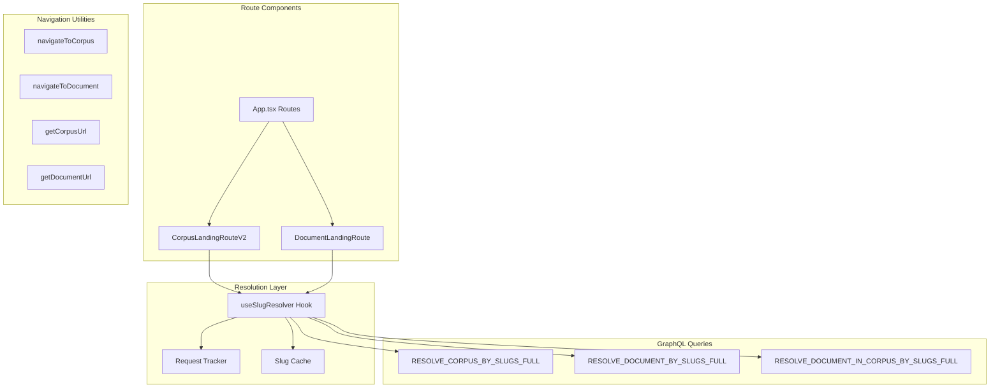
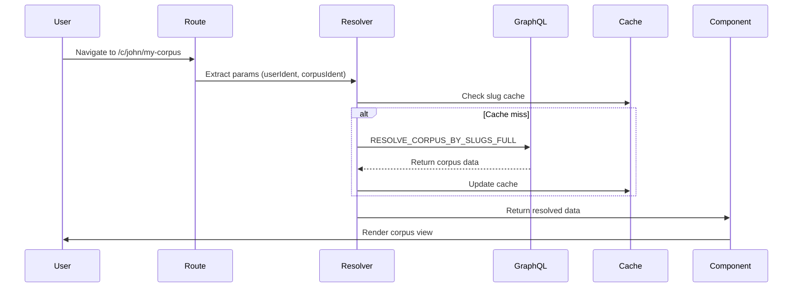

# OpenContracts Navigation System - Complete Documentation

## Table of Contents

1. [Overview](#overview)
2. [Architecture](#architecture)
3. [Route Patterns](#route-patterns)
4. [Core Components](#core-components)
5. [Navigation Utilities](#navigation-utilities)
6. [Data Flow](#data-flow)
7. [GraphQL Strategy](#graphql-strategy)
8. [ID-Based Navigation Support](#id-based-navigation-support)
9. [Performance & Caching](#performance--caching)
10. [Error Handling](#error-handling)
11. [Testing Guide](#testing-guide)

## Overview

The OpenContracts navigation system uses explicit, deterministic slug-based routing with clear prefixes to eliminate ambiguity. Every route clearly indicates its content type through `/c/` (corpus) and `/d/` (document) prefixes. The system now also supports ID-based navigation with automatic redirection to canonical slug URLs.

### Key Principles

- **Explicit Routes**: Clear patterns with `/c/` and `/d/` prefixes
- **Slug-First**: Slugs are preferred, IDs redirect to slug URLs
- **Deterministic**: Each URL pattern maps to exactly one route handler
- **Graceful Fallback**: ID-based URLs automatically resolve and redirect
- **No Page Reloads**: Navigation uses React Router for smooth transitions
- **Performant**: Single GraphQL query per route, efficient caching

### Design Decisions

- **Hybrid Support**: Both slug and ID-based navigation work seamlessly
- **Canonical URLs**: IDs always redirect to slug-based canonical URLs
- **No Ambiguity**: Routes use explicit prefixes (`/c/` for corpus, `/d/` for documents)
- **Smart Resolution**: Automatically detects IDs vs slugs and handles appropriately
- **Clear Intent**: URLs clearly communicate content type

## Architecture



## Route Patterns

### Supported URL Patterns

| Pattern                                | Example                      | Component            | Description             |
| -------------------------------------- | ---------------------------- | -------------------- | ----------------------- |
| **Corpus Route**                       |                              |                      |                         |
| `/c/:userIdent/:corpusIdent`           | `/c/john/my-corpus`          | CorpusLandingRouteV2 | Slug-based corpus route |
| **Document Routes**                    |                              |                      |                         |
| `/d/:userIdent/:docIdent`              | `/d/john/my-document`        | DocumentLandingRoute | Standalone document     |
| `/d/:userIdent/:corpusIdent/:docIdent` | `/d/john/my-corpus/contract` | DocumentLandingRoute | Document within corpus  |
| **List Views**                         |                              |                      |                         |
| `/corpuses`                            | `/corpuses`                  | Corpuses             | Corpus list view        |
| `/documents`                           | `/documents`                 | Documents            | Document list view      |

### Query Parameters

| Parameter | Purpose                     | Example                       | Component Handling   |
| --------- | --------------------------- | ----------------------------- | -------------------- |
| `?ann=`   | Select specific annotations | `/d/john/doc?ann=123`         | DocumentLandingRoute |
|           | Multiple annotations        | `/d/john/doc?ann=123,456,789` | Comma-separated IDs  |

### Route Configuration (App.tsx)

```typescript
{/* Simple declarative routes with explicit prefixes */}

{/* Document routes */}
<Route path="/d/:userIdent/:corpusIdent/:docIdent" element={<DocumentLandingRoute />} />
<Route path="/d/:userIdent/:docIdent" element={<DocumentLandingRoute />} />

{/* Corpus routes */}
<Route path="/c/:userIdent/:corpusIdent" element={<CorpusLandingRouteV2 />} />

{/* List views */}
<Route path="/corpuses" element={<Corpuses />} />
<Route path="/documents" element={<Documents />} />
```

### ID-Based Navigation (Auto-Redirect)

These patterns are supported but will redirect to canonical URLs:

- ✅ `/c/john/123` → `/c/john/my-corpus` (corpus ID redirects to slug)
- ✅ `/d/john/456` → `/d/john/my-document` (document ID redirects to slug)
- ✅ `/d/john/corpus/789` → `/d/john/corpus/doc` (mixed ID/slug supported)
- ✅ `/d/456` → `/d/john/my-document` (single ID redirects to full path)

### Legacy Patterns (Not Supported)

These patterns are NO LONGER SUPPORTED:

- ❌ `/corpuses/:corpusId` (use `/c/user/corpus` or ID will redirect)
- ❌ `/documents/:documentId` (use `/d/user/document` or ID will redirect)
- ❌ `/corpus/:corpusId/document/:documentId` (use new patterns)
- ❌ `/:userIdent/:secondIdent` (ambiguous - use explicit prefixes)

## Core Components

### DocumentLandingRoute

Handles all document routes with explicit `/d/` prefix.

```typescript
/**
 * Route patterns:
 * - /d/:userIdent/:corpusIdent/:docIdent (document within a corpus)
 * - /d/:userIdent/:docIdent (standalone document)
 */
```

**Key Features:**

- Simple parameter extraction from route
- Uses `useSlugResolver` for data fetching
- Handles both standalone and corpus-context documents
- Clean error handling and loading states

### CorpusLandingRouteV2

Handles corpus routes with explicit `/c/` prefix.

```typescript
/**
 * Route pattern:
 * - /c/:userIdent/:corpusIdent
 */
```

**Key Features:**

- Single route pattern to handle
- Uses `useSlugResolver` for data fetching
- Clean, minimal implementation
- Proper meta tags for SEO

### useSlugResolver Hook

Central hub for all slug resolution logic - simplified to only handle slug-based routes.

```typescript
interface SlugResolverOptions {
  userIdent?: string;
  corpusIdent?: string;
  documentIdent?: string;
  annotationIds?: string[];
  onResolved?: (result: SlugResolverResult) => void;
}

interface SlugResolverResult {
  loading: boolean;
  error: Error | undefined;
  corpus: CorpusType | null;
  document: DocumentType | null;
}
```

**Resolution Cases:**

1. **Document in Corpus (3 identifiers)**

   - Pattern: `userIdent + corpusIdent + documentIdent`
   - Query: `RESOLVE_DOCUMENT_IN_CORPUS_BY_SLUGS_FULL`
   - Returns both corpus and document

2. **Standalone Document (2 identifiers)**

   - Pattern: `userIdent + documentIdent`
   - Query: `RESOLVE_DOCUMENT_BY_SLUGS_FULL`
   - Returns document only

3. **Corpus (2 identifiers)**
   - Pattern: `userIdent + corpusIdent`
   - Query: `RESOLVE_CORPUS_BY_SLUGS_FULL`
   - Returns corpus only

**ID Support with Redirection**: The hook now detects GraphQL IDs and automatically:

1. Queries for the entity using ID-based queries
2. Redirects to the canonical slug-based URL
3. Preserves query parameters (like `?ann=`) during redirection

## Annotation Handling

### Overview

The navigation system supports selecting and highlighting specific annotations when navigating to documents through query parameters. This enables deep linking to specific content within documents.

### How It Works

1. **URL Format**

   ```
   /d/john/my-document?ann=annotation-id
   /d/john/my-corpus/doc?ann=id1,id2,id3
   ```

2. **Parameter Extraction**
   DocumentLandingRoute extracts annotation IDs from the URL:

   ```typescript
   const [searchParams] = useSearchParams();
   const annParam = searchParams.get("ann");
   const annotationIds = annParam ? annParam.split(",").filter(Boolean) : [];
   ```

3. **State Management**
   The annotation IDs are passed to useSlugResolver, which sets the global state:

   ```typescript
   if (annotationIds.length > 0) {
     selectedAnnotationIds(annotationIds);
   }
   ```

4. **Navigation with Annotations**
   Components preserve annotations when navigating:
   ```typescript
   // Get base URL
   const url = getDocumentUrl(document, corpus);
   // Add annotation parameter
   navigate(`${url}?ann=${annotation.id}`);
   ```

### Components That Navigate with Annotations

- **QueryResultsViewer**: Navigate to annotation from query results
- **AnnotationCards**: Navigate to selected annotation
- **ExtractCellFormatter**: Navigate to source annotations
- **DataCell**: Navigate to extract source annotations

### Example Navigation Flows

1. **Viewing Query Result**

   - User clicks on query result annotation
   - System navigates to `/d/user/corpus/doc?ann=123`
   - Document opens with annotation 123 highlighted

2. **Multiple Annotations**

   - User selects multiple annotations
   - System navigates to `/d/user/doc?ann=123,456,789`
   - Document opens with all specified annotations visible

3. **Cross-Document Navigation**
   - User clicks annotation reference in another document
   - System navigates to target document with annotation
   - Target document opens with referenced annotation highlighted

## Navigation Utilities

### URL Generation

```typescript
// Builds corpus URL - always with /c/ prefix
getCorpusUrl(corpus); // Returns: /c/john/my-corpus

// Builds document URL - always with /d/ prefix
getDocumentUrl(document, corpus); // Returns: /d/john/my-corpus/doc
getDocumentUrl(document); // Returns: /d/john/doc
```

**Important**: These functions return `"#"` if slugs are missing, preventing navigation to invalid routes.

### Smart Navigation

```typescript
// Navigate to corpus (won't navigate if already there)
navigateToCorpus(corpus, navigate, currentPath);

// Navigate to document (won't navigate if already there)
navigateToDocument(document, corpus, navigate, currentPath);
```

These functions:

- Check if already at destination
- Prevent navigation without slugs
- Use replace navigation for cleaner history
- Use React Router's `navigate()` to avoid full page reloads

### Document Closing Behavior

When closing a document:

```typescript
const handleClose = () => {
  // Uses React Router navigation (no page reload)
  if (corpus) {
    navigate(`/c/${corpus.creator.slug}/${corpus.slug}`);
  } else {
    navigate("/documents");
  }
};
```

Benefits:

- **No Page Reload**: Smooth transition using React Router
- **State Preservation**: App state remains intact
- **Fast Navigation**: Instant UI updates
- **Proper Cleanup**: `openedDocument(null)` called on unmount

## Data Flow

### Navigation Flow



### Key Points

1. Routes are matched by React Router based on explicit patterns
2. Route components extract parameters from URL
3. `useSlugResolver` handles all data fetching
4. Request deduplication prevents duplicate queries
5. Caching improves subsequent navigation

## GraphQL Strategy

### Query Selection

The resolver selects queries based on available parameters:

```typescript
// Document in corpus - full context
if (userIdent && corpusIdent && documentIdent) {
  // Uses RESOLVE_DOCUMENT_IN_CORPUS_BY_SLUGS_FULL
}

// Standalone document
else if (userIdent && documentIdent && !corpusIdent) {
  // Uses RESOLVE_DOCUMENT_BY_SLUGS_FULL
}

// Corpus only
else if (userIdent && corpusIdent && !documentIdent) {
  // Uses RESOLVE_CORPUS_BY_SLUGS_FULL
}
```

### Fetch Policies

```typescript
fetchPolicy: "cache-first";
nextFetchPolicy: "cache-and-network";
```

- Initial load uses cache if available
- Subsequent loads check network for updates
- Provides fast initial render with fresh data updates

## ID-Based Navigation Support

### Overview

The navigation system now supports GraphQL ID-based navigation with automatic redirection to canonical slug URLs. This ensures backward compatibility while maintaining clean, SEO-friendly URLs.

### How It Works

1. **ID Detection**: The system automatically detects when an identifier is a GraphQL ID:

   - Numeric IDs (e.g., `123`, `456789`)
   - Base64 encoded IDs (e.g., `Q29ycHVzOjEyMw==`)
   - GID prefixed IDs (e.g., `gid://app/Corpus/123`)

2. **Resolution Process**:

   ```typescript
   // When an ID is detected in the URL
   if (isValidGraphQLId(identifier)) {
     // 1. Query for entity by ID
     const entity = await resolveEntityById(identifier);

     // 2. Extract slug information
     const slugUrl = buildCanonicalUrl(entity);

     // 3. Redirect to slug URL
     navigate(slugUrl, { replace: true });
   }
   ```

3. **Query Parameter Preservation**: During redirection, all query parameters (like `?ann=`) are preserved.

### Supported ID Patterns

| Pattern     | Example              | Resolution             | Final URL                    |
| ----------- | -------------------- | ---------------------- | ---------------------------- |
| Corpus ID   | `/c/john/123`        | Queries corpus by ID   | `/c/john-doe/my-corpus`      |
| Document ID | `/d/john/456`        | Queries document by ID | `/d/john-doe/my-document`    |
| Mixed       | `/d/john/corpus/789` | Queries document by ID | `/d/john/corpus/my-document` |
| Single ID   | `/d/789`             | Queries document by ID | `/d/john-doe/my-document`    |

### GraphQL Queries for ID Resolution

```graphql
# Corpus ID resolution
query GetCorpusByIdForRedirect($id: ID!) {
  corpus(id: $id) {
    id
    slug
    title
    creator {
      id
      slug
      username
    }
  }
}

# Document ID resolution
query GetDocumentByIdForRedirect($id: String!) {
  document(id: $id) {
    id
    slug
    title
    creator {
      id
      slug
      username
    }
    corpus {
      id
      slug
      title
      creator {
        id
        slug
        username
      }
    }
  }
}
```

### Benefits

1. **Backward Compatibility**: Old ID-based links continue to work
2. **SEO Optimization**: All traffic ends up at canonical slug URLs
3. **User Experience**: Seamless navigation without broken links
4. **Developer Experience**: No need to update old references immediately

## Performance & Caching

### Three-Layer Caching

1. **Slug Cache** (In-Memory)

```typescript
const slugCache = new Map<string, { corpus?: string; document?: string }>();
```

2. **Apollo Cache** (GraphQL)

- Normalized cache for GraphQL responses
- Shared across all components

3. **Request Deduplication**

```typescript
class RequestTracker {
  // Prevents duplicate simultaneous requests
  // Returns existing promise if request pending
}
```

### Performance Monitoring

```typescript
performanceMonitor.startMetric("slug-resolution", {
  userIdent,
  corpusIdent,
  documentIdent,
});
```

Tracks:

- Resolution time
- Success/failure rates
- Cache hit rates

## Error Handling

### Error States

1. **Missing Slugs**

```typescript
if (!corpus.slug || !corpus.creator?.slug) {
  console.warn("Cannot generate corpus URL without slugs");
  return "#"; // Safe fallback
}
```

2. **Not Found**

```typescript
if (!document) {
  navigate("/404", { replace: true });
  return;
}
```

3. **Invalid Routes**

```typescript
if (!userIdent) {
  setState({
    error: new Error("Missing required route parameters"),
  });
}
```

### User Experience

- Clear error messages
- Graceful fallbacks
- 404 page for not found content
- Console warnings for debugging

## Testing Guide

### Unit Tests

```typescript
describe("Navigation URLs", () => {
  it("generates corpus URL with prefix", () => {
    const corpus = {
      id: "1",
      slug: "my-corpus",
      creator: { slug: "john" },
    };
    expect(getCorpusUrl(corpus)).toBe("/c/john/my-corpus");
  });

  it("returns safe fallback without slugs", () => {
    const corpus = { id: "1" };
    expect(getCorpusUrl(corpus)).toBe("#");
  });
});
```

### Integration Tests

```typescript
describe("Route Resolution", () => {
  it("resolves corpus route", async () => {
    render(<CorpusLandingRouteV2 />, {
      route: "/c/john/my-corpus",
    });

    await waitFor(() => {
      expect(screen.getByText("My Corpus")).toBeInTheDocument();
    });
  });
});
```

### E2E Test Scenarios

1. **Corpus Navigation**

   - Navigate to `/c/john/my-corpus`
   - Verify corpus loads
   - Check meta tags

2. **Document Navigation**

   - Navigate to `/d/john/doc`
   - Verify document loads
   - Test close navigation

3. **Document in Corpus**

   - Navigate to `/d/john/corpus/doc`
   - Verify both corpus and document load
   - Check breadcrumbs

4. **Document with Annotations**

   - Navigate to `/d/john/doc?ann=123`
   - Verify document loads with annotation selected
   - Navigate to `/d/john/doc?ann=123,456`
   - Verify multiple annotations are selected

5. **Annotation Navigation**

   - Click on annotation reference
   - Verify navigation includes `?ann=` parameter
   - Verify target document opens with annotation highlighted

6. **Error Handling**
   - Navigate to `/c/invalid/corpus`
   - Verify 404 page
   - Check console warnings

## Migration from Legacy System

### Breaking Changes

All legacy routes are NO LONGER SUPPORTED:

- `/corpuses/[id]` → Must use `/c/[user]/[corpus]`
- `/documents/[id]` → Must use `/d/[user]/[document]`
- `/corpus/[id]/document/[id]` → Must use `/d/[user]/[corpus]/[document]`
- `/[user]/[item]` → Must use explicit `/c/` or `/d/` prefix

### Migration Requirements

1. **Backend Must Provide Slugs**

   - All entities must have `slug` field
   - All entities must have `creator.slug`

2. **Update All Links**

   - Use `getCorpusUrl()` and `getDocumentUrl()`
   - Never hardcode URLs

3. **Handle Missing Slugs**
   - Entities without slugs cannot be navigated to
   - Consider adding slug generation to backend

## Best Practices

### DO

- ✅ Always use navigation utility functions
- ✅ Use explicit route prefixes (`/c/`, `/d/`)
- ✅ Handle missing slugs gracefully
- ✅ Use TypeScript types for route params
- ✅ Test navigation flows thoroughly
- ✅ Preserve annotation parameters when navigating
- ✅ Use comma-separated IDs for multiple annotations

### DON'T

- ❌ Hardcode navigation URLs
- ❌ Assume slugs exist
- ❌ Use IDs for navigation
- ❌ Create ambiguous routes
- ❌ Add fallback logic for legacy routes
- ❌ Forget to append `?ann=` when navigating to specific annotations
- ❌ Navigate without checking if URL generation succeeded (check for "#")

## Summary

The OpenContracts navigation system provides:

- **Explicit Routes**: Clear `/c/` and `/d/` prefixes eliminate ambiguity
- **Simple Implementation**: Minimal code, easy to understand
- **Deterministic Behavior**: Each URL maps to exactly one handler
- **Performance**: Single query per route, efficient caching
- **Maintainability**: Clean separation of concerns, no legacy complexity

The system requires slugs for all navigation but provides a much cleaner, more maintainable codebase with deterministic routing behavior.
